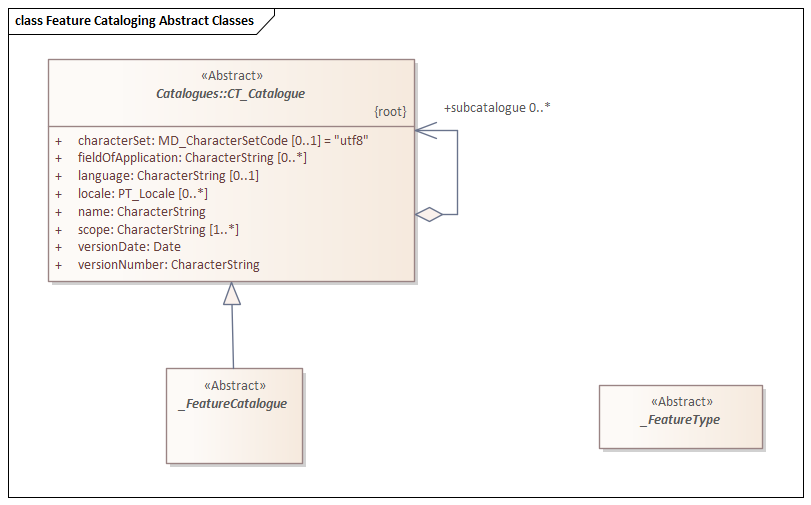

= Feature Cataloguing Concepts (FCC)
:edition: 2.2.0
:revdate: 2010-02-25

== Feature Cataloguing Common (FCC) Version: 2.2.0

.Classes in the fcc namespace

=== Description

Feature Cataloguing Common (FCC) is an XML Schema implementation derived from ISO
19110:2016, Geographic Information - Methodologies for feature cataloging. It
includes elements for cataloguing features. The XML schema was encoded using the
encoding rules defined in ISO 19118, ISO 19139.

=== XML Namespace for fcc 2.2

The namespace URI for fcc 2.2 is `https://schemas.isotc211.org/19110/-/fcc/2.2`.

=== XML Schema for fcc 1.2

https://schemas.isotc211.org/19110/-/fcc/2.2.0/.2.0/fcc.xsd[fcc.xsd] is the XML Schema document
to be referenced by XML documents containing XML elements in the fcc 2.2 namespace or
by XML Schema documents importing the fcc 2.2 namespace. This XML schema includes
(indirectly) all the implemented concepts of the fcct namespace, but it does not
contain the declaration of any types.

=== Related XML Schema for cat 1.2

https://schemas.isotc211.org/19110/-/fcc/2.2.0/abstract.xsd[catalogues.xsd] implements the UML
conceptual schema defined in ISO 191110:2016, Geographic Information - Methodologies
for feature cataloging, Clause 6.3. It was created using the encoding rules defined
in ISO 19118, ISO 19139.

https://schemas.isotc211.org/19110/-/fcc/2.2.0/abstract.xsd contains the following classes:

* Abstract_FeatureCatalogue
* Abstract_FeatureType

=== Related XML Namespaces for fcc 2.2

The fcc 2.2 namespace imports these other namespaces:

[%unnumbered]
[options=header,cols=4]
|===
| Name | Standard Prefix | Namespace Location | Schema Location

| Geographic Common Objects | gco |
https://schemas.isotc211.org/19103/-/gco/1.2 | https://schemas.isotc211.org/19103/-/gco/1.2.0/gco.xsd[gco.xsd]
| General Feature Catalogue | gco |
https://schemas.isotc211.org/19110/-/gfc/2.2 | https://schemas.isotc211.org/19110/-/gfc/2.2.0/gfc.xsd[gfc.xsd]
| Cataloguing | cat |
https://schemas.isotc211.org/19139/-/cat/1.2 | https://schemas.isotc211.org/19139/-/cat/1.2.0/cat.xsd[cat.xsd]
|===

=== Working Versions

When revisions to these schema become necessary, they will be managed in the
https://github.com/ISO-TC211/XML[ISO TC211 Git Repository].
