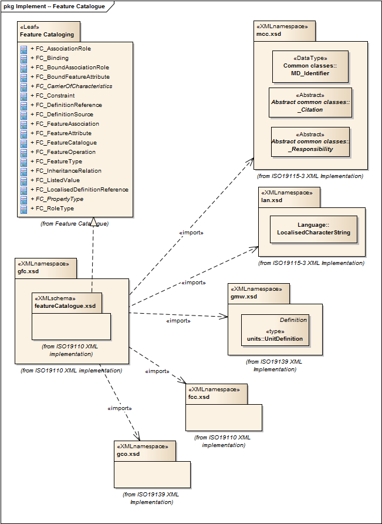

= General Feature Catalog (GFC)
:edition: 2.2.0
:revdate: 2019-01-04

== General Feature Catalog (GFC) Version: 1.1

=== Description

GFC 1.1 is an XML Schema implementation derived from ISO 19110, Geographic
information -- Methodology for feature cataloguing. It includes ISO 19110:2005
defines the methodology for cataloguing feature types and specifies how the
classification of feature types is organized into a feature catalogue and presented
to the users of a set of geographic data. ISO 19110:2005 is applicable to creating
catalogues of feature types in previously uncatalogued domains and to revising
existing feature catalogues to comply with standard practice. ISO 19110:2005 applies
to the cataloguing of feature types that are represented in digital form. Its
principles can be extended to the cataloguing of other forms of geographic data. The
XML schema was encoded using the rules described in ISO/TS 19139:2007, Clause 8 and
implementation approach from ISO/TS 19115-3, Clause 8.

=== Sample XML files for gfc 1.1

link:exampleInstance.xml[exampleInstance.xml]

=== XML Namespace for gfc 1.1

The namespace URI for gfc 1.1 is `http://standards.iso.org/iso/19110/gfc/1.1`.

=== XML Schema for gfc 1.1

link:gfc.xsd[gfc.xsd] is the XML Schema document to be referenced by XML documents
containing XML elements in the gfc 1.1 namespace or by XML Schema documents importing
the gfc 1.1 namespace. This XML schema includes (indirectly) all the implemented
concepts of the gfc namespace, but it does not contain the declaration of any types.

NOTE: The XML Schema for gfc 1.1 are available link:gfc.zip[here]. A zip archive
including all the XML Schema Implementations defined in ISO/TS 19115-3 and related
standards is also https://schemas.isotc211.org/19115/19115AllNamespaces.zip[available].

=== Related XML Schema for gfc 1.1

link:featureCatalogue.xsd[featureCatalogue.xsd] implements the UML conceptual
schema defined in ISO 19110, Geographic information -- Methodology for feature
cataloguing. It was created using the encoding rules defined in ISO 19118, ISO 19139,
and the implementation approach described in ISO 19115-3 and contains the following
classes (codeLists are bold): FC_AssociationRole, FC_Binding,
FC_BoundAssociationRole, FC_BoundFeatureAttribute,
AbstractFC_CarrierOfCharacteristics, FC_Constraint, FC_DefinitionReference,
FC_DefinitionSource, FC_FeatureAssociation, FC_FeatureAttribute, FC_FeatureCatalogue,
FC_FeatureOperation, FC_FeatureType, FC_InheritanceRelation, FC_ListedValue,
FC_LocalisedDefinitionReference, AbstractFC_PropertyType, and FC_RoleType

=== Related XML Namespaces for gfc 1.1

The gfc 1.1 namespace imports these other namespaces:

[%unnumbered]
[options=header,cols=4]
|===
| Name | Standard Prefix | Namespace Location | Schema Location

| Citation and responsible party information Citation and responsible party
information
| cit
| `https://schemas.isotc211.org/19115/-3/cit/1.0`
| https://schemas.isotc211.org/19115/-3/cit/1.0/cit.xsd[cit.xsd]

| Feature Catalog Common
| fcc
| https://schemas.isotc211.org/19110/fcc/1.0
| https://schemas.isotc211.org/19110/fcc/1.0/fcc.xsd[fcc.xsd]

| Geographic COmmon
| gco
| `https://schemas.isotc211.org/19115/-3/gco/1.0`
| https://schemas.isotc211.org/19115/-3/gco/1.0/gco.xsd[gco.xsd]

| Language localization
| lan
| `https://schemas.isotc211.org/19115/-3/lan/1.0`
| https://schemas.isotc211.org/19115/-3/lan/1.0/lan.xsd[lan.xsd]

| Metadata Common Classes
| mcc
| `https://schemas.isotc211.org/19115/-3/mcc/1.0`
| https://schemas.isotc211.org/19115/-3/mcc/1.0/mcc.xsd[mcc.xsd]

|===

=== Working Versions

When revisions to these schema become necessary, they will be managed in the
https://github.com/ISO-TC211/XML[ISO TC211 Git Repository].
