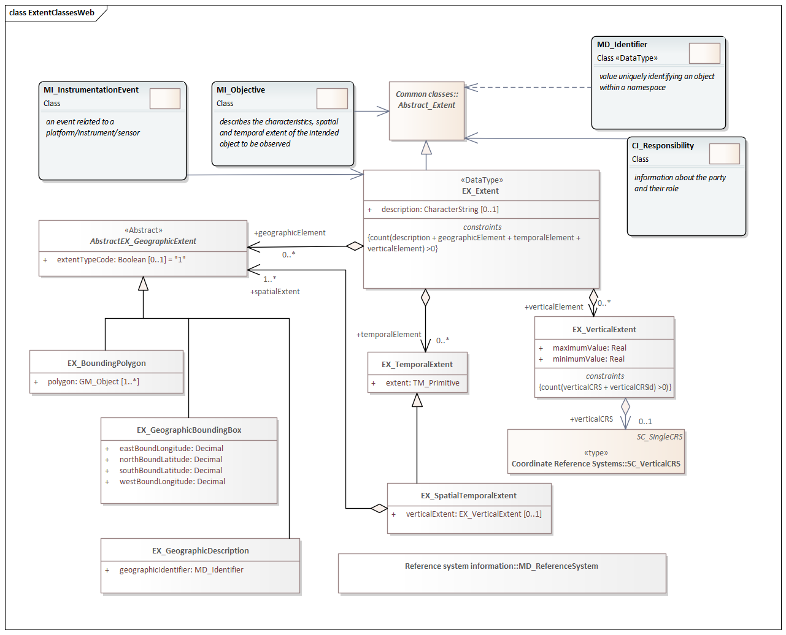

= Geospatial EXtent (GEX)
:edition: 1.3
:revdate: 2021-02-15

== Geospatial EXtent (GEX) Version: 1.3

.Classes in the gex namespace

GEX 1.3 is an XML Schema implementation derived from ISO 19115-1, Geographic
Information - Metadata - Part 1: Fundamentals, Clause 6.6.1. It includes elements for
specifying geospatial properties of a resource, including extent and spatial
reference systems. The XML schema was encoded using the rules described in ISO/TS
19139:2007.

=== XML Namespace for gex 1.3

The namespace URI for gex 1.3 is `https://schemas.isotc211.org/19115/-1/gex/1.3`.

=== XML Schema for gex 1.3

https://schemas.isotc211.org/19115/-1/gex/1.3.0/gex.xsd[gex.xsd] is the XML Schema document to
be referenced by XML documents containing XML elements in the gex 1.3 namespace or by
XML Schema documents importing the gex 1.3 namespace. This XML schema includes
(indirectly) all the implemented concepts of the gex namespace, but it does not
contain the declaration of any types.

=== Related XML Schema for gex 1.3

https://schemas.isotc211.org/19115/-1/gex/1.3.0/extent.xsd[extent.xsd] implements the UML
conceptual schema defined in ISO 19115-1, Geographic Information - Metadata - Part 1:
Fundamentals, Clause 6.6.1. It was created using the encoding rules defined in ISO
19118, ISO 19139.

https://schemas.isotc211.org/19115/-1/gex/1.3.0/extent.xsd contains the following classes:

* EX_Extent
* AbstractEX_GeographicExtent
* EX_BoundingPolygon
* EX_GeographicBoundingBox
* EX_GeographicDescription
* EX_TemporalExtent
* EX_SpatialTemporalExtent
* EX_VerticalExtent

=== Related XML Namespaces for gex 1.3

The gex 1.3 namespace imports these other namespaces:

[%unnumbered]
[options=header,cols=4]
|===
| Name | Standard Prefix | Namespace Location | Schema Location

| Geographic Common Objects | gco |
`https://schemas.isotc211.org/19103/-/gco/1.2.0` | https://schemas.isotc211.org/19103/-/gco/1.2/gco.xsd[gco.xsd]
| Geographic Markup Wrappers | gmw |
`https://schemas.isotc211.org/19163/-/gmw/1.1.0` | https://schemas.isotc211.org/19163/-/gmw/1.1/gmw.xsd[gmw.xsd]
| Metadata Common Classes | mcc |
`https://schemas.isotc211.org/19115/-1/mcc/1.3.0` | https://schemas.isotc211.org/19115/-1/mcc/1.3.0/mcc.xsd[mcc.xsd]
| Geospatial Meta-Language | gml |
http://schemas.opengis.net/gml/3.2.1/gml.xsd |
http://schemas.opengis.net/gml/3.2.1/gml.xsd
| Referencing By Coordinates | rbc |
https://schemas.isotc211.org/19111/-/rbc/3.0.1 | https://schemas.isotc211.org/19111/-/rbc/3.0.1/rbc.xsd[rbc.xsd]
|===

=== Schematron Validation Rules for mdb 1.3

Schematron rules for validating instance documents required for a complete validation
are:

[%unnumbered]
[options=header,cols=4]
|===
| Package name | File name | Location | Constraint tested

| Geographic EXtent | gex.sch |
https://schemas.isotc211.org/19115/-1/gex/1.3.0/gex.sch a|
* EX_Extent - count (description + geographicElement + temporalElement + verticalElement) \>0
|===

=== Schematron Validation Rules for gex 1.3

Schematron rules for validating instance documents of the gex 1.3 namespace are in
https://schemas.isotc211.org/19115/-1/gex/1.3.0/gex.sch[gex.sch].

=== Working Versions

When revisions to these schema become necessary, they will be managed in the
https://github.com/ISO-TC211/XML[ISO TC211 Git Repository].
