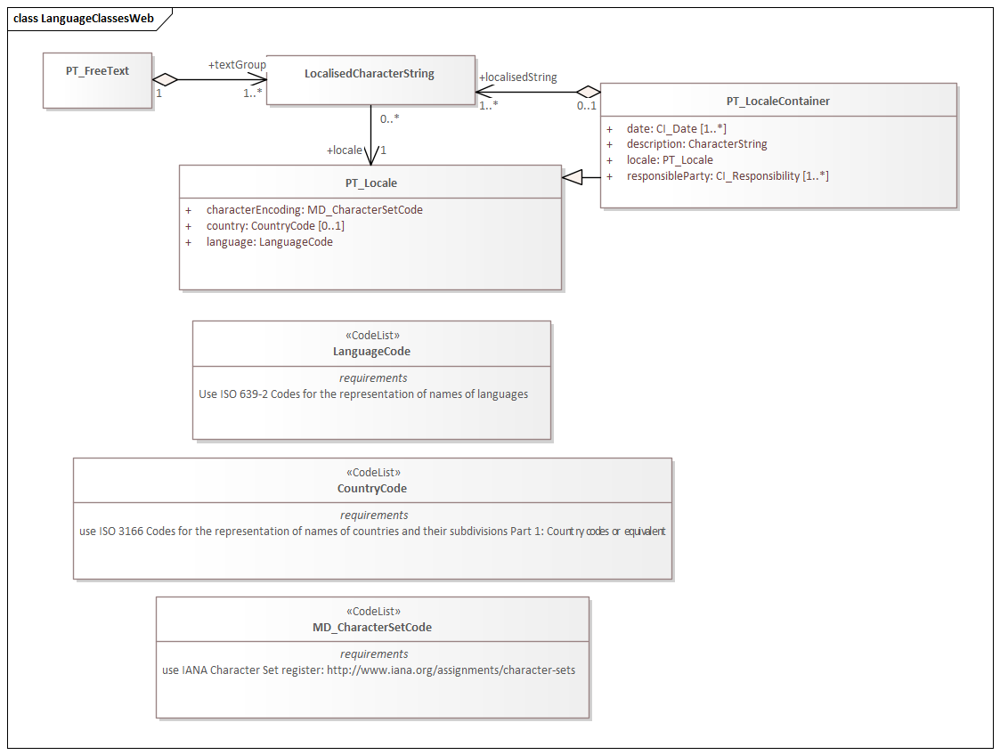

= Language localization (LAN)
:edition: 1.3
:revdate: 2021-02-15

== Language localization (LAN) Version: 1.3

.Classes in the lan namespace

=== Description

LAN 1.3 is an XML Schema implementation derived from ISO 19115-1, Geographic
Information - Metadata - Part 1: Fundamentals, Clause 7.3. It includes elements for
cultural and linguistic adaptability. The XML schema was encoded using the rules
described in ISO/TS 19139:2007.

=== XML Namespace for lan 1.3

The namespace URI for lan 1.3 is `https://schemas.isotc211.org/19115/-1/lan/1.3.0`.

=== XML Schema for lan 1.3

https://schemas.isotc211.org/19115/-1/lan/1.3.0/lan.xsd[lan.xsd] is the XML Schema document to
be referenced by XML documents containing XML elements in the lan 1.3 namespace or by
XML Schema documents importing the lan 1.3 namespace. This XML schema includes
(indirectly) all the implemented concepts of the lan namespace, but it does not
contain the declaration of any types.

=== Related XML Schema for lan 1.3

https://schemas.isotc211.org/19115/-1/lan/1.3.0/language.xsd[language.xsd] implements the UML
conceptual schema defined in ISO 19115-1, Geographic Information - Metadata - Part 1:
Fundamentals, Clause 7.3. It was created using the encoding rules defined in ISO
19118, ISO 19139.

https://schemas.isotc211.org/19115/-1/lan/1.3.0/language.xsd contains the following classes:

* PT_FreeText
* LocalisedCharacterString
* LocalisedCharacterString
* LocalisedCharacterString
* PT_Locale
* PT_LocaleContainer
* CountryCode
* LanguageCode
* MD_CharacterSetCode

=== Related XML Namespaces for lan 1.3

The lan 1.3 namespace imports these other namespaces:

[%unnumbered]
[options=header,cols=4]
|===
| Name | Standard Prefix | Namespace Location | Schema Location

| Citation and responsible party information Citation and responsible party
information | cit |
`https://schemas.isotc211.org/19115/-1/cit/1.3.0` | https://schemas.isotc211.org/19115/-1/cit/1.3.0/cit.xsd[cit.xsd]
| Geographic Common Objects | gco |
`https://schemas.isotc211.org/19103/-/gco/1.2.0` | https://schemas.isotc211.org/19103/-/gco/1.2/gco.xsd[gco.xsd]
|===

=== Working Versions

When revisions to these schema become necessary, they will be managed in the
https://github.com/ISO-TC211/XML[ISO TC211 Git Repository].
