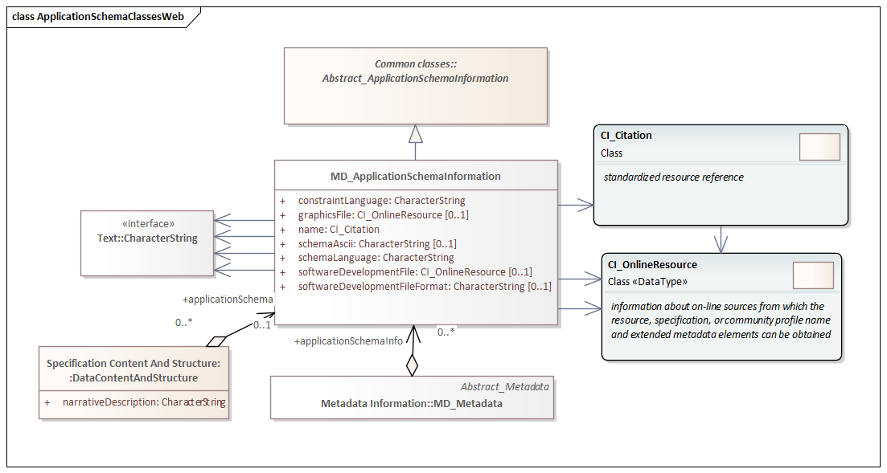

= Metadata for Application Schema (MAS)
:edition: 1.3
:revdate: 2021-02-15

== Metadata for Application Schema (MAS) Version: 1.3

.Classes in the mas namespace

=== Description

MAS 1.3 is an XML Schema implementation derived from ISO 19115-1, Geographic
Information - Metadata - Part 1: Fundamentals, Clause 6.5.13. It includes elements
for referencing Application Schema. The XML schema was encoded using the rules
described in ISO/TS 19139:2007.

=== XML Namespace for mas 1.3

The namespace URI for mas 1.3 is `https://schemas.isotc211.org/19115/-1/mas/1.3.0`.

=== XML Schema for mas 1.3

https://schemas.isotc211.org/19115/-1/mas/1.3.0/mas.xsd[mas.xsd] is the XML Schema document to
be referenced by XML documents containing XML elements in the mas 1.3 namespace or by
XML Schema documents importing the mas 1.3 namespace. This XML schema includes
(indirectly) all the implemented concepts of the mas namespace, but it does not
contain the declaration of any types.

=== Related XML Schema for mas 1.3

https://schemas.isotc211.org/19115/-1/mas/1.3.0/applicationSchema.xsd[applicationSchema.xsd]
implements the UML conceptual schema defined in ISO 19115-1, Geographic Information -
Metadata - Part 1: Fundamentals, Clause 6.5.13. It was created using the encoding
rules defined in ISO 19118, ISO 19139.

https://schemas.isotc211.org/19115/-1/mas/1.3.0/applicationSchema.xsd contains the following classes:

* MD_ApplicationSchemaInformation

=== Related XML Namespaces for mas 1.3

The mas 1.3 namespace imports these other namespaces:

[%unnumbered]
[options=header,cols=4]
|===
| Name | Standard Prefix | Namespace Location | Schema Location

| Citation and responsible party information Citation and responsible party
information | cit |
`https://schemas.isotc211.org/19115/-1/cit/1.3.0` | https://schemas.isotc211.org/19115/-1/cit/1.3.0/cit.xsd[cit.xsd]
| Geographic COmmon | gco |
`https://schemas.isotc211.org/19103/-/gco/1.2.0` | https://schemas.isotc211.org/19103/-/gco/1.2/gco.xsd[gco.xsd]
| Metadata Common Classes | mcc |
`https://schemas.isotc211.org/19115/-1/mcc/1.3.0` | https://schemas.isotc211.org/19115/-1/mcc/1.3.0/mcc.xsd[mcc.xsd]
|===

=== Working Versions

When revisions to these schema become necessary, they will be managed in the
https://github.com/ISO-TC211/XML[ISO TC211 Git Repository].
