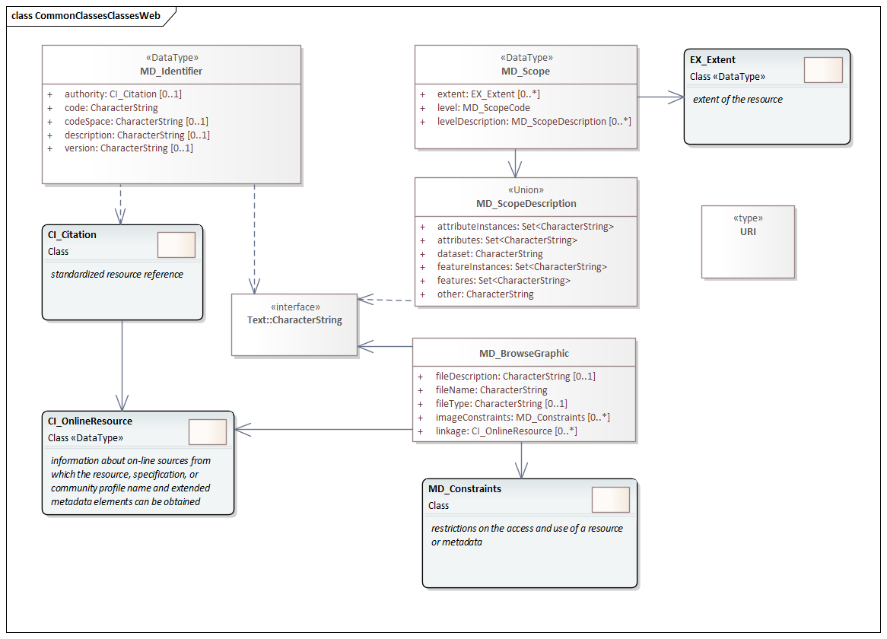

= Metadata Common Classes (MCC)
:edition: 1.3
:revdate: 2021-02-15

== Metadata Common Classes (MCC) Version: 1.3

.Non-abstract classes in the mcc namespace

.Code list(s) in the mcc namespace
image::CommonCodelist.png[UML diagram of Metadata Common Classes codelists in the mcc namespace,300]

.Abstract classes in the mcc namespace

=== Description

MCC 1.3 is an XML Schema implementation derived from ISO 19115-1, Geographic
Information - Metadata - Part 1: Fundamentals, Clause 6.6.4. It includes abstract
classes shared by multiple namespaces and is required in order to enable
modularization of the XML implementation. The XML schema was encoded using the rules
described in ISO/TS 19139:2007.

=== XML Namespace for mcc 1.3

The namespace URI for mcc 1.3 is `https://schemas.isotc211.org/19115/-1/mcc/1.3.0`.

=== XML Schema for mcc 1.3

https://schemas.isotc211.org/19115/-1/mcc/1.3.0/mcc.xsd[mcc.xsd] is the XML Schema document to
be referenced by XML documents containing XML elements in the mcc 1.3 namespace or by
XML Schema documents importing the mcc 1.3 namespace. This XML schema includes
(indirectly) all the implemented concepts of the mcc namespace, but it does not
contain the declaration of any types.

=== Related XML Schema for mcc 1.3

https://schemas.isotc211.org/19115/-1/mcc/1.3.0/commonClasses.xsd[commonClasses.xsd] implements
the UML conceptual schema defined in ISO 19115-1, Geographic Information - Metadata -
Part 1: Fundamentals, Clause 6.6.4. It was created using the encoding rules defined
in ISO 19118, ISO 19139.

https://schemas.isotc211.org/19115/-1/mcc/1.3.0/commonClasses.xsd contains the following classes:

* MD_Scope
* MD_ScopeDescription
* MD_Identifier
* MD_BrowseGraphic

https://schemas.isotc211.org/19115/-1/mcc/1.3.0/commonClasses.xsd contains references to the following code lists:

* MD_ProgressCode
* MD_ScopeCode
* MD_SpatialRepresentationTypeCode

https://schemas.isotc211.org/19115/-1/mcc/1.3.0/AbstractCommonClasses.xsd[AbstractCommonClasses.xsd]
implements the UML conceptual schema defined in ISO 19115-1, Geographic Information -
Metadata - Part 1: Fundamentals, Clause 6.6.4. It was created using the encoding
rules defined in ISO 19118, ISO 19139.

https://schemas.isotc211.org/19115/-1/mcc/1.3.0/AbstractCommonClasses.xsd contains the following classes:

* Abstract_AcquisitionInformation
* Abstract_ApplicationSchemaInformation
* Abstract_Citation
* Abstract_Constraints
* Abstract_ContentInformation
* Abstract_Distribution
* Abstract_Extent
* Abstract_Format
* Abstract_LineageInformation
* Abstract_MaintenanceInformation
* Abstract_Metadata
* Abstract_MetadataExtension
* Abstract_OnlineResource
* Abstract_Platform
* Abstract_PortrayalCatalogueInformation
* Abstract_ReferenceSystem
* Abstract_ResourceDescription
* Abstract_Responsibility
* Abstract_SpatialRepresentation
* Abstract_SpatialResolution
* Abstract_StandardOrderProcess
* Abstract_TypedDate
* Abstract_Parameter

=== Related XML Namespaces for mcc 1.3

The mcc 1.3 namespace imports these other namespaces:

[%unnumbered]
[options=header,cols=4]
|===
| Name | Standard Prefix | Namespace Location | Schema Location

| Geographic Common Objects | gco |
`https://schemas.isotc211.org/19103/-/gco/1.2.0` | https://schemas.isotc211.org/19103/-/gco/1.2/gco.xsd[gco.xsd]
|===

=== Working Versions

When revisions to these schema become necessary, they will be managed in the
https://github.com/ISO-TC211/XML[ISO TC211 Git Repository].
