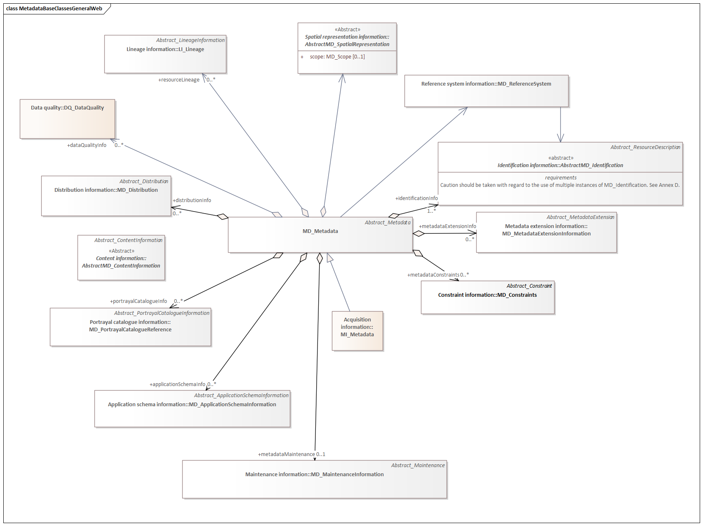
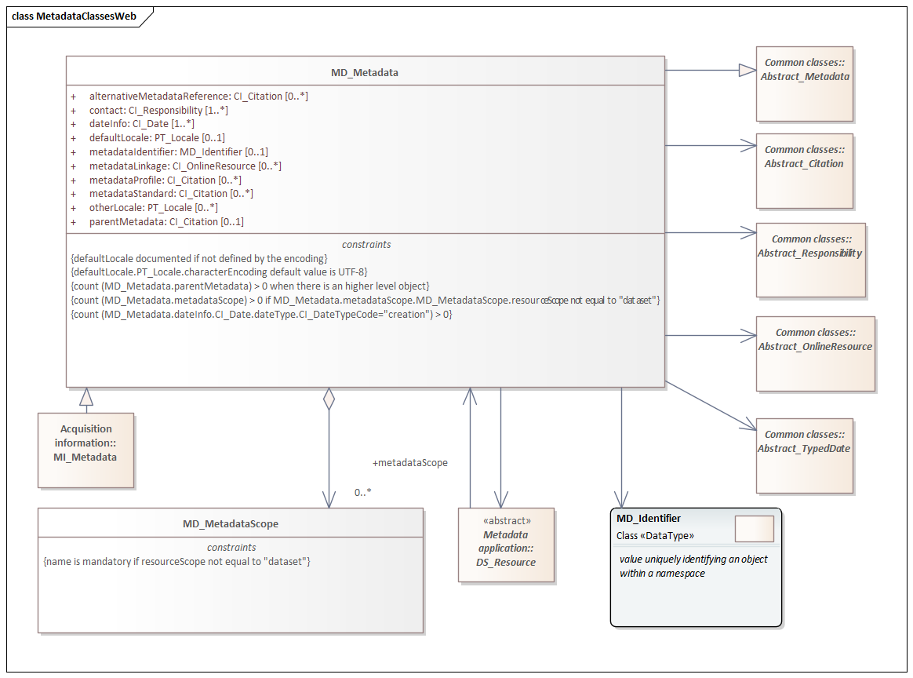

= Metadata Base (MDB)
:edition: 1.3
:revdate: 2021-02-15

== Metadata Base (MDB) Version: 1.3

.Overview of the MD_Metadata class and linked classes

.Specifics of the MD_Metadata class and its associated classes

=== Description

MDB 1.3 is an XML Schema implementation derived from ISO 19115-1, Geographic
Information - Metadata - Part 1: Fundamentals, Clause 6.5.2. It includes mandatory
elements for describing resources that are not services. The XML schema was encoded
using the rules described in ISO/TS 19139:2007.

=== XML Namespace for mdb 1.3

The namespace URI for mdb 1.3 is `https://schemas.isotc211.org/19115/-1/mdb/1.3`.

=== XML Schema for mdb 1.3

https://schemas.isotc211.org/19115/-1/mdb/1.3.0/mdb.xsd[mdb.xsd] is the XML Schema document to
be referenced by XML documents containing XML elements in the mdb 1.3 namespace or by
XML Schema documents importing the mdb 1.3 namespace. This XML schema includes
(indirectly) all the implemented concepts of the mdb namespace, but it does not
contain the declaration of any types.

=== Related XML Schema for mdb 1.3

https://schemas.isotc211.org/19115/-1/mdb/1.3.0/metadataBase.xsd[metadataBase.xsd] implements
the UML conceptual schema defined in ISO 19115-1, Geographic Information - Metadata -
Part 1: Fundamentals, Clause 6.5.2. It was created using the encoding rules defined
in ISO 19118, ISO 19139.

https://schemas.isotc211.org/19115/-1/mdb/1.3.0/metadataBase.xsd contains the folowing classes:

* MD_Metadata
* MD_MetadataScope

=== Related XML Namespaces for mdb 1.3

The mdb 1.3 namespace imports these other namespaces:

[%unnumbered]
[options=header,cols=4]
|===
| Name | Standard Prefix | Namespace Location | Schema Location

| Citation and responsible party information Citation and responsible party
information | cit |
`https://schemas.isotc211.org/19115/-1/cit/1.3.0` | https://schemas.isotc211.org/19115/-1/cit/1.3.0/cit.xsd[cit.xsd]
| Data Quality Common Classes | dqc |
`https://schemas.isotc211.org/19157/-2/dqc/1.3.0` | https://schemas.isotc211.org/19157/-2/dqc/1.3.0/dqc.xsd[dqc.xsd]
| Geographic Common Objects | gco |
`https://schemas.isotc211.org/19103/-/gco/1.2.0` | https://schemas.isotc211.org/19103/-/gco/1.2/gco.xsd[gco.xsd]
| Geospatial EXtent | gex |
`https://schemas.isotc211.org/19115/-1/gex/1.3.0` | https://schemas.isotc211.org/19115/-1/gex/1.3.0/gex.xsd[gex.xsd]
| Language localization | lan |
`https://schemas.isotc211.org/19115/-1/lan/1.3.0` | https://schemas.isotc211.org/19115/-1/lan/1.3.0/lan.xsd[lan.xsd]
| Metadata Common Classes | mcc |
`https://schemas.isotc211.org/19115/-1/mcc/1.3.0` | https://schemas.isotc211.org/19115/-1/mcc/1.3.0/mcc.xsd[mcc.xsd]
| Metadata COnstraints | mco |
`https://schemas.isotc211.org/19115/-1/mco/1.3.0` | https://schemas.isotc211.org/19115/-1/mco/1.3.0/mco.xsd[mco.xsd]
| Metadata for Resource Identification | mri |
`https://schemas.isotc211.org/19115/-1/mri/1.3.0` | https://schemas.isotc211.org/19115/-1/mri/1.3.0/mri.xsd[mri.xsd]
| Metadata Spatial Representation | msr |
`https://schemas.isotc211.org/19115/-1/msr/1.3.0` | https://schemas.isotc211.org/19115/-1/msr/1.3.0/msr.xsd[msr.xsd]
| Metadata Reference System | mrs |
`https://schemas.isotc211.org/19115/-1/mrs/1.3.0` | https://schemas.isotc211.org/19115/-1/mrs/1.3.0/mrs.xsd[mrs.xsd]
| Metadata EXtension information | mex |
`https://schemas.isotc211.org/19115/-1/mex/1.3.0` | https://schemas.isotc211.org/19115/-1/mex/1.3.0/mex.xsd[mex.xsd]
| Metadata Resource Content | mrc |
`https://schemas.isotc211.org/19115/-1/mrc/1.3.0` | https://schemas.isotc211.org/19115/-1/mrc/1.3.0/mrc.xsd[mrc.xsd]
| Metadata Resource Distribution | mrc |
`https://schemas.isotc211.org/19115/-1/mrd/1.3.0` | https://schemas.isotc211.org/19115/-1/mrd/1.3.0/mrd.xsd[mrd.xsd]
| Metadata Application Schemas | mas |
`https://schemas.isotc211.org/19115/-1/mas/1.3.0` | https://schemas.isotc211.org/19115/-1/mas/1.3.0/mas.xsd[mas.xsd]
| Metadata Maintenance Information | mmi |
`https://schemas.isotc211.org/19115/-1/mmi/1.3.0` | https://schemas.isotc211.org/19115/-1/mmi/1.3.0/mmi.xsd[mmi.xsd]
| Metadata Resource Lineage | mrl |
`https://schemas.isotc211.org/19115/-1/mrl/1.3.0` | https://schemas.isotc211.org/19115/-1/mrl/1.3.0/mrl.xsd[mrl.xsd]
| Metadata ACquisition | mac |
`https://schemas.isotc211.org/19115/-2/mpc/2.2.0` | https://schemas.isotc211.org/19115/-2/mac/2.2.0/mac.xsd[mac.xsd]
|===

=== Schematron Validation Rules for mdb 1.3

Schematron rules for validating instance documents required for a complete validation are:

[%unnumbered]
[options=header,cols=4]
|===
| Package name | File name | Location | Constraint tested

| MetaData Base | mdb.sch |
https://schemas.isotc211.org/19115/-1/mdb/1.3.0/mdb.sch a|
* MD_Metadata - defaultLocale documented if not defined by the encoding
* MD_Metadata - defaultLocale.PT_Locale.characterEncoding default value is UTF-8
* MD_Metadata - count(MD_Metadata.parentMetadata) \> 0 when there is an higher level
object (testing not viable)
* MD_Metadata - count(MD_Metadata.m etadataScope) \> 0 if
MD_Metadata.metadataScope.MD_MetadataScope.resourceScope not equal to "dataset"
* MD_Metadata -
count(MD_Metadata.dateInfo.CI_Date.dateType.CI_DateTypeCode="creation") \> 0
* MD_MetadataScope - name is mandatory if resourceScope not equal to "dataset"
| CITation and responsibility | cit.sch |
https://schemas.isotc211.org/19115/-1/cit/1.3.0/cit.sch a|
* CI_Individual - count(name + positionName) \> 0
* CI_organisation - count(name + logo) \> 0
| Metadata Resource Identification | mri.sch |
https://schemas.isotc211.org/19115/-1/mri/1.3.0/mri.sch a|
* MD_MetadataScope/MD_Identification -
MD_Metadata.metadataScope.MD_MetadataScope.resourceScope)='dataset' implies
count(extent.geographicElement.EX_GeographicBoundingBox + extent.geographicElement.EX_GeographicDescription) \>= 1
* MD_MetadataScope/MD_Identification -
MD_Metadata.metadataScope.MD_Scope.resourceScope) = ('dataset' or 'series') implies
topicCategory is mandatory
* MD_DataIdentification - defaultLocale documented if resource includes textual
information (test attempt only)
* MD_DataIdentification - defaultLocale.PT_Locale.characterEncoding default value is
UTF-8
* MD_AssociatedResource - count(name + metadataReference
* MD_Keywords/[SV_ServiceIdentification] - When the resource described is a service,
one instance of MD_Keyword shall refer to the service taxonomy defined in ISO 19119
| Geographic EXtent | gex.sch |
https://schemas.isotc211.org/19115/-1/gex/1.3.0/gex.sch a|
* EX_Extent - count (description + geographicElement + temporalElement + verticalElement) \>0
| Metadata for ACquisition | mac.sch |
https://schemas.isotc211.org/19115/-1/mac/2.2.0/mac.sch a|
* MI_Operation - count(otherProperty) = count(otherPropertyType)
* MI_Platform - count(otherProperty) = count(otherPropertyType)
* MI_Instrument - count(otherProperty) = count(otherPropertyType)
|===

Other schematron rule sets that maybe required for a complete validation (optional
direct from MD_Metadata or indirectly through associations) are:

* Metadata EXtension
https://schemas.isotc211.org/19115/-1/mex/1.3.0/mex.sch[mex.sch]
* Metadata for Resource Lineage
https://schemas.isotc211.org/19115/-1//mrl/1.3.0/mrl.sch[mrl.sch]
* Metadata for Maintenance Information
https://schemas.isotc211.org/19115/-1/mmi/1.3.0/mmi.sch[mmi.sch]
* Metadata for Resource Content
https://schemas.isotc211.org/19115/-1/mrc/1.3.0/mrc.sch[mrc.sch]
* Metadata for Resource Distribution
https://schemas.isotc211.org/19115/-1/mrd/1.3.0/mrd.sch[mrd.sch]
* Metadata for Reference Systems
https://schemas.isotc211.org/19115/-1/mrs/1.3.0/mrs.sch[mrs.sch]
* metadata for SeRVice identification
https://schemas.isotc211.org/19115/-1/srv/1.3.0/srv.sch[srv.sch]
* Metadata for ACquisition information
https://schemas.isotc211.org/19115/-2/mac/2.2.0/mac.sch[mac.sch]
* Metadata for Resource Lineage extension
https://schemas.isotc211.org/19115/-2/mrl/2.2.0/mrlExt.sch[mrlExt.sch]
* Metadata for Data Quality
https://schemas.isotc211.org/19157/-/mdq/1.1.0/mdq.sch[mdq.sch]
* Data Quality Measurement
https://schemas.isotc211.org/19157/-/dqm/1.1.0/dqm.sch[dqm.sch]

=== Schematron Validation Rules for mdb 1.3

Schematron rules for validating instance documents of the mdb 1.3 namespace are in
https://schemas.isotc211.org/19115/-1/mdb/1.3.0/mdb.sch[mdb.sch].

=== Working Versions

When revisions to these schema become necessary, they will be managed in the
https://github.com/ISO-TC211/XML[ISO TC211 Git Repository].
