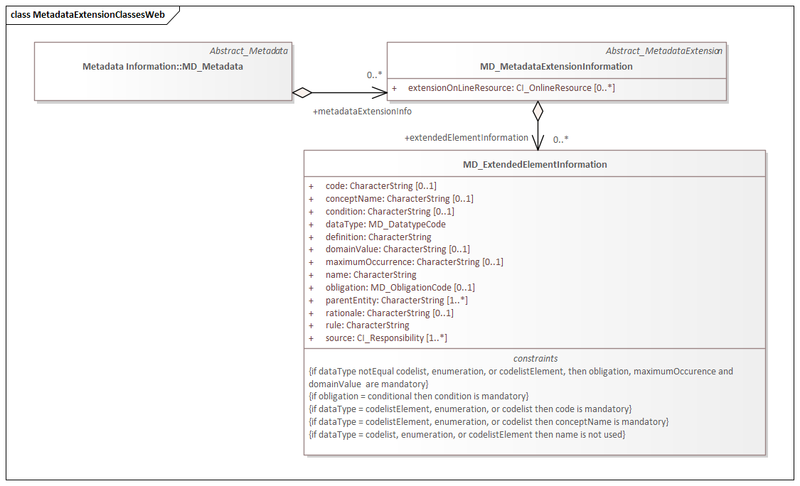
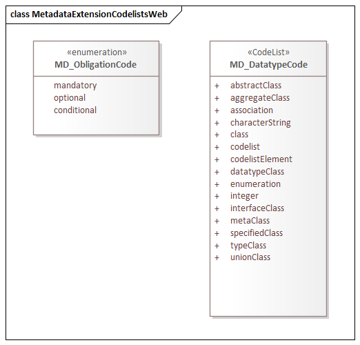

= Metadata with Schema Extensions (MEX)
:edition: 1.3
:revdate: 2021-02-16

== Metadata with Schema Extensions (MEX) Version: 1.3

.Classes in the mex namespace

.Code list(s) in the mex namespace

=== Description

MEX 1.3 is an XML Schema implementation derived from ISO 19115-1, Geographic
Information - Metadata - Part 1: Fundamentals, Clause 6.5.12. It includes elements
describing extensions to metadata standards. The XML schema was encoded using the
rules described in ISO/TS 19139:2007.

=== XML Namespace for mex 1.3

The namespace URI for mex 1.3 is `https://schemas.isotc211.org/19115/-1/mex/1.3`.

=== XML Schema for mex 1.3

https://schemas.isotc211.org/19115/-1/mex/1.3.0/mex.xsd[mex.xsd] is the XML Schema document to
be referenced by XML documents containing XML elements in the mex 1.3 namespace or by
XML Schema documents importing the mex 1.3 namespace. This XML schema includes
(indirectly) all the implemented concepts of the mex namespace, but it does not
contain the declaration of any types.

=== Related XML Schema for mex 1.3

https://schemas.isotc211.org/19115/-1/mex/1.3.0/metadataExtension.xsd[metadataExtension.xsd]
implements the UML conceptual schema defined in ISO 19115-1, Geographic Information -
Metadata - Part 1: Fundamentals, Clause 6.5.12. It was created using the encoding
rules defined in ISO 19118, ISO 19139ISO 19139.

https://schemas.isotc211.org/19115/-1/mex/1.3.0/metadataExtension.xsd contains the following classes:

* MD_MetadataExtensionInformation
* MD_ExtendedElementInformation

https://schemas.isotc211.org/19115/-1/mex/1.3.0/metadataExtension.xsd contains reference to the
following codelists:

* MD_DatatypeCode
* MD_ObligationCode

=== Related XML Namespaces for mex 1.3

The mex 1.3 namespace imports these other namespaces:

[%unnumbered]
[options=header,cols=4]
|===
| Name | Standard Prefix | Namespace Location | Schema Location

| Geographic Common Objects | gco |
`https://schemas.isotc211.org/19103/-/gco/1.2.0` | https://schemas.isotc211.org/19103/-/gco/1.2/gco.xsd[gco.xsd]
| Metadata Common Classes | mcc |
`https://schemas.isotc211.org/19115/-1/mcc/1.3.0` | https://schemas.isotc211.org/19115/-1/mcc/1.3.0/mcc.xsd[mcc.xsd]
| CITation and Responsibility | cit |
`https://schemas.isotc211.org/19115/-1/cit/1.3.0` | https://schemas.isotc211.org/19115/-1/cit/1.3.0/cit.xsd[cit.xsd]
|===

=== Schematron Validation Rules for mex 1.3

Schematron rules for validating instance documents required for a complete validation
are:

[%unnumbered]
[options=header,cols=4]
|===
| Package name | File name | Location | Constraint tested

| Metadata EXtension | mex.sch |
https://schemas.isotc211.org/19115/-1/mex/1.3.0/mex.sch a|
* MD_ExtendedElementInformation - if dataType notEqual codelist, enumeration, or
codelistElement, then obligation, max imumOccurence and domainValue are mandatory
* MD_ExtendedElementInformation - if obligation = conditional then condition is
mandatory
* MD_ExtendedElementInformation - if dataType = codelistElement, enumeration, or
codelist then code is mandatory
* MD_ExtendedElementInformation - if dataType = codelistElement, enumeration, or
codelist then conceptName is mandatory
* MD_ExtendedElementInformation - if dataType = codelist, enumeration, or
codelistElement then name is not used
| CITation and responsibility | cit.sch |
https://schemas.isotc211.org/19115/-1/cit/1.3.0/cit.sch a|
* CI_Individual - count(name + positionName) \> 0
* CI_organisation - count(name + logo) \> 0
|===

=== Schematron Validation Rules for mex 1.3

Schematron rules for validating instance documents of the mex 1.3 namespace are in
https://schemas.isotc211.org/19115/-1/mex/1.3.0/mex.sch[mex.sch]. Other schematron
rule sets that are

=== Working Versions

When revisions to these schema become necessary, they will be managed in the
https://github.com/ISO-TC211/XML[ISO TC211 Git Repository].
