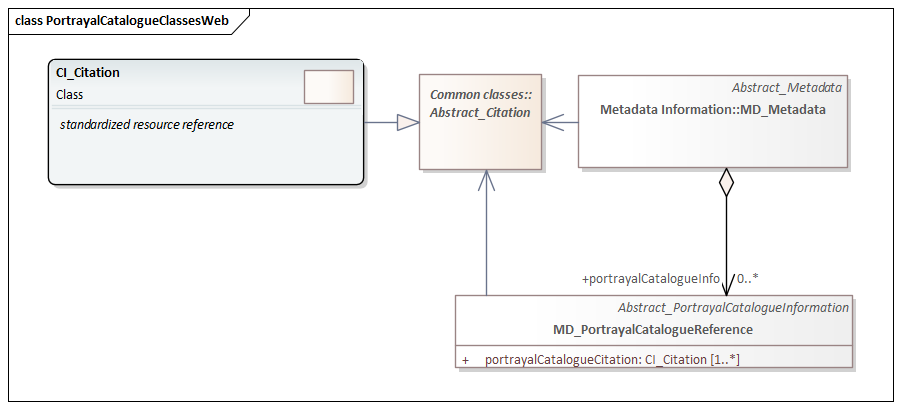

= Metadata for Portrayal Catalog (MPC)
:edition: 1.3
:revdate: 2021-02-16

== Metadata for Portrayal Catalog (MPC) Version: 1.3

.Classes in the mpc namespace

=== Description

MPC 1.3 is an XML Schema implementation derived from ISO 19115-1, Geographic
Information - Metadata - Part 1: Fundamentals, Clause 6.5.10. It includes elements
for referencing portrayal catalogs. The XML schema was encoded using the rules
described in ISO/TS 19139:2007.

=== XML Namespace for mpc 1.3

The namespace URI for mpc 1.3 is `https://schemas.isotc211.org/19115/-1/mpc/1.3`.

=== XML Schema for mpc 1.3

https://schemas.isotc211.org/19115/-1/mpc/1.3.0/mpc.xsd[mpc.xsd] is the XML Schema document to
be referenced by XML documents containing XML elements in the mpc 1.3 namespace or by
XML Schema documents importing the mpc 1.3 namespace. This XML schema includes
(indirectly) all the implemented concepts of the mpc namespace, but it does not
contain the declaration of any types.

=== Related XML Schema for mpc 1.3

https://schemas.isotc211.org/19115/-1/mpc/1.3.0/portrayalCatalogue.xsd[portrayalCatalogue.xsd]
implements the UML conceptual schema defined in ISO 19115-1, Geographic Information -
Metadata - Part 1: Fundamentals, Clause 6.5.10. It was created using the encoding
rules defined in ISO 19118, ISO 19139.

https://schemas.isotc211.org/19115/-1/mpc/1.3.0/portrayalCatalogue.xsd contains the folowing class:

* MD_PortrayalCatalogueReference

=== Related XML Namespaces for mpc 1.3

The mpc 1.3 namespace imports these other namespaces:

[%unnumbered]
[options=header,cols=4]
|===
| Name | Standard Prefix | Namespace Location | Schema Location

| Geographic Common Objects | gco |
`https://schemas.isotc211.org/19103/-/gco/1.2.0` | https://schemas.isotc211.org/19103/-/gco/1.2/gco.xsd[gco.xsd]
| Metadata Common Classes | mcc |
`https://schemas.isotc211.org/19115/-1/mcc/1.3.0` | https://schemas.isotc211.org/19115/-1/mcc/1.3.0/mcc.xsd[mcc.xsd]
| CITation and Responsibility | cit |
`https://schemas.isotc211.org/19115/-1/cit/1.3.0` | https://schemas.isotc211.org/19115/-1/cit/1.3.0/cit.xsd[cit.xsd]
|===

=== Working Versions

When revisions to these schema become necessary, they will be managed in the
https://github.com/ISO-TC211/XML[ISO TC211 Git Repository].
