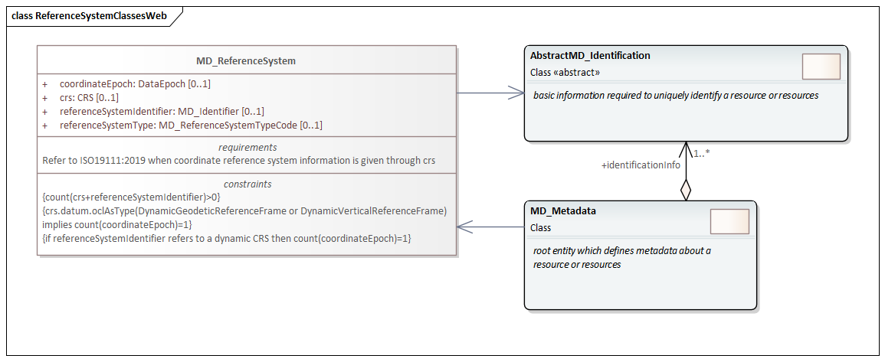
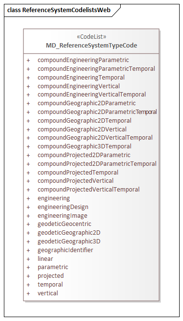

= Metadata for Reference System (MRS)
:edition: 1.3
:revdate: 2021-02-16

== Metadata for Reference System (MRS) Version: 1.3

.Classes in the mrs namespace

.Code list(s) in the mrs namespace

=== Description
ISO
MRS 1.3 is an XML Schema implementation derived from ISO ISO 19115-1, Geographic
Information - Metadata - Part 1: Fundamentals, Clause 6.5.8. It includes elements for
describing Reference Systems. The XML schema was encoded using the rules described in
ISO/TS 19139:2007.

=== XML Namespace for mrs 1.3

The namespace URI for mrs 1.3 is `https://schemas.isotc211.org/19115/-1/mrs/1.3`.

=== XML Schema for mrs 1.3

https://schemas.isotc211.org/19115/-1/mrs/1.3.0/mrs.xsd[mrs.xsd] is the XML Schema document to
be referenced by XML documents containing XML elements in the mrs 1.3 namespace or by
XML Schema documents importing the mrs 1.3 namespace. This XML schema includes
(indirectly) all the implemented concepts of the mrs namespace, but it does not
contain the declaration of any types.

=== Related XML Schema for mrs 1.3

https://schemas.isotc211.org/19115/-1/mrs/1.3.0/referenceSystem.xsd[referenceSystem.xsd]
implements the UML conceptual schema defined in ISO 19115-1, Geographic Information -
Metadata - Part 1: Fundamentals, Clause 6.5.8. It was created using the encoding
rules defined in ISO 19118, ISO 19139.

https://schemas.isotc211.org/19115/-1/mrs/1.3.0/referenceSystem.xsd contains the following class:

* MD_ReferenceSystem
* MD_ReferenceSystemTypeCode

https://schemas.isotc211.org/19115/-1/mrs/1.3.0/referenceSystem.xsd contains reference to the following codelist:

* MD_ReferenceSystemTypeCode

=== Related XML Namespaces for mrs 1.3

The mrs 1.3 namespace imports these other namespaces:

[%unnumbered]
[options=header,cols=4]
|===
| Name | Standard Prefix | Namespace Location | Schema Location

| Geographic Common Objects | gco |
`https://schemas.isotc211.org/19103/-/gco/1.2.0` | https://schemas.isotc211.org/19103/-/gco/1.2/gco.xsd[gco.xsd]
| Metadata Common Classes | mcc |
`https://schemas.isotc211.org/19115/-1/mcc/1.3.0` | https://schemas.isotc211.org/19115/-1/mcc/1.3.0/mcc.xsd[mcc.xsd]
| Referencing By Coordinates | mcc |
https://schemas.isotc211.org/19111/-/rbc/3.1.0/rbc.xsd | https://schemas.isotc211.org/19111/-/rbc/3.1.0/rbc.xsd[rbc.xsd]
|===

=== Schematron Validation Rules for mrs 1.3

Schematron rules for validating instance documents of the mrs 1.3 namespace are in
https://schemas.isotc211.org/19115/-1/mrs/1.3.0/mrs.sch[mrs.sch].
