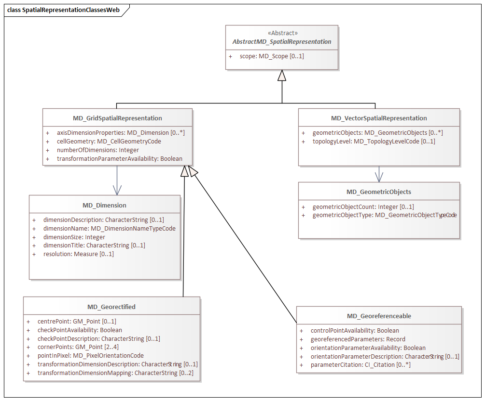
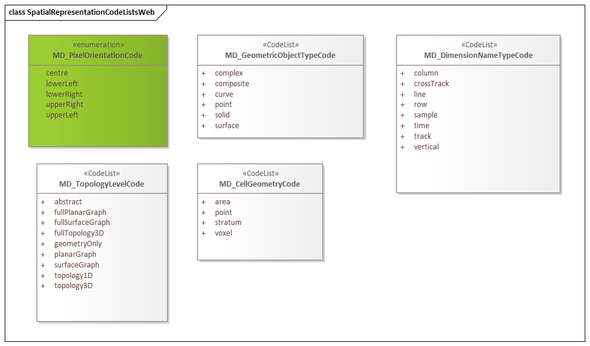

= Metadata for Spatial Representation (MSR)
:edition: 1.3
:revdate: 2019-01-04

== Metadata for Spatial Representation (MSR) Version: 1.3

.Classes in the msr namespace

.Code list(s) in the msr namespace

=== Description

MSR 1.3 is an XML Schema implementation derived from ISO 19115-1, Geographic
Information - Metadata - Part 1: Fundamentals AMENDMENT 1, Clause 6.5.7. It includes
elements for describing spatial representations of resources. The XML schema was
encoded using the rules described in ISO/TS 19139:2007.

=== XML Namespace for msr 1.3

The namespace URI for msr 1.3 is `https://schemas.isotc211.org/19115/-1/msr/1.3`.

=== XML Schema for msr 1.3

https://schemas.isotc211.org/19115/-1/msr/1.3.0/msr.xsd[msr.xsd] is the XML Schema document to
be referenced by XML documents containing XML elements in the msr 1.3 namespace or by
XML Schema documents importing the msr 1.3 namespace. This XML schema includes
(indirectly) all the implemented concepts of the msr namespace, but it does not
contain the declaration of any types.

=== Related XML Schema for msr 1.3

https://schemas.isotc211.org/19115/-1/msr/1.3.0/spatialRepresentation.xsd[spatialRepresentation.xsd]
implements the UML conceptual schema defined in ISO 19115-1, Geographic Information -
Metadata - Part 1: Fundamentals AMENDMENT 1, Clause 6.5.7. It was created using the
encoding rules defined in ISO 19118, ISO 19139.

https://schemas.isotc211.org/19115/-1/msr/1.3.0/spatialRepresentation.xsd contains the following
classes:

* AbstractMD_SpatialRepresentation
* MD_GridSpatialRepresentation
* MD_Georectified
* MD_Georeferenceable
* MD_VectorSpatialRepresentation
* MD_Dimension
* MD_GeometricObjects

https://schemas.isotc211.org/19115/-1/msr/1.3.0/spatialRepresentation.xsd
contains references to the following codelists:

* MD_DimensionNameTypeCode
* MD_CellGeometryCode
* MD_GeometricObjectTypeCode
* MD_PixelOrientationCode
* MD_TopologyLevelCode

https://schemas.isotc211.org/19115/-2/msr/2.2.0/spatialRepresentationImagery.xsd[spatialRepresentationImagery.xsd]
implements the UML conceptual schema defined in ISO 19115-2, Geographic Information -
Metadata - Part 2: Extensions for acquisition and processing, Clause 6.5.7. It was
created using the encoding rules defined in ISO 19118, ISO 19139.

https://schemas.isotc211.org/19115/-2/msr/2.2.0/spatialRepresentationImagery.xsd contains
the following classes:

* MI_Georectified
* MI_Georeferenceable
* AbstractMI_GeolocationInformation
* MI_GCPCollection
* MI_GCP

=== Related XML Namespaces for msr 1.3

The msr 1.3 namespace imports these other namespaces:

[%unnumbered]
[options=header,cols=4]
|===
| Name | Standard Prefix | Namespace Location | Schema Location

| Data Quality Common Classes | dqc |
`https://schemas.isotc211.org/19157/-2/dqc/1.2.0` | https://schemas.isotc211.org/19157/-2/dqc/1.3.0/dqc.xsd[dqc.xsd]
| Geographic Common Objects | gco |
`https://schemas.isotc211.org/19103/-/gco/1.2.0` | https://schemas.isotc211.org/19103/-/gco/1.2/gco.xsd[gco.xsd]
| Geographic Markup Wrappers | gmw |
`https://schemas.isotc211.org/19163/-/gmw/1.1.0` | https://schemas.isotc211.org/19163/-/gmw/1.1/gmw.xsd[gmw.xsd]
| Metadata Common Classes | mcc |
`https://schemas.isotc211.org/19115/-1/mcc/1.3.0` | https://schemas.isotc211.org/19115/-1/mcc/1.3.0/mcc.xsd[mcc.xsd]
| CITation and Responsibility | cit |
`https://schemas.isotc211.org/19115/-1/cit/1.3.0` | https://schemas.isotc211.org/19115/-1/cit/1.3.0/cit.xsd[cit.xsd]
| Metadata for Reference Systems | mrs |
`https://schemas.isotc211.org/19115/-1/mrs/1.3.0` | https://schemas.isotc211.org/19115/-1/mrs/1.3.0/mrs.xsd[mrs.xsd]
| Geospatial MetaLanguage | gml |
http://schemas.opengis.net/gml/3.2.1/gml.xsd |
http://schemas.opengis.net/gml/3.2.1/gml.xsd
|===

=== Schematron Validation Rules for mrs 1.3

Schematron rules for validating instance documents of the mrs 1.3 namespace are in
https://schemas.isotc211.org/19115/-1/mrs/1.3.0/mrs.sch[mrs.sch].

=== Working Versions

When revisions to these schema become necessary, they will be managed in the
https://github.com/ISO-TC211/XML[ISO TC211 Git Repository].
