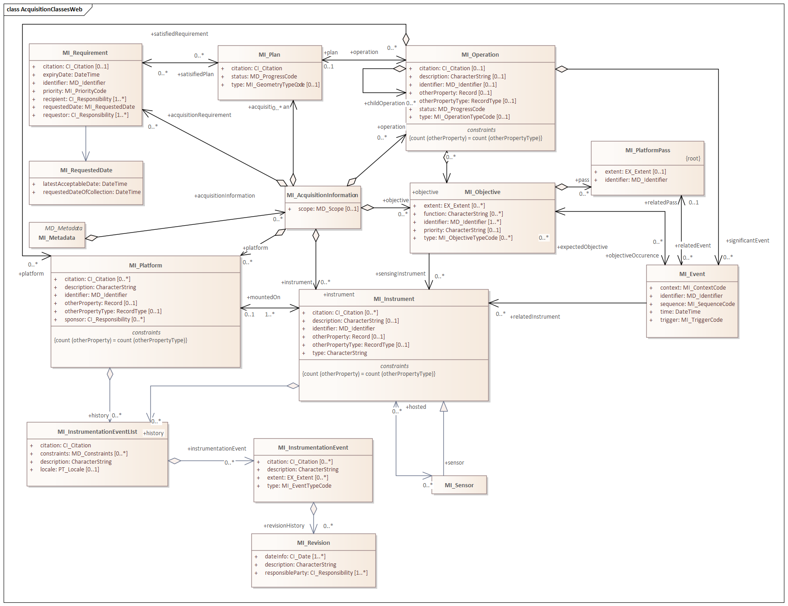

= Metadata for Acquisition (MAC)
:edition: 2.2
:revdate: 2021-02-16

== Metadata for Acquisition (MAC) Version: 2.2

.Classes in the mac namespace

.Codelists in the mac namespace
image::AcquisitionCodelist.png[UML diagram of Metadata for Acquisition codelists in the mac namespace,600]

=== Description

MAC 2.2 is an XML Schema implementation derived from ISO 19115-2, Geographic
Information - Metadata - Part 2: Extensions for acquisition and processing, Clause
6.3.2. It includes information related to acquisition platforms, instruments,
operations and other details. The XML schema was encoded using the rules described in
ISO/TS 19139:2007, Clause 8.

=== XML Namespace for mac 2.2

The namespace URI for mac 2.2 is `https://schemas.isotc211.org/19115/-2/mac/2.2`.

=== XML Schema for mac 2.2

link:mac.xsd[mac.xsd] is the XML Schema document to be referenced by XML documents
containing XML elements in the mac 2.2 namespace or by XML Schema documents importing
the mac 2.2 namespace. This XML schema includes (indirectly) all the implemented
concepts of the mac namespace, but it does not contain the declaration of any types.

=== Related XML Schema for mac 2.2

https://schemas.isotc211.org/19115/-2/mac/2.2.0/acquisitionInformationImagery.xsd[acquisitionInformationImagery.xsd]
implements the UML conceptual schema defined in ISO 19115-2, Geographic Information -
Metadata - Part 2: Extensions for acquisition and processing, Clause 6.3.2. It was
created using the encoding rules defined in ISO 19118, ISO 19139. Within
https://schemas.isotc211.org/19115/-2/mac/2.2.0/acquisitionInformationImagery.xsd[acquisitionInformationImagery.xsd]
the MI_Metadata class inherits attribute from MD_Metadata
(https://schemas.isotc211.org/19115/-1/mdb/1.3.0/[19115/-1/mdb/1.3]).

https://schemas.isotc211.org/19115/-2/mac/2.2.0/acquisitionInformationImagery.xsd[acquisitionInformationImagery.xsd]
contains the following classes:

* MI_Metadata
* MI_AcquisitionInformation
* MI_EnvironmentalRecord
* MI_Instrument
* MI_Sensor
* MI_Objective
* MI_Operation
* MI_Plan
* MI_Event
* MI_Platform
* MI_PlatformPass
* MI_RequestedDate
* MI_Requirement
* MI_InstrumentationEventList
* MI_InstrumentEvent
* MI_Revision

https://schemas.isotc211.org/19115/-2/mac/2.2.0/acquisitionInformationImagery.xsd
contains references to the following codelists:

* MI_EventTypeCode
* MI_ContextCode
* MI_GeometryTypeCode
* MI_ObjectiveTypeCode
* MI_OperationTypeCode
* MI_PriorityCode
* MI_SequenceCode
* MI_TriggerCode

=== Related XML Namespaces for mac 2.2

The mac 2.2 namespace imports these other namespaces:

[%unnumbered]
[options=header,cols=4]
|===
| Name | Standard Prefix | Namespace Location | Schema Location

| Geographic Common Objects | gco |
https://schemas.isotc211.org/19103/-/gco/1.2 | https://schemas.isotc211.org/191103/-/gco/1.2.0/gco.xsd[gco.xsd]
| Geographic Markup Wrappers | gmw |
https://schemas.isotc211.org/19163/-/gmw/1.1 | https://schemas.isotc211.org/19136/-/gmw/1.1.0/gmw.xsd[gmw.xsd]
| Geospatial MetaLanguage | gml |
http://schemas.opengis.net/gml/3.2.1/gml.xsd |
http://schemas.opengis.net/gml/3.2.1/gml.xsd
| Language localization | lan |
`https://schemas.isotc211.org/19115/-1/lan/1.3.0` | https://schemas.isotc211.org/19115/-1/lan/1.3.0/lan.xsd[lan.xsd]
| Metadata Common Classes | mcc |
`https://schemas.isotc211.org/19115/-1/mcc/1.3.0` | https://schemas.isotc211.org/19115/-1/mcc/1.3.0/mcc.xsd[mcc.xsd]
| Geographic Extent | gex |
`https://schemas.isotc211.org/19115/-1/gex/1.3.0` | https://schemas.isotc211.org/19115/-1/gex/1.3.0/gex.xsd[gex.xsd]
| CITation and Responsibility | cit |
`https://schemas.isotc211.org/19115/-1/cit/1.3.0` | https://schemas.isotc211.org/19115/-1/cit/1.3.0/cit.xsd[cit.xsd]
|===

=== Schematron Validation Rules for mdb 1.3

Schematron rules for validating instance documents required for a complete validation
are:

[%unnumbered]
[options=header,cols=4]
|===
| Package name | File name | Location | Constraint tested

| Metadata for ACquisition | mac.sch |
https://schemas.isotc211.org/19115/-1/mac/2.2.0/mac.sch a|
* MI_Operation - count(otherProperty) = count(otherPropertyType)
* MI_Platform - count(otherProperty) = count(otherPropertyType)
* MI_Instrument - count(otherProperty) = count(otherPropertyType)
| MetaData Base | mdb.sch |
https://schemas.isotc211.org/19115/-1/mdb/1.3.0/mdb.sch a|
* MD_Metadata - defaultLocale documented if not defined by the encoding
* MD_Metadata - defaultLocale.PT_Locale.characterEncoding default value is UTF-8
* MD_Metadata - count(MD_Metadata.parentMetadata) \> 0 when there is an higher level
object (testing not viable)
* MD_Metadata - count(MD_Metadata.m etadataScope) \> 0 if
MD_Metadata.metadataScope.MD_MetadataScope.resourceScope not equal to "dataset"
* MD_Metadata -
count(MD_Metadata.dateInfo.CI_Date.dateType.CI_DateTypeCode="creation") \> 0
* MD_MetadataScope - name is mandatory if resourceScope not equal to "dataset"
| Metadata for COnstraints | mco.sch |
https://schemas.isotc211.org/19115/-1/mco/1.3.0/mco.sch a|
* MD_Releasability - count(addressee + statement) \> 0
* MD_LegalConstraints - count of (accessConstraints + useConstraints + otherConstraints + useLimitation + releasability) \> 0
| CITation and responsibility | cit.sch |
https://schemas.isotc211.org/19115/-1/cit/1.3.0/cit.sch a|
* CI_Individual - count(name + positionName) \> 0
* CI_organisation - count(name + logo) \> 0
| Geographic EXtent | gex.sch |
https://schemas.isotc211.org/19115/-1/gex/1.3.0/gex.sch a|
* EX_Extent - count (description + geographicElement + temporalElement + verticalElement) \>0
|===

=== Working Versions

When revisions to these schema become necessary, they will be managed in the
https://github.com/ISO-TC211/XML[ISO TC211 Git Repository].
