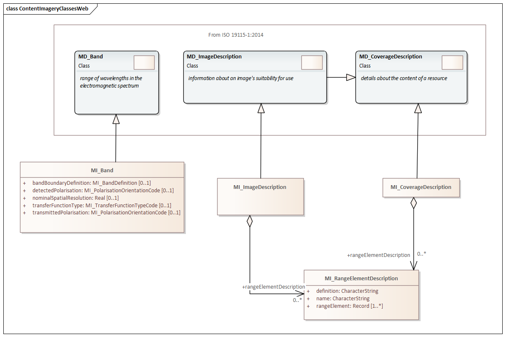
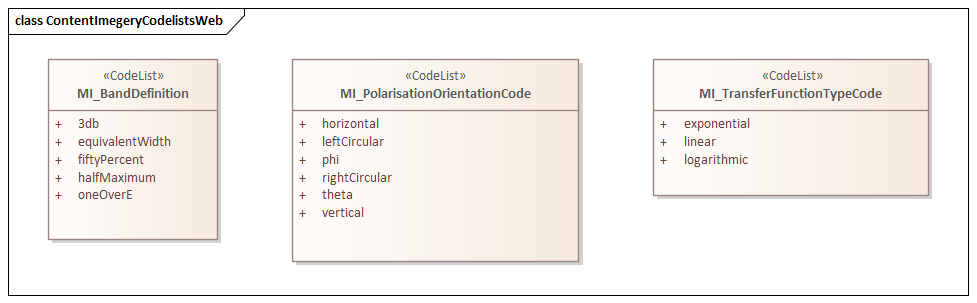

= Metadata for Resource Content (MRC) [Imagery]
:edition: 2.2
:revdate: 2021-02-17

== Metadata for Resource Content (MRC) [Imagery] Version: 2.2

.Classes in the mrc namespace

.Codelists in the mrc namespace

=== Description

MRC 2.2 is an XML Schema implementation derived from ISO 19115-2:2019 (Ed2),
Geographic Information - Metadata - Part 2: Extensions for acquisition and
processing, Clause 6.3.5. The MRC 2.2 schema is an extension of MRC 1.3 as defined in
ISO 19115-1, Geographic Information - Metadata - Part 1: Fundamentals. It includes
additional elements for describing resource structure and content mostly relating to
imagery. The XML schema was encoded using the rules described in ISO/TS 19139:2007.

=== XML Namespace for Metadata for Resource Content (MRC) [Imagery]

The namespace URI for mrc 1.3 is *https://schemas.isotc211.org/19115/-1/mrc/1.3
inherited from ISO 19115-1*.

=== XML Schema for mrc 1.3

https://schemas.isotc211.org/19115/-1/mrc/1.3.0/mrc.xsd
is the XML Schema document to be referenced by XML documents containing XML elements
in the mrc 1.3 namespace or by XML Schema documents importing the mrc 1.3 namespace.
The schema
https://schemas.isotc211.org/19115/-1/mrc/1.3.0/mrc.xsd
forms the basis the ISO 19115 Metadata Resource Content definitions from both ISO
19115-1 and ISO 19115-2. This XML schema includes (indirectly) all the implemented
concepts of the mrc namespace, but it does not contain the declaration of any types.

=== Related XML Schema for mrc 1.3

https://schemas.isotc211.org/19115/-1/mrc/1.3.0/content.xsd
implements the UML conceptual schema defined in ISO 19115-1, Geographic Information -
Metadata - Part 1: Fundamentals AMENDMENT 1, Clause 6.5.9. Details about
https://schemas.isotc211.org/19115/-1/mrc/1.3.0/content.xsd
can be accessed from
https://schemas.isotc211.org/19115/-1/mrc/1.3.0.

https://schemas.isotc211.org/19115/-2/mrc/2.2.0/contentInformationImagery.xsd[contentInformationImagery.xsd]
implements the UML conceptual schema defined in ISO 19115-2, Geographic Information -
Metadata - Part 2: Extensions for acquisition and processing, Clause 6.3.5.
https://schemas.isotc211.org/19115/-2/mrc/2.2.0/contentInformationImagery.xsd[contentInformationImagery.xsd]
MI_Band inherits attributes from ISO 19115-1:Content Information:MD_Band,
MI_ImageDescription inherits attributes from ISO 19115-1:Content
Information:MD_ImageDescription, and MI_CoverageDescription inherits attributes from
ISO 19115-1:Content Information:MD_CoverageDescription. It was created using the
encoding rules defined in ISO 19118, ISO 19139.

https://schemas.isotc211.org/19115/-2/mrc/2.2.0/contentInformationImagery.xsd contains the
following classes:

* MI_Band
* MI_CoverageDescription
* MI_ImageDescription
* MI_RangeElementDescription
* MI_BandDefinition

https://schemas.isotc211.org/19115/-2/mrc/2.2.0/contentInformationImagery.xsd contains references to the following codelists:

* MI_PolarisationOrientationCode
* MI_TransferFunctionTypeCode

https://schemas.isotc211.org/19115/-2/mrc/2.2.0/contentInformationImagery.xsd[contentInformationImagery.xsd]

=== Related XML Namespaces for

https://schemas.isotc211.org/19115/-2/mrc/2.2.0/contentInformationImagery.xsd[contentInformationImagery.xsd]
imports these other namespaces:

[%unnumbered]
[options=header,cols=4]
|===
| Name | Standard Prefix | Namespace Location | Schema Location

a| Geographic Common Objects +
in its own right and also by inheritance
| gco |
`https://schemas.isotc211.org/19103/-/gco/1.2.0` | https://schemas.isotc211.org/191103/-/gco/1.2.0/gco.xsd[gco.xsd]
a| Feature Catalog Common +
by inheritance
| fcc |
`https://schemas.isotc211.org/19110/-/fcc/2.2.0` | https://schemas.isotc211.org/19110/-/fcc/2.2.0/fcc.xsd[fcc.xsd]
a| Geographic Markup Wrappers +
by inheritance
| gmw |
`https://schemas.isotc211.org/19163/-/gmw/1.1.0` | https://schemas.isotc211.org/19136/-/gmw/1.1.0/gmw.xsd[gmw.xsd]
a| Geospatial MetaLanguage +
by inheritance
| gml |
http://schemas.opengis.net/gml/3.2.1/gml.xsd |
http://schemas.opengis.net/gml/3.2.1/gml.xsd
a| Language localization +
by inheritance
| lan |
`https://schemas.isotc211.org/19115/-1/lan/1.3.0` | https://schemas.isotc211.org/19115/-1/lan/1.3.0/lan.xsd[lan.xsd]
a| Metadata for Acquisition Metadata for Acquisition +
by inheritance
| mac |
`https://schemas.isotc211.org/19115/-2/mac/2.2.0` | https://schemas.isotc211.org/19115/-2/mac/2.2/mac.xsd[mac.xsd]
a| Metadata Common Classes +
by inheritance
| mcc |
`https://schemas.isotc211.org/19115/-1/mcc/1.3.0` | https://schemas.isotc211.org/19115/-1/mcc/1.3.0/mcc.xsd[mcc.xsd]
|===

=== Working Versions

When revisions to these schema become necessary, they will be managed in the
https://github.com/ISO-TC211/XML[ISO TC211 Git Repository].
