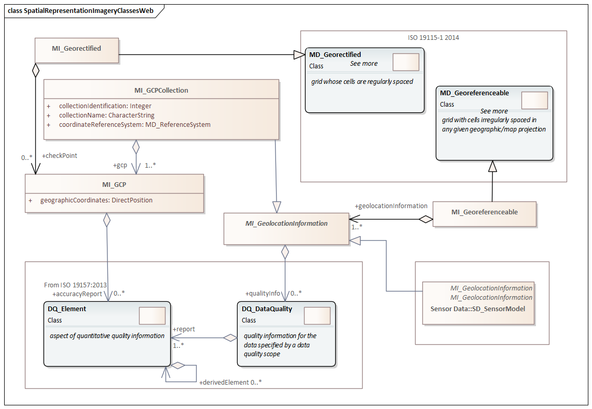

= Metadata for Spatial Representation (MSR) [Imagery]
:edition: 2.2
:revdate: 2021-02-17

== Metadata for Spatial Representation (MSR) [ISO 19115-2] Version: 2.2

.Classes in the msr namespace

=== Description

MSR 2.2 is an XML Schema implementation derived from ISO 19115-2:2019 (Ed2),
Geographic Information - Metadata - Part 2: Extensions for acquisition and
processing, Clause 6.3.4. The MRL 2.2 schema is an extension of MRL 1.3 as defined in
ISO 19115-1, Geographic Information - Metadata - Part 1: Fundamentals. It includes
additional elements for describing lineage, processes and sources. The XML schema was
encoded using the rules described in ISO/TS 19139:2007.

=== XML Namespace for Metadata for Spatial Representation (MSR) [ISO 19115-2]

The namespace URI for Metadata for Spatial Representation (MSR) [ISO 19115-2] is
derived from ISO 19115-1 `https://schemas.isotc211.org/19115/-1/mrl/1.3`.

=== XML Schema for mrl 1.3

https://schemas.isotc211.org/19115/-1/msr/1.3.0/msr.xsd
is the XML Schema document to be referenced by XML documents containing XML elements
in the mrl 1.3 namespace or by XML Schema documents importing the msr 1.3 namespace.
The schema
https://schemas.isotc211.org/19115/-1/msr/1.3.0/msr.xsd
forms the basis for ISO 19115 Metadata for Spatial Representation definitions from
both ISO 19115-1 and ISO 19115-2. This XML schema includes (indirectly) all the
implemented concepts of the mrc namespace, but it does not contain the declaration of
any types.

=== Related XML Schema for mrl 1.3

https://schemas.isotc211.org/19115/-1/msr/1.3.0/spatialRepresentation.xsd
implements the UML conceptual schema defined in ISO 19115-1, Geographic Information -
Metadata - Part 1: Fundamentals AMENDMENT 1, Clause 6.5.7. Details about
https://schemas.isotc211.org/19115/-1/msr/1.3.0/spatialRepresentation.xsd
can be accessed from
https://schemas.isotc211.org/19115/-1/msr/1.3.0.

https://schemas.isotc211.org/19115/-2/msr/2.2.0/spatialRepresentationImagery.xsd[spatialRepresentationImagery.xsd"]
implements the UML conceptual schema defined in ISO 19115-2, Geographic Information -
Metadata - Part 2: Extensions for acquisition and processing, Clause 6.3.4.
https://schemas.isotc211.org/19115/-2/msr/2.2.0/spatialRepresentationImagery.xsd[spatialRepresentationImagery.xsd"]
MI_Georectified inherits attributes from ISO 19115-1:Spatial
Representation:MD_Georectified, and MI_Georeferenceable inherits attributes from ISO
19115-1:Spatial Representation:MD_Georeferenceable. It was created using the encoding
rules defined in ISO 19118, ISO 19139.

https://schemas.isotc211.org/19115/-2/msr/2.2.0/spatialRepresentationImagery.xsd contains
the following classes:

* MI_Georectified
* MI_Georeferenceable
* AbstractMI_GeolocationInformation
* MI_GCPCollection
* MI_GCP

=== Related XML Namespaces for msr 2.2

The msr 2.2 namespace imports these other namespaces: cit mrs

[%unnumbered]
[options=header,cols=4]
|===
| Name | Standard Prefix | Namespace Location | Schema Location

a| Data Quality Common Classes +
in its own right and also by inheritance
| dqc |
https://schemas.isotc211.org/19157/-/dqc/1.2 | https://schemas.isotc211.org/19157/-/dqc/1.2.0/dqc.xsd[dqc.xsd]
a| Geographic Common Objects +
in its own right and also by inheritance
| gco |
`https://schemas.isotc211.org/19103/-/gco/1.2.0` | https://schemas.isotc211.org/19103/-/gco/1.2.0/gco.xsd[gco.xsd]
a| Geographic Markup Wrappers +
by inheritance
| gmw |
`https://schemas.isotc211.org/19103/-/gmw/1.1.0` | https://schemas.isotc211.org/19136/-/gmw/1.1.0/gmw.xsd[gmw.xsd]
a| Geospatial MetaLanguage +
by inheritance
| gml |
http://schemas.opengis.net/gml/3.2.1/gml.xsd |
http://schemas.opengis.net/gml/3.2.1/gml.xsd
a| Metadata Common Classes +
by inheritance
| mcc |
`https://schemas.isotc211.org/19115/-1/mcc/1.3.0` | https://schemas.isotc211.org/19115/-1/mcc/1.3.0/mcc.xsd[mcc.xsd]
a| metadata for CITation and responsibility +
by inheritance
| cit |
`https://schemas.isotc211.org/19115/-1/cit/1.3.0` | https://schemas.isotc211.org/19115/-1/cit/1.3.0/cit.xsd[cit.xsd]
a| Metadata for Reference Systems +
in its own right
| mrs |
`https://schemas.isotc211.org/19115/-1/mrs/1.3.0` | https://schemas.isotc211.org/19115/-1/mrs/1.3.0/mrs.xsd[mrs.xsd]
|===

=== Working Versions

When revisions to these schema become necessary, they will be managed in the
https://github.com/ISO-TC211/XML[ISO TC211 Git Repository].
