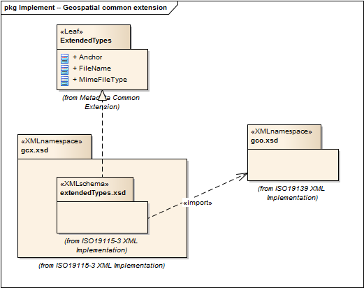

= Geospatial Common eXtension (GCX)
:edition: 1.0
:revdate: 2019-01-04

== Geospatial Common eXtension (GCX) Version: 1.0

=== Description

GCX 1.0 is an XML Schema implementation derived from ISO 19115-1, Geographic
Information - Metadata - Part 1: Fundamentals, Clause 7.2. It includes elements for
xml implementation, from ISO 19139 updated for compatibility with 19115-3. The XML
schema was encoded using the rules described in ISO/TS 19139:2007, Clause 8 and
implementation approach from ISO/TS19115-3, Clause 8.

=== Sample XML files for gcx 1.0

link:gcx.xml[gcx.xml]

=== XML Namespace for gcx 1.0

The namespace URI for gcx 1.0 is `http://standards.iso.org/iso/19115/-3/gcx/1.0`.

=== XML Schema for gcx 1.0

link:gcx.xsd[gcx.xsd] is the XML Schema document to be referenced by XML documents
containing XML elements in the gcx 1.0 namespace or by XML Schema documents importing
the gcx 1.0 namespace. This XML schema includes (indirectly) all the implemented
concepts of the gcx namespace, but it does not contain the declaration of any types.

NOTE: The XML Schema for gcx 1.0 are available link:gcx.zip[here]. A zip archive
including all the XML Schema Implementations defined in ISO/TS 19115-3 and related
standards is also
https://schemas.isotc211.org/19115/19115AllNamespaces.zip[available].

=== Related XML Schema for gcx 1.0

link:extendedTypes.xsd[extendedTypes.xsd] implements the UML conceptual schema
defined in ISO 19115-1, Geographic Information - Metadata - Part 1: Fundamentals,
Clause 7.2. It was created using the encoding rules defined in ISO 19118, ISO 19139,
and the implementation approach described in ISO 19115-3 and contains the following
classes (codeLists are bold): FileName, MimeFileType, and Anchor

=== Related XML Namespaces for gcx 1.0

The gcx 1.0 namespace imports these other namespaces:

[%unnumbered]
[options=header,cols=4]
|===
| Name | Standard Prefix | Namespace Location | Schema Location

| Geographic COmmon | gco |
`https://schemas.isotc211.org/19115/-3/gco/1.0` | https://schemas.isotc211.org/19115/-3/gco/1.0/gco.xsd[gco.xsd]
| Metadata Common Classes | mcc |
`https://schemas.isotc211.org/19115/-3/mcc/1.0` | https://schemas.isotc211.org/19115/-3/mcc/1.0/mcc.xsd[mcc.xsd]
| XML Linking Language (XLink) Version 1.0. W3C Recommendation | xlink |
http://www.w3.org/1999/xlink[http://www.w3.org/1999/xlink] |
http://www.w3.org/1999/xlink.xsd
|===

=== Working Versions

When revisions to these schema become necessary, they will be managed in the
https://github.com/ISO-TC211/XML[ISO TC211 Git Repository].
