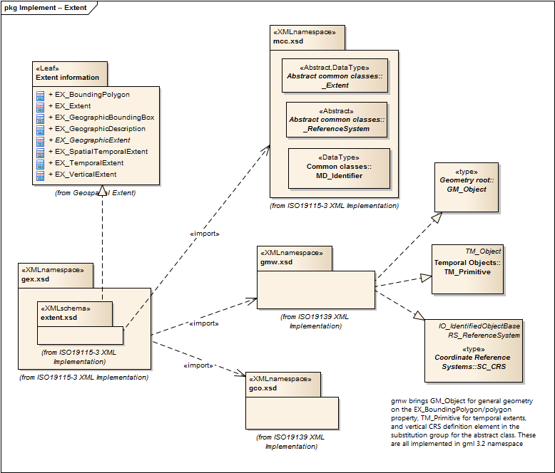

= Geospatial EXtent (GEX)
:edition: 1.0
:revdate: 2019-01-04

== Geospatial EXtent (GEX) Version: 1.0

=== Description

GEX 1.0 is an XML Schema implementation derived from ISO 19115-1, Geographic
Information - Metadata - Part 1: Fundamentals, Clause 6.6.1. It includes elements for
specifying geospatial properties of a resource, including extent and spatial
reference systems. The XML schema was encoded using the rules described in ISO/TS
19139:2007, Clause 8 and implementation approach from ISO/TS19115-3, Clause 8.

=== Sample XML files for gex 1.0

* link:gex_invalid.xml[gex_invalid.xml]
* link:gex_valid.xml[gex_valid.xml]

=== XML Namespace for gex 1.0

The namespace URI for gex 1.0 is `http://standards.iso.org/iso/19115/-3/gex/1.0`.

=== XML Schema for gex 1.0

link:gex.xsd[gex.xsd] is the XML Schema document to be referenced by XML documents
containing XML elements in the gex 1.0 namespace or by XML Schema documents importing
the gex 1.0 namespace. This XML schema includes (indirectly) all the implemented
concepts of the gex namespace, but it does not contain the declaration of any types.

NOTE: The XML Schema for gex 1.0 are available link:gex.zip[here]. A zip archive
including all the XML Schema Implementations defined in ISO/TS 19115-3 and related
standards is also https://schemas.isotc211.org/19115/19115AllNamespaces.zip[available].

=== Related XML Schema for gex 1.0

link:extent.xsd[extent.xsd] implements the UML conceptual schema defined in ISO
19115-1, Geographic Information - Metadata - Part 1: Fundamentals, Clause 6.6.1. It
was created using the encoding rules defined in ISO 19118, ISO 19139, and the
implementation approach described in ISO 19115-3 and contains the following classes
(codeLists are bold): EX_BoundingPolygon, EX_Extent, EX_GeographicBoundingBox,
EX_GeographicDescription, AbstractEX_GeographicExtent, EX_SpatialTemporalExtent,
EX_TemporalExtent, and EX_VerticalExtent

=== Related XML Namespaces for gex 1.0

The gex 1.0 namespace imports these other namespaces:

[%unnumbered]
[options=header,cols=4]
|===
| Name | Standard Prefix | Namespace Location | Schema Location

| Geographic COmmon | gco |
`https://schemas.isotc211.org/19115/-3/gco/1.0` | https://schemas.isotc211.org/19115/-3/gco/1.0/gco.xsd[gco.xsd]
| Geographic Markup Wrappers | gmw |
`https://schemas.isotc211.org/19115/-3/gmw/1.0` | https://schemas.isotc211.org/19115/-3/gmw/1.0/gmw.xsd[gmw.xsd]
| Metadata Common Classes | mcc |
`https://schemas.isotc211.org/19115/-3/mcc/1.0` | https://schemas.isotc211.org/19115/-3/mcc/1.0/mcc.xsd[mcc.xsd]
|===

=== Schematron Validation Rules for gex 1.0

Schematron rules for validating instance documents of the gex 1.0 namespace are in
link:gex.sch[gex.sch]. Other schematron rule sets that are required for a complete
validation are: gco.sch, gmw.sch, mcc.sch, and mcc.sch

=== Working Versions

When revisions to these schema become necessary, they will be managed in the
https://github.com/ISO-TC211/XML[ISO TC211 Git Repository].
