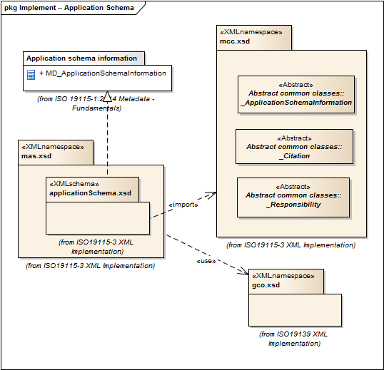

= Metadata for Application Schema (MAS)
:edition: 1.0
:revdate: 2019-01-04

== Metadata for Application Schema (MAS) Version: 1.0

=== Description

MAS 1.0 is an XML Schema implementation derived from ISO 19115-1, Geographic
Information - Metadata - Part 1: Fundamentals, Clause 6.5.13. It includes elements
for referencing Application Schema. The XML schema was encoded using the rules
described in ISO/TS 19139:2007, Clause 8 and implementation approach from
ISO/TS19115-3, Clause 8.

=== XML Namespace for mas 1.0

The namespace URI for mas 1.0 is `http://standards.iso.org/iso/19115/-3/mas/1.0`.

=== XML Schema for mas 1.0

link:mas.xsd[mas.xsd] is the XML Schema document to be referenced by XML documents
containing XML elements in the mas 1.0 namespace or by XML Schema documents importing
the mas 1.0 namespace. This XML schema includes (indirectly) all the implemented
concepts of the mas namespace, but it does not contain the declaration of any types.

NOTE: The XML Schema for mas 1.0 are available link:mas.zip[here]. A zip archive
including all the XML Schema Implementations defined in ISO/TS 19115-3 and related
standards is also https://schemas.isotc211.org/19115/19115AllNamespaces.zip[available].

=== Related XML Schema for mas 1.0

link:applicationSchema.xsd[applicationSchema.xsd] implements the UML conceptual
schema defined in ISO 19115-1, Geographic Information - Metadata - Part 1:
Fundamentals, Clause 6.5.13. It was created using the encoding rules defined in ISO
19118, ISO 19139, and the implementation approach described in ISO 19115-3 and
contains the following classes (codeLists are bold): MD_ApplicationSchemaInformation

=== Related XML Namespaces for mas 1.0

The mas 1.0 namespace imports these other namespaces:

[%unnumbered]
[options=header,cols=4]
|===
| Name | Standard Prefix | Namespace Location | Schema Location

| Citation and responsible party information Citation and responsible party
information | cit |
`https://schemas.isotc211.org/19115/-3/cit/1.0` | https://schemas.isotc211.org/19115/-3/cit/1.0/cit.xsd[cit.xsd]
| Geographic COmmon | gco |
`https://schemas.isotc211.org/19115/-3/gco/1.0` | https://schemas.isotc211.org/19115/-3/gco/1.0/gco.xsd[gco.xsd]
| Metadata Common Classes | mcc |
`https://schemas.isotc211.org/19115/-3/mcc/1.0` | https://schemas.isotc211.org/19115/-3/mcc/1.0/mcc.xsd[mcc.xsd]
|===

=== Working Versions

When revisions to these schema become necessary, they will be managed in the
https://github.com/ISO-TC211/XML[ISO TC211 Git Repository].
