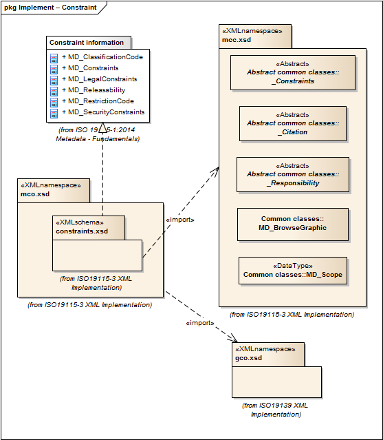

= Metadata for Constraints (MCO)
:edition: 1.0
:revdate: 2019-01-04

== Metadata for Constraints (MCO) Version: 1.0

=== Description

MCO 1.0 is an XML Schema implementation derived from ISO 19115-1, Geographic
Information - Metadata - Part 1: Fundamentals, Clause 6.5.4. It includes elements for
describing resource and metadata constraints. The XML schema was encoded using the
rules described in ISO/TS 19139:2007, Clause 8 and implementation approach from
ISO/TS19115-3, Clause 8.

=== Sample XML files for mco 1.0

* link:mco_invalid.xml[mco_invalid.xml]
* link:mco_valid.xml[mco_valid.xml]

=== CodeLists for mco 1.0

* link:codelists.html[codelists.html]
* link:codelists.xml[codelists.xml]

=== XML Namespace for mco 1.0

The namespace URI for mco 1.0 is `http://standards.iso.org/iso/19115/-3/mco/1.0`.

=== XML Schema for mco 1.0

link:mco.xsd[mco.xsd] is the XML Schema document to be referenced by XML documents
containing XML elements in the mco 1.0 namespace or by XML Schema documents importing
the mco 1.0 namespace. This XML schema includes (indirectly) all the implemented
concepts of the mco namespace, but it does not contain the declaration of any types.

NOTE: The XML Schema for mco 1.0 are available link:mco.zip[here]. A zip archive
including all the XML Schema Implementations defined in ISO/TS 19115-3 and related
standards is also
https://schemas.isotc211.org/19115/19115AllNamespaces.zip[available].

=== Related XML Schema for mco 1.0

link:constraints.xsd[constraints.xsd] implements the UML conceptual schema defined
in ISO 19115-1, Geographic Information - Metadata - Part 1: Fundamentals, Clause
6.5.4. It was created using the encoding rules defined in ISO 19118, ISO 19139, and
the implementation approach described in ISO 19115-3 and contains the following
classes (codeLists are bold): *MD_ClassificationCode*, MD_Constraints,
MD_LegalConstraints, MD_Releasability, *MD_RestrictionCode*, and MD_SecurityConstraints

=== Related XML Namespaces for mco 1.0

The mco 1.0 namespace imports these other namespaces:

[%unnumbered]
[options=header,cols=4]
|===
| Name | Standard Prefix | Namespace Location | Schema Location

| Geographic COmmon | gco |
`https://schemas.isotc211.org/19115/-3/gco/1.0` | https://schemas.isotc211.org/19115/-3/gco/1.0/gco.xsd[gco.xsd]
| Metadata Common Classes | mcc |
`https://schemas.isotc211.org/19115/-3/mcc/1.0` | https://schemas.isotc211.org/19115/-3/mcc/1.0/mcc.xsd[mcc.xsd]
|===

=== Schematron Validation Rules for mco 1.0

Schematron rules for validating instance documents of the mco 1.0 namespace are in
link:mco.sch[mco.sch]. Other schematron rule sets that are required for a complete
validation are: gco.sch, mcc.sch, and mcc.sch

=== Working Versions

When revisions to these schema become necessary, they will be managed in the
https://github.com/ISO-TC211/XML[ISO TC211 Git Repository].
