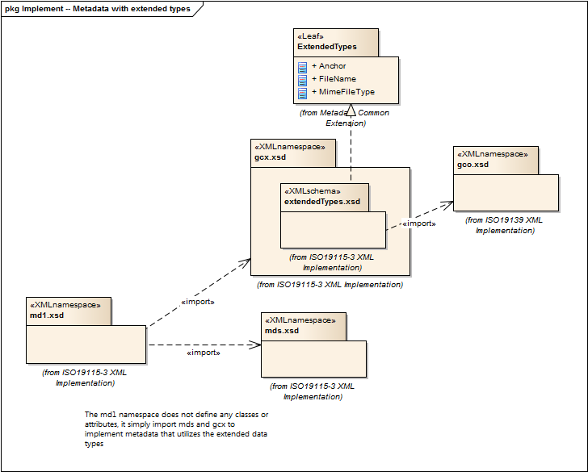

= Metadata for Data and Services with Geospatial Common Extensions (MD1)
:edition: 1.0
:revdate: 2019-01-04

== Metadata for Data and Services with Geospatial Common Extensions (MD1) Version: 1.0

=== Description

MD1 1.0 is an XML Schema implementation derived from ISO 19115-1, Geographic
Information - Metadata - Part 1: Fundamentals, Clause A.2.3.4. It includes this
namespace contains all classes needed for a complete metadata record for any resource
and enables the use of FileName, MimeType, and Anchor elements (gex). The XML schema
was encoded using the rules described in ISO/TS 19139:2007, Clause 8 and
implementation approach from ISO/TS19115-3, Clause 8.

=== Sample XML files for md1 1.0

link:md1.xml[md1.xml]

=== XML Namespace for md1 1.0

The namespace URI for md1 1.0 is `http://standards.iso.org/iso/19115/-3/md1/1.0`.

=== XML Schema for md1 1.0

link:md1.xsd[md1.xsd] is the XML Schema document to be referenced by XML documents
containing XML elements in the md1 1.0 namespace or by XML Schema documents importing
the md1 1.0 namespace. This XML schema includes (indirectly) all the implemented
concepts of the md1 namespace, but it does not contain the declaration of any types.

NOTE: The XML Schema for md1 1.0 are available link:md1.zip[here]. A zip archive
including all the XML Schema Implementations defined in ISO/TS 19115-3 and related
standards is also
https://schemas.isotc211.org/19115/19115AllNamespaces.zip[available].

=== Related XML Schema for md1 1.0

link:metadataWExtendedType.xsd[metadataWExtendedType.xsd] implements the UML
conceptual schema defined in ISO 19115-1, Geographic Information - Metadata - Part 1:
Fundamentals, Clause A.2.3.4. It was created using the encoding rules defined in ISO
19118, ISO 19139, and the implementation approach described in ISO 19115-3 and
contains the following classes (codeLists are bold):

=== Related XML Namespaces for md1 1.0

The md1 1.0 namespace imports these other namespaces:

[%unnumbered]
[options=header,cols=4]
|===
| Name | Standard Prefix | Namespace Location | Schema Location

| Geospatial Common eXtension | gcx |
`https://schemas.isotc211.org/19115/-3/gcx/1.0` | https://schemas.isotc211.org/19115/-3/gcx/1.0/gcx.xsd[gcx.xsd]
| Metadata for Data and Services Metadata for Data and Services | mds |
`https://schemas.isotc211.org/19115/-3/mds/1.0` | https://schemas.isotc211.org/19115/-3/mds/1.0/mds.xsd[mds.xsd]
|===

=== Working Versions

When revisions to these schema become necessary, they will be managed in the
https://github.com/ISO-TC211/XML[ISO TC211 Git Repository].
