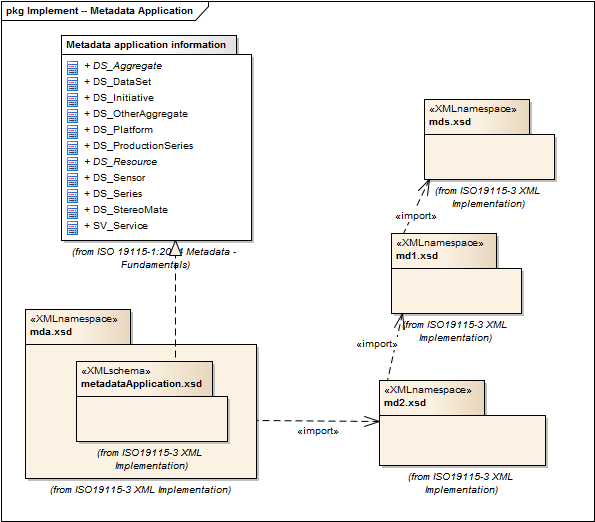

= MetaData Application (MDA)
:edition: 2.0
:revdate: 2019-01-04

== MetaData Application (MDA) Version: 2.0

=== Description

MDA 2.0 is an XML Schema implementation derived from ISO 19115-1, Geographic
Information - Metadata - Part 1: Fundamentals, Clause 6.2. It includes elements to
represent resources that may be aggregated and described by metadata records (DS_*)
The XML schema was encoded using the rules described in ISO/TS 19139:2007, Clause 8
and implementation approach from ISO/TS19115-3, Clause 8.

=== Sample XML files for mda 2.0

link:mda.xml[mda.xml]

=== XML Namespace for mda 2.0

The namespace URI for mda 2.0 is `http://standards.iso.org/iso/19115/-3/mda/2.0`.

=== XML Schema for mda 2.0

link:mda.xsd[mda.xsd] is the XML Schema document to be referenced by XML documents
containing XML elements in the mda 2.0 namespace or by XML Schema documents importing
the mda 2.0 namespace. This XML schema includes (indirectly) all the implemented
concepts of the mda namespace, but it does not contain the declaration of any types.

NOTE: The XML Schema for mda 2.0 are available link:mda.zip[here]. A zip archive
including all the XML Schema Implementations defined in ISO/TS 19115-3 and related
standards is also
https://schemas.isotc211.org/19115/19115AllNamespaces.zip[available].

=== Related XML Schema for mda 2.0

link:metadataApplication.xsd[metadataApplication.xsd] implements the UML conceptual
schema defined in ISO 19115-1, Geographic Information - Metadata - Part 1:
Fundamentals, Clause 6.2. It was created using the encoding rules defined in ISO
19118, ISO 19139, and the implementation approach described in ISO 19115-3 and
contains the following classes (codeLists are bold): AbstractDS_Aggregate,
DS_DataSet, DS_Initiative, DS_OtherAggregate, DS_Platform, DS_ProductionSeries,
AbstractDS_Resource, DS_Sensor, DS_Series, and SV_Service

=== Related XML Namespaces for mda 2.0

The mda 2.0 namespace imports these other namespaces:

[%unnumbered]
[options=header,cols=4]
|===
| Name | Standard Prefix | Namespace Location | Schema Location

| Geographic COmmon | gco |
`https://schemas.isotc211.org/19115/-3/gco/1.0` | https://schemas.isotc211.org/19115/-3/gco/1.0/gco.xsd[gco.xsd]
| Metadata with Extended Schema Metadata with Extended Schema | md2 |
`https://schemas.isotc211.org/19115/-3/md2/2.0` | https://schemas.isotc211.org/19115/-3/md2/2.0/md2.xsd[md2.xsd]
| Metadata Base Metadata Base | mdb |
`https://schemas.isotc211.org/19115/-3/mdb/2.0` | https://schemas.isotc211.org/19115/-3/mdb/2.0/mdb.xsd[mdb.xsd]
|===

=== Working Versions

When revisions to these schema become necessary, they will be managed in the
https://github.com/ISO-TC211/XML[ISO TC211 Git Repository].
