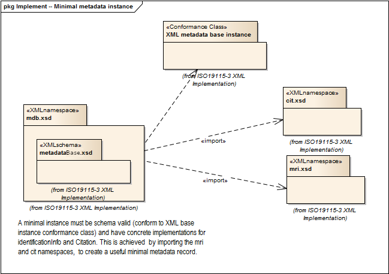

= Metadata Base (MDB)
:edition: 2.0
:revdate: 2019-01-04

== Metadata Base (MDB) Version: 2.0

=== Description

MDB 2.0 is an XML Schema implementation derived from ISO 19115-1, Geographic
Information - Metadata - Part 1: Fundamentals, Clause 6.5.2. It includes mandatory
elements for describing resources that are not services. This namespace is used for
metadata records that include only mandatory elements. The XML schema was encoded
using the rules described in ISO/TS 19139:2007, Clause 8 and implementation approach
from ISO/TS19115-3, Clause 8.

=== Sample XML files for mdb 2.0

link:mdb.xml[mdb.xml]

=== XML Namespace for mdb 2.0

The namespace URI for mdb 2.0 is `http://standards.iso.org/iso/19115/-3/mdb/2.0`.

=== XML Schema for mdb 2.0

link:mdb.xsd[mdb.xsd] is the XML Schema document to be referenced by XML documents
containing XML elements in the mdb 2.0 namespace or by XML Schema documents importing
the mdb 2.0 namespace. This XML schema includes (indirectly) all the implemented
concepts of the mdb namespace, but it does not contain the declaration of any types.

NOTE: The XML Schema for mdb 2.0 are available link:mdb.zip[here]. A zip archive
including all the XML Schema Implementations defined in ISO/TS 19115-3 and related
standards is also
https://schemas.isotc211.org/19115/19115AllNamespaces.zip[available].

=== Related XML Schema for mdb 2.0

link:metadataBase.xsd[metadataBase.xsd] implements the UML conceptual schema
defined in ISO 19115-1, Geographic Information - Metadata - Part 1: Fundamentals,
Clause 6.5.2. It was created using the encoding rules defined in ISO 19118, ISO
19139, and the implementation approach described in ISO 19115-3 and contains the
following classes (codeLists are bold): MD_Metadata, and MD_MetadataScope

=== Related XML Namespaces for mdb 2.0

The mdb 2.0 namespace imports these other namespaces:

[%unnumbered]
[options=header,cols=4]
|===
| Name | Standard Prefix | Namespace Location | Schema Location

| Citation and responsible party information Citation and responsible party
information | cit |
`https://schemas.isotc211.org/19115/-3/cit/2.0` | https://schemas.isotc211.org/19115/-3/cit/2.0/cit.xsd[cit.xsd]
| Data Quality Common Classes | dqc |
`https://schemas.isotc211.org/19157/-2/dqc/1.0` | https://schemas.isotc211.org/19157/-2/dqc/1.0/dqc.xsd[dqc.xsd]
| Geographic COmmon | gco |
`https://schemas.isotc211.org/19115/-3/gco/1.0` | https://schemas.isotc211.org/19115/-3/gco/1.0/gco.xsd[gco.xsd]
| Geospatial EXtent | gex |
`https://schemas.isotc211.org/19115/-3/gex/1.0` | https://schemas.isotc211.org/19115/-3/gex/1.0/gex.xsd[gex.xsd]
| Language localization | lan |
`https://schemas.isotc211.org/19115/-3/lan/1.0` | https://schemas.isotc211.org/19115/-3/lan/1.0/lan.xsd[lan.xsd]
| Metadata Common Classes | mcc |
`https://schemas.isotc211.org/19115/-3/mcc/1.0` | https://schemas.isotc211.org/19115/-3/mcc/1.0/mcc.xsd[mcc.xsd]
| Metadata for Resource Identification | mri |
`https://schemas.isotc211.org/19115/-3/mri/1.0` | https://schemas.isotc211.org/19115/-3/mri/1.0/mri.xsd[mri.xsd]
|===

=== Working Versions

When revisions to these schema become necessary, they will be managed in the
https://github.com/ISO-TC211/XML[ISO TC211 Git Repository].
