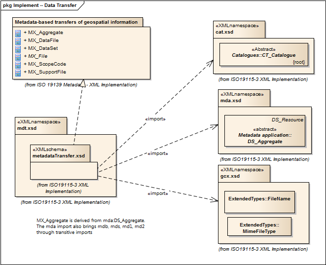

= Metadata for Data Transfer (MDT)
:edition: 1.0
:revdate: 2019-01-04

== Metadata for Data Transfer (MDT) Version: 1.0

=== Description

MDT 1.0 is an XML Schema implementation derived from ISO 19115-1, Geographic
Information - Metadata - Part 1: Fundamentals, Clause 7.4.2, 7.4.3. It includes this
namespace contains all classes needed for a complete metadata record for any resource
and enables the description of data transfer (MX_*) elements. This is the most
inclusive of the ISO 19115-3 namespaces so it should be used in situations where all
19115-3 capabilities are required. The XML schema was encoded using the rules
described in ISO/TS 19139:2007, Clause 8 and implementation approach from
ISO/TS19115-3, Clause 8.

=== Sample XML files for mdt 1.0

link:mdt.xml[mdt.xml]

=== CodeLists for mdt 1.0

* link:codelists.html[codelists.html]
* link:codelists.xml[codelists.xml]

=== XML Namespace for mdt 1.0

The namespace URI for mdt 1.0 is `http://standards.iso.org/iso/19115/-3/mdt/1.0`.

=== XML Schema for mdt 1.0

link:mdt.xsd[mdt.xsd] is the XML Schema document to be referenced by XML documents
containing XML elements in the mdt 1.0 namespace or by XML Schema documents importing
the mdt 1.0 namespace. This XML schema includes (indirectly) all the implemented
concepts of the mdt namespace, but it does not contain the declaration of any types.

NOTE: The XML Schema for mdt 1.0 are available link:mdt.zip[here]. A zip archive
including all the XML Schema Implementations defined in ISO/TS 19115-3 and related
standards is also
https://schemas.isotc211.org/19115/19115AllNamespaces.zip[available].

=== Related XML Schema for mdt 1.0

link:metadataTransfer.xsd[metadataTransfer.xsd] implements the UML conceptual
schema defined in ISO 19115-1, Geographic Information - Metadata - Part 1:
Fundamentals, Clause 7.4.2, 7.4.3. It was created using the encoding rules defined in
ISO 19118, ISO 19139, and the implementation approach described in ISO 19115-3 and
contains the following classes (codeLists are bold): MX_Aggregate, MX_DataFile,
MX_DataSet, AbstractMX_File, *MX_ScopeCode*, and MX_SupportFile

=== Related XML Namespaces for mdt 1.0

The mdt 1.0 namespace imports these other namespaces:

[%unnumbered]
[options=header,cols=4]
|===
| Name | Standard Prefix | Namespace Location | Schema Location

| CATalogue | cat |
`https://schemas.isotc211.org/19115/-3/cat/1.0` | https://schemas.isotc211.org/19115/-3/cat/1.0/cat.xsd[cat.xsd]
| Geographic COmmon | gco |
`https://schemas.isotc211.org/19115/-3/gco/1.0` | https://schemas.isotc211.org/19115/-3/gco/1.0/gco.xsd[gco.xsd]
| Geospatial Common eXtension | gcx |
`https://schemas.isotc211.org/19115/-3/gcx/1.0` | https://schemas.isotc211.org/19115/-3/gcx/1.0/gcx.xsd[gcx.xsd]
| MetaData Application MetaData Application | mda |
`https://schemas.isotc211.org/19115/-3/mda/1.0` | https://schemas.isotc211.org/19115/-3/mda/1.0/mda.xsd[mda.xsd]
|===

=== Working Versions

When revisions to these schema become necessary, they will be managed in the
https://github.com/ISO-TC211/XML[ISO TC211 Git Repository].
