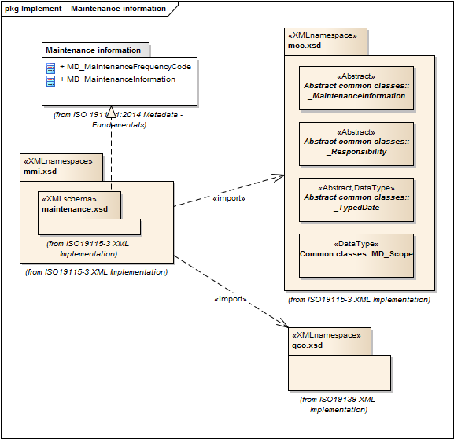

= Metadata for Maintenance Information (MMI)
:edition: 1.0
:revdate: 2019-01-04

== Metadata for Maintenance Information (MMI) Version: 1.0

=== Description

MMI 1.0 is an XML Schema implementation derived from ISO 19115-1, Geographic
Information - Metadata - Part 1: Fundamentals, Clause 6.5.6. It includes elements
describing resource and metadata maintenance. The XML schema was encoded using the
rules described in ISO/TS 19139:2007, Clause 8 and implementation approach from
ISO/TS19115-3, Clause 8.

=== Sample XML files for mmi 1.0

* link:mmi_invalid.xml[mmi_invalid.xml]
* link:mmi_valid.xml[mmi_valid.xml]

=== CodeLists for mmi 1.0

* link:codelists.html[codelists.html]
* link:codelists.xml[codelists.xml]

=== XML Namespace for mmi 1.0

The namespace URI for mmi 1.0 is `http://standards.iso.org/iso/19115/-3/mmi/1.0`.

=== XML Schema for mmi 1.0

link:mmi.xsd[mmi.xsd] is the XML Schema document to be referenced by XML documents
containing XML elements in the mmi 1.0 namespace or by XML Schema documents importing
the mmi 1.0 namespace. This XML schema includes (indirectly) all the implemented
concepts of the mmi namespace, but it does not contain the declaration of any types.

NOTE: The XML Schema for mmi 1.0 are available link:mmi.zip[here]. A zip archive
including all the XML Schema Implementations defined in ISO/TS 19115-3 and related
standards is also
https://schemas.isotc211.org/19115/19115AllNamespaces.zip[available].

=== Related XML Schema for mmi 1.0

link:maintenance.xsd[maintenance.xsd] implements the UML conceptual schema defined
in ISO 19115-1, Geographic Information - Metadata - Part 1: Fundamentals, Clause
6.5.6. It was created using the encoding rules defined in ISO 19118, ISO 19139, and
the implementation approach described in ISO 19115-3 and contains the following
classes (codeLists are bold): *MD_MaintenanceFrequencyCode*, and
MD_MaintenanceInformation

=== Related XML Namespaces for mmi 1.0

The mmi 1.0 namespace imports these other namespaces:

[%unnumbered]
[options=header,cols=4]
|===
| Name | Standard Prefix | Namespace Location | Schema Location

| Geographic COmmon | gco |
`https://schemas.isotc211.org/19115/-3/gco/1.0` | https://schemas.isotc211.org/19115/-3/gco/1.0/gco.xsd[gco.xsd]
| Metadata Common Classes | mcc |
`https://schemas.isotc211.org/19115/-3/mcc/1.0` | https://schemas.isotc211.org/19115/-3/mcc/1.0/mcc.xsd[mcc.xsd]
|===

=== Schematron Validation Rules for mmi 1.0

Schematron rules for validating instance documents of the mmi 1.0 namespace are in
link:mmi.sch[mmi.sch]. Other schematron rule sets that are required for a complete
validation are: gco.sch, mcc.sch, and mcc.sch

=== Working Versions

When revisions to these schema become necessary, they will be managed in the
https://github.com/ISO-TC211/XML[ISO TC211 Git Repository].
