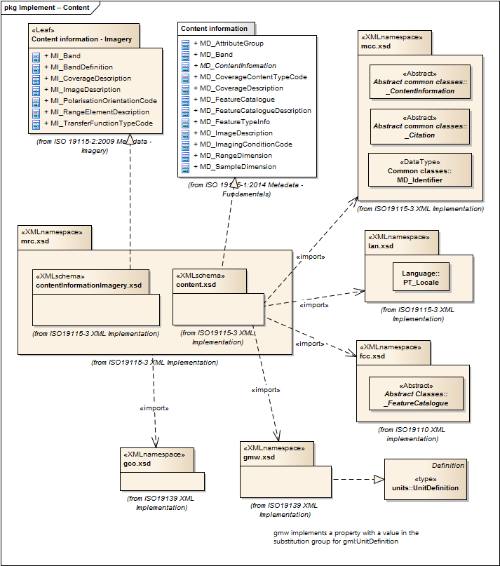

= Metadata for Resource Content (MRC)
:edition: 2.0
:revdate: 2019-01-04

== Metadata for Resource Content (MRC) Version: 2.0

=== Description

MRC 2.0 is an XML Schema implementation derived from ISO 19115-1, Geographic
Information - Metadata - Part 1: Fundamentals AMENDMENT 1, Clause 6.5.9. It includes
elements for describing resource structure and content. The XML schema was encoded
using the rules described in ISO/TS 19139:2007, Clause 8 and implementation approach
from ISO/TS19115-3, Clause 8.

=== Sample XML files for mrc 2.0

link:mrc.xml[mrc.xml]

=== CodeLists for mrc 2.0

* link:codelists.html[codelists.html]
* link:codelists.xml[codelists.xml]

=== XML Namespace for mrc 2.0

The namespace URI for mrc 2.0 is `http://standards.iso.org/iso/19115/-3/mrc/2.0`.

=== XML Schema for mrc 2.0

link:mrc.xsd[mrc.xsd] is the XML Schema document to be referenced by XML documents
containing XML elements in the mrc 2.0 namespace or by XML Schema documents importing
the mrc 2.0 namespace. This XML schema includes (indirectly) all the implemented
concepts of the mrc namespace, but it does not contain the declaration of any types.

NOTE: The XML Schema for mrc 2.0 are available link:mrc.zip[here]. A zip archive
including all the XML Schema Implementations defined in ISO/TS 19115-3 and related
standards is also
https://schemas.isotc211.org/19115/19115AllNamespaces.zip[available].

=== Related XML Schema for mrc 2.0

link:content.xsd[content.xsd] implements the UML conceptual schema defined in ISO
19115-1, Geographic Information - Metadata - Part 1: Fundamentals AMENDMENT 1, Clause
6.5.9. It was created using the encoding rules defined in ISO 19118, ISO 19139, and
the implementation approach described in ISO 19115-3 and contains the following
classes (codeLists are bold): MD_AttributeGroup, MD_Band,
AbstractMD_ContentInformation, *MD_CoverageContentTypeCode*, MD_CoverageDescription,
MD_FeatureCatalogue, MD_FeatureCatalogueDescription, MD_FeatureTypeInfo,
MD_ImageDescription, *MD_ImagingConditionCode*, MD_RangeDimension, and
MD_SampleDimension

link:contentInformationImagery.xsd[contentInformationImagery.xsd] implements the
UML conceptual schema defined in ISO 19115-1, Geographic Information - Metadata -
Part 1: Fundamentals AMENDMENT 1, Clause 6.5.9. It was created using the encoding
rules defined in ISO 19118, ISO 19139, and the implementation approach described in
ISO 19115-3 and contains the following classes (codeLists are bold): MI_Band,
MI_BandDefinition, MI_CoverageDescription, MI_ImageDescription,
*MI_PolarisationOrientationCode*, MI_RangeElementDescription, and
*MI_TransferFunctionTypeCode*

=== Related XML Namespaces for mrc 2.0

The mrc 2.0 namespace imports these other namespaces:

[%unnumbered]
[options=header,cols=4]
|===
| Name | Standard Prefix | Namespace Location | Schema Location

| Feature Catalog Common | fcc |
`https://schemas.isotc211.org/19110/fcc/1.0` | https://schemas.isotc211.org/19110/fcc/1.0/fcc.xsd[fcc.xsd]
| Geographic COmmon | gco |
`https://schemas.isotc211.org/19115/-3/gco/1.0` | https://schemas.isotc211.org/19115/-3/gco/1.0/gco.xsd[gco.xsd]
| Geographic Markup Wrappers | gmw |
`https://schemas.isotc211.org/19115/-3/gmw/1.0` | https://schemas.isotc211.org/19115/-3/gmw/1.0/gmw.xsd[gmw.xsd]
| Language localization | lan |
`https://schemas.isotc211.org/19115/-3/lan/1.0` | https://schemas.isotc211.org/19115/-3/lan/1.0/lan.xsd[lan.xsd]
| Metadata for Acquisition Metadata for Acquisition | mac |
`https://schemas.isotc211.org/19115/-3/mac/2.0` | https://schemas.isotc211.org/19115/-3/mac/2.0/mac.xsd[mac.xsd]
| Metadata Common Classes | mcc |
`https://schemas.isotc211.org/19115/-3/mcc/1.0` | https://schemas.isotc211.org/19115/-3/mcc/1.0/mcc.xsd[mcc.xsd]
|===

=== Working Versions

When revisions to these schema become necessary, they will be managed in the
https://github.com/ISO-TC211/XML[ISO TC211 Git Repository].
