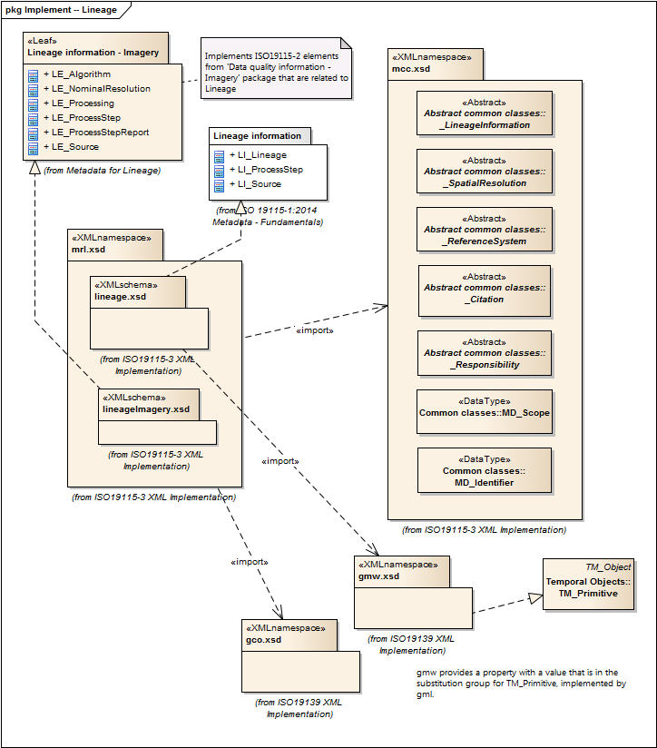

= Metadata for Resource Lineage (MRL)
:edition: 2.0
:revdate: 2019-01-04

== Metadata for Resource Lineage (MRL) Version: 2.0

=== Description

MRL 2.0 is an XML Schema implementation derived from ISO 19115-1, Geographic
Information - Metadata - Part 2: Extensions for acquisition and processing, Clause
6.3.3. It includes elements for describing resource lineage. The XML schema was
encoded using the rules described in ISO/TS 19139:2007, Clause 8 and implementation
approach from ISO/TS19115-3, Clause 8.

=== Sample XML files for mrl 2.0

link:mrl.xml[mrl.xml]

=== XML Namespace for mrl 2.0

The namespace URI for mrl 2.0 is `http://standards.iso.org/iso/19115/-3/mrl/2.0`.

=== XML Schema for mrl 2.0

link:mrl.xsd[mrl.xsd] is the XML Schema document to be referenced by XML documents
containing XML elements in the mrl 2.0 namespace or by XML Schema documents importing
the mrl 2.0 namespace. This XML schema includes (indirectly) all the implemented
concepts of the mrl namespace, but it does not contain the declaration of any types.

NOTE: The XML Schema for mrl 2.0 are available link:mrl.zip[here]. A zip archive
including all the XML Schema Implementations defined in ISO/TS 19115-3 and related
standards is also
https://schemas.isotc211.org/19115/19115AllNamespaces.zip[available].

=== Related XML Schema for mrl 2.0

link:lineage.xsd[lineage.xsd] implements the UML conceptual schema defined in ISO
19115-1, Geographic Information - Metadata - Part 2: Extensions for acquisition and
processing, Clause 6.3.3. It was created using the encoding rules defined in ISO
19118, ISO 19139, and the implementation approach described in ISO 19115-3 and
contains the following classes (codeLists are bold): LI_Lineage, LI_ProcessStep, and
LI_Source

link:lineageImagery.xsd[lineageImagery.xsd] implements the UML conceptual schema
defined in ISO 19115-1, Geographic Information - Metadata - Part 2: Extensions for
acquisition and processing, Clause 6.3.3. It was created using the encoding rules
defined in ISO 19118, ISO 19139, and the implementation approach described in ISO
19115-3 and contains the following classes (codeLists are bold): LE_Algorithm,
LE_NominalResolution, LE_ProcessStep, LE_ProcessStepReport, LE_Processing, LE_Source,
LE_ProcessParameter, and LE_ParameterDirection

=== Related XML Namespaces for mrl 2.0

The mrl 2.0 namespace imports these other namespaces:

[%unnumbered]
[options=header,cols=4]
|===
| Name | Standard Prefix | Namespace Location | Schema Location

| Geographic COmmon | gco |
`https://schemas.isotc211.org/19115/-3/gco/1.0` | https://schemas.isotc211.org/19115/-3/gco/1.0/gco.xsd[gco.xsd]
| Geographic Markup Wrappers | gmw |
`https://schemas.isotc211.org/19115/-3/gmw/1.0` | https://schemas.isotc211.org/19115/-3/gmw/1.0/gmw.xsd[gmw.xsd]
| Metadata Common Classes | mcc |
`https://schemas.isotc211.org/19115/-3/mcc/1.0` | https://schemas.isotc211.org/19115/-3/mcc/1.0/mcc.xsd[mcc.xsd]
| Metadata for Services | srv |
`https://schemas.isotc211.org/19115/-3/srv/2.0` | https://schemas.isotc211.org/19115/-3/srv/2.0/srv.xsd[srv.xsd]
|===

=== Working Versions

When revisions to these schema become necessary, they will be managed in the
https://github.com/ISO-TC211/XML[ISO TC211 Git Repository].
