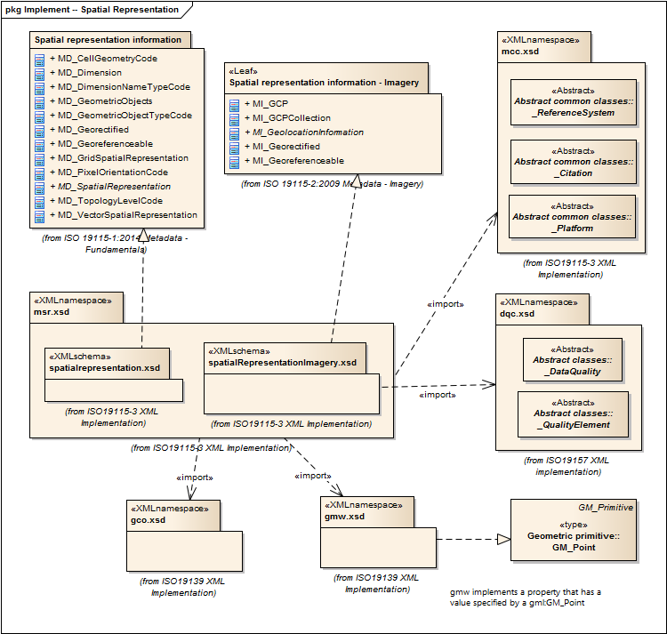

= Metadata for Spatial Representation (MSR)
:edition: 2.0
:revdate: 2019-01-04

== Metadata for Spatial Representation (MSR) Version: 2.0

=== Description

MSR 2.0 is an XML Schema implementation derived from ISO 19115-1, Geographic
Information - Metadata - Part 1: Fundamentals AMENDMENT 1, Clause 6.5.7. It includes
elements for describing spatial representations of resources. The XML schema was
encoded using the rules described in ISO/TS 19139:2007, Clause 8 and implementation
approach from ISO/TS19115-3, Clause 8.

=== Sample XML files for msr 2.0

link:msr.xml[msr.xml]

=== XML Namespace for msr 2.0

The namespace URI for msr 2.0 is `http://standards.iso.org/iso/19115/-3/msr/2.0`.

=== XML Schema for msr 2.0

link:msr.xsd[msr.xsd] is the XML Schema document to be referenced by XML documents
containing XML elements in the msr 2.0 namespace or by XML Schema documents importing
the msr 2.0 namespace. This XML schema includes (indirectly) all the implemented
concepts of the msr namespace, but it does not contain the declaration of any types.

NOTE: The XML Schema for msr 2.0 are available link:msr.zip[here]. A zip archive
including all the XML Schema Implementations defined in ISO/TS 19115-3 and related
standards is also
https://schemas.isotc211.org/19115/19115AllNamespaces.zip[available].

=== Related XML Schema for msr 2.0

link:spatialRepresentation.xsd[spatialRepresentation.xsd] implements the UML
conceptual schema defined in ISO 19115-1, Geographic Information - Metadata - Part 1:
Fundamentals AMENDMENT 1, Clause 6.5.7. It was created using the encoding rules
defined in ISO 19118, ISO 19139, and the implementation approach described in ISO
19115-3 and contains the following classes (codeLists are bold):
AbstractMD_SpatialRepresentation, *MD_CellGeometryCode*, MD_Dimension,
*MD_DimensionNameTypeCode*, *MD_GeometricObjectTypeCode*, MD_GeometricObjects,
MD_Georectified, MD_Georeferenceable, MD_GridSpatialRepresentation,
*MD_PixelOrientationCode*, *MD_TopologyLevelCode*, and MD_VectorSpatialRepresentation

link:spatialRepresentationImagery.xsd[spatialRepresentationImagery.xsd] implements
the UML conceptual schema defined in ISO 19115-1, Geographic Information - Metadata -
Part 1: Fundamentals AMENDMENT 1, Clause 6.5.7. It was created using the encoding
rules defined in ISO 19118, ISO 19139, and the implementation approach described in
ISO 19115-3 and contains the following classes (codeLists are bold): MI_GCP,
MI_GCPCollection, AbstractMI_GeolocationInformation, MI_Georectified, and
MI_Georeferenceable

=== Related XML Namespaces for msr 2.0

The msr 2.0 namespace imports these other namespaces:

[%unnumbered]
[options=header,cols=4]
|===
| Name | Standard Prefix | Namespace Location | Schema Location

| Data Quality Common Classes | dqc |
`https://schemas.isotc211.org/19157/-2/dqc/1.0` | https://schemas.isotc211.org/19157/-2/dqc/1.0/dqc.xsd[dqc.xsd]
| Geographic COmmon | gco |
`https://schemas.isotc211.org/19115/-3/gco/1.0` | https://schemas.isotc211.org/19115/-3/gco/1.0/gco.xsd[gco.xsd]
| Geographic Markup Wrappers | gmw |
`https://schemas.isotc211.org/19115/-3/gmw/1.0` | https://schemas.isotc211.org/19115/-3/gmw/1.0/gmw.xsd[gmw.xsd]
| Metadata Common Classes | mcc |
`https://schemas.isotc211.org/19115/-3/mcc/1.0` | https://schemas.isotc211.org/19115/-3/mcc/1.0/mcc.xsd[mcc.xsd]
|===

=== Working Versions

When revisions to these schema become necessary, they will be managed in the
https://github.com/ISO-TC211/XML[ISO TC211 Git Repository].
