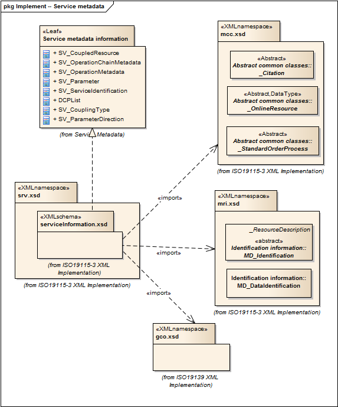

= Metadata for Services (SRV)
:edition: 2.0
:revdate: 2019-01-04

== Metadata for Services (SRV) Version: 2.0

=== Description

SRV 2.0 is an XML Schema implementation derived from ISO 19115-1, Geographic
Information - Metadata - Part 1: Fundamentals, Clause 6.5.14. It includes elements
for describing services. The XML schema was encoded using the rules described in
ISO/TS 19139:2007, Clause 8 and implementation approach from ISO/TS19115-3, Clause 8.

=== Sample XML files for srv 2.0

* link:srv_invalid.xml[srv_invalid.xml]
* link:srv_valid.xml[srv_valid.xml]

=== CodeLists for srv 2.0

* link:codelists.html[codelists.html]
* link:codelists.xml[codelists.xml]

=== XML Namespace for srv 2.0

The namespace URI for srv 2.0 is `http://standards.iso.org/iso/19115/-3/srv/2.0`.

=== XML Schema for srv 2.0

link:srv.xsd[srv.xsd] is the XML Schema document to be referenced by XML documents
containing XML elements in the srv 2.0 namespace or by XML Schema documents importing
the srv 2.0 namespace. This XML schema includes (indirectly) all the implemented
concepts of the srv namespace, but it does not contain the declaration of any types.

NOTE: The XML Schema for srv 2.0 are available link:srv.zip[here]. A zip archive
including all the XML Schema Implementations defined in ISO/TS 19115-3 and related
standards is also
https://schemas.isotc211.org/19115/19115AllNamespaces.zip[available].

=== Related XML Schema for srv 2.0

link:serviceInformation.xsd[serviceInformation.xsd] implements the UML conceptual
schema defined in ISO 19115-1, Geographic Information - Metadata - Part 1:
Fundamentals, Clause 6.5.14. It was created using the encoding rules defined in ISO
19118, ISO 19139, and the implementation approach described in ISO 19115-3 and
contains the following classes (codeLists are bold): DCPList, SV_CoupledResource,
SV_CouplingType, SV_OperationChainMetadata, SV_OperationMetadata, SV_Parameter,
SV_ParameterDirection, and SV_ServiceIdentification

=== Related XML Namespaces for srv 2.0

The srv 2.0 namespace imports these other namespaces:

[%unnumbered]
[options=header,cols=4]
|===
| Name | Standard Prefix | Namespace Location | Schema Location

| Geographic COmmon | gco |
`https://schemas.isotc211.org/19115/-3/gco/1.0` | https://schemas.isotc211.org/19115/-3/gco/1.0/gco.xsd[gco.xsd]
| Metadata Common Classes | mcc |
`https://schemas.isotc211.org/19115/-3/mcc/1.0` | https://schemas.isotc211.org/19115/-3/mcc/1.0/mcc.xsd[mcc.xsd]
| Metadata for Resource Identification | mri |
`https://schemas.isotc211.org/19115/-3/mri/1.0` | https://schemas.isotc211.org/19115/-3/mri/1.0/mri.xsd[mri.xsd]
|===

=== Schematron Validation Rules for srv 2.0

Schematron rules for validating instance documents of the srv 2.0 namespace are in
link:srv.sch[srv.sch]. Other schematron rule sets that are required for a complete
validation are: gco.sch, mcc.sch, mri.sch, mcc.sch, and mri.sch

=== Working Versions

When revisions to these schema become necessary, they will be managed in the
https://github.com/ISO-TC211/XML[ISO TC211 Git Repository].
