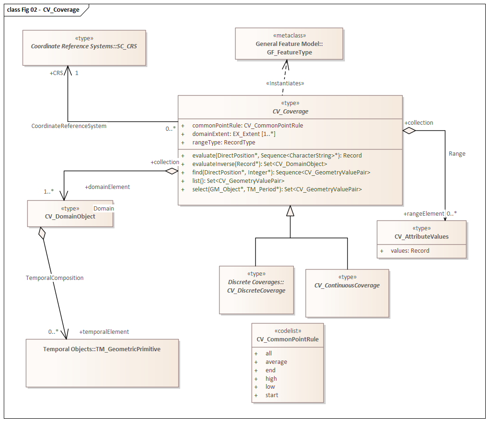

= Schemas for coverage geometry and functions (CIS)
:edition: 1.1.0
:revdate: 2010-02-25

== Schemas for coverage geometry and functions (CIS) Version: 1.1

.Classes in the 19123:2005 gmlCov namespace

=== Description

Schemas for coverage geometry and functions (CIS) is an XML Schema implementation
derived from ISO 19111:2019, Schemas for coverage geometry and functions. It includes
elements for defining geometry and functions for coverages. The XML schema was
encoded using the encoding rules defined in ISO 19118, ISO 19139.

=== XML Namespace for ISO 19123:2005 CIS 1.1

The namespace URI for 19123:2005 CIS 1.1 is `http://www.opengis.net/gmlcov/1.0`.

=== XML Schema for 19123:2005 CIS 1.1

https://schemas.isotc211.org/19123/-/cis/1.1.0/1.1.0/cis-0.xsd[cis-0.xsd] is the XML Schema
document to be referenced by XML documents containing XML elements in the gmlCov
namespace or by XML Schema documents importing the gmlCov 1.0 namespace. This XML
schema includes (indirectly) all the implemented concepts of the gmlCov namespace,
but it does not contain the declaration of any types.

=== Related XML Schema for 19123:2005 CIS 1.1

https://schemas.isotc211.org/19123/-/cis/1.1.0/gridPoint.xsd[gridPoint.xsd] implements very
limited of the UML conceptual schema defined in ISO 191123:2005, Geographic
Information - Schemas for coverage geometry and functions, Clause 8.4. It was created
using the encoding rules defined in ISO 19118, ISO 19139.

https://schemas.isotc211.org/19123/-/cis/1.1.0/gridPoint.xsd contains the following classes:

* CV_GridPoint
* CV_GridCoordinates

https://schemas.isotc211.org/19123/-/cis/1.1.0/codeLists.xsd[codeLists.xsd] implements very
limited of the UML conceptual schema defined in ISO 191123:2005, Geographic
Information - Schemas for coverage geometry and functions. It was created using the
encoding rules defined in ISO 19118, ISO 19139.

https://schemas.isotc211.org/19123/-/cis/1.1.0/codeLists.xsd contains the following classes:

* CV_CommonPointRule
* CV_InterpolationMethod

=== Related XML Namespaces for ISO 19123:2005 CIS 1.1

The ISO 19123:2005 CIS 1.1 imports these other namespaces:

[%unnumbered]
[options=header,cols=4]
|===
| Name | Standard Prefix | Namespace Location | Schema Location

| Geographic Common Objects | gco |
https://schemas.isotc211.org/19103/-/gco/1.2 | https://schemas.isotc211.org/19103/-/gco/1.2.0/gco.xsd[gco.xsd]
| Geospatial Meta-Language | gml |
http://www.opengis.net/gml/3.2[http://www.opengis.net/gml/3.2] |
http://www.opengis.net/gml/3.2.1/gml.xsd
|===

=== Working Versions

When revisions to these schema become necessary, they will be managed in the
https://github.com/ISO-TC211/XML[ISO TC211 Git Repository].
