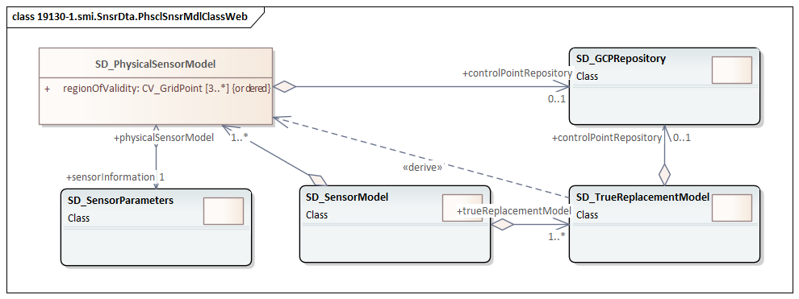
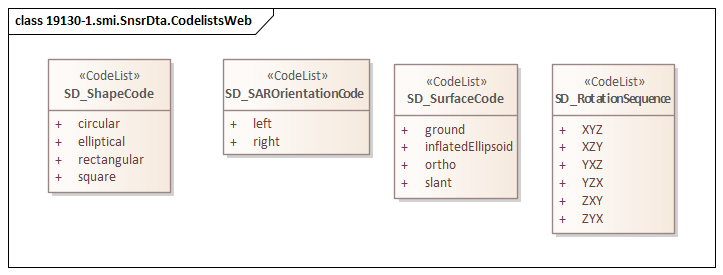

= Sensor Model Implementation (SMI)
:edition: 1.1
:revdate: 2021-02-15

== Sensor Model Implementation Version: 1.1

.Codelist(s) in the ISO 19130-1 smi namespace
image::19130-1.smi.SensorDataCodelistsWeb.png[UML diagram of Sensor Model Implementation codelists in the smi namespace,600]

=== Description

SMI 1.1 is an XML Schema implementation derived from
ISO 19130-1, Geographic Information - Imagery Sensor Models for Geopositioning - Part 1: Fundamentals.

The XML schema was encoded using the rules described in ISO/TS 19139:2007.

=== XML Namespace for smi 1.1

The namespace URI for smi 1.1 is `https://schemas.isotc211.org/19130/-3/smi/1.1`.

=== XML Schema for smi 1.1

https://schemas.isotc211.org/19130/-3/smi/1.1.0/smi.xsd
is the XML Schema document to be referenced by XML documents
containing XML elements in the smi 1.1 namespace or by XML Schema documents importing
the smi 1.1 namespace. This XML schema includes (indirectly) all the implemented
concepts of the smi namespace, but it does not contain the declaration of any types.

=== Related XML Schema for smi 1.1 derived from ISO 19130-1, Geographic Information - Imagery Sensor Models for Geopositioning - Part 1: Fundamentals

==== Sensor Model

`https://schemas.isotc211.org/19130/-1/smi/1.1.0/sensorModel.xsd` implements the UML conceptual schema
defined in ISO 19130-1, Geographic Information - Imagery Sensor Models for
Geopositioning - Part 1: Fundamentals, Clause 7.2. It was created using the encoding
rules defined in ISO 19118, ISO 19139.

.Classes in the ISO 19130-1 smi namespace

https://schemas.isotc211.org/19130/-1/smi/1.1.0/sensorModel.xsd contains the following class:

* SD_SensorModel

==== Ground Control Points

`https://schemas.isotc211.org/19130/-1/smi/1.1.0/groundControlPoints.xsd`
implements the UML conceptual schema defined in ISO 19130-1, Geographic Information -
Imagery Sensor Models for Geopositioning - Part 1: Fundamentals, Clause 7.4. It was
created using the encoding rules defined in ISO 19118, ISO 19139.

.Classes in the ISO 19130-1 smi namespace, ground control points

https://schemas.isotc211.org/19130/-1/smi/1.1.0/groundControlPoints.xsd
contains the following classes:

* SD_GCPRepository
* SD_LocationGCP
* SD_ImageIdentifiableGCP
* SD_GriddedGCPCollection
* SD_ImageGridGCPCollection
* SD_ObjectGridGCPCollection

==== Physical Sensor Model

`https://schemas.isotc211.org/19130/-1/smi/1.1.0/physicalSensorModel.xsd` implements the UML
conceptual schema defined in ISO 19130-1, Geographic Information - Imagery Sensor
Models for Geopositioning - Part 1: Fundamentals, Clause 8.4. It was created using
the encoding rules defined in ISO 19118, ISO 19139.

.Classes in the ISO 19130-1 smi namespace, physical sensor model

https://schemas.isotc211.org/19130/-1/smi/1.1.0/physicalSensorModel.xsd
contains the following classes:

* SD_PhysicalSensorModel

==== Spatial Elements

`https://schemas.isotc211.org/19130/-1/smi/1.1.0/spatialElements.xsd` implements the UML conceptual
schema defined in ISO 19130-1, Geographic Information - Imagery Sensor Models for
Geopositioning - Part 1: Fundamentals, Clause 8.6. It was created using the encoding
rules defined in ISO 19118, ISO 19139.

.Classes in the ISO 19130-1 smi namespace, non-physical sensor model

https://schemas.isotc211.org/19130/-1/smi/1.1.0/spatialElements.xsd contains the following classes:

* SD_Position
* SD_EarthMeasuredLocation
* SD_OrbitMeasuredLocation
* SD_Attitude
* SD_AngleAttitude
* SD_MatrixAttitude
* SD_Dynamics
* SD_PlatformDynamics
* SD_PositionAndOrientation
* SD_PlatformParameters

==== Sensor Parameters

`https://schemas.isotc211.org/19130/-1/smi/1.1.0/sensorParameters.xsd` implements the UML conceptual
schema defined in ISO 19130-1, Geographic Information - Imagery Sensor Models for
Geopositioning - Part 1: Fundamentals, Clause 8.5. It was created using the encoding
rules defined in ISO 19118, ISO 19139.

.Classes in the ISO 19130-1 smi namespace, sensor parameters

https://schemas.isotc211.org/19130/-1/smi/1.1.0/sensorParameters.xsd contains the following classes:

* SD_Sensor
* SD_Calibration
* SD_GSD
* SD_AzimuthMeasure
* SD_DetectorArray
* SD_ArrayDimension
* SD_SensorSystemAndOperation
* SD_Microwave
* SD_Optics
* SD_OpticalSystem
* SD_SAROperation
* SD_OpticsOperation
* SD_WhiskbroomOperation
* SD_PushbroomOperation
* SD_ScanAngleFunction
* SD_ScanAngleTime
* SD_Distortion
* SD_DistortionPolynomial
* SD_DistortionTable

==== True Replacement Model

`https://schemas.isotc211.org/19130/-1/smi/1.1.0/nonPhysicalSensorModel.xsd` implements the UML
conceptual schema defined in ISO 19130-1, Geographic Information - Imagery Sensor
Models for Geopositioning - Part 1: Fundamentals, Clause 9. It was created using the
encoding rules defined in ISO 19118, ISO 19139.

https://schemas.isotc211.org/19130/-1/smi/1.1.0/nonPhysicalSensorModel.xsd contains the following classes:

* SD_FittingFunction
* SD_Polynomial
* SD_RationalPolynomial
* SD_PolynomialCoefficient
* SD_Variable
* SD_TrueReplacementModel
* CV_GridPoint
* SD_TRMAsGrid
* CV_InterpolationMethod
* SD_CorrespondenceModel

==== ISO 19130-1 Code lists

`https://schemas.isotc211.org/19130/-1/smi/1.1.0/codeList.xsd` implements the codelists from the UML
conceptual schema defined in ISO 19130-1, Geographic Information - Imagery Sensor
Models for Geopositioning - Part 1: Fundamentals. It was created using the encoding
rules defined in ISO 19118, ISO 19139.

.Codelist(s) in the ISO 19130-1 smi namespace

https://schemas.isotc211.org/19130/-1/smi/1.1.0/codeList.xsd contains the following codelists/enumerations:

* SD_ShapeCode
* SD_SurfaceCode
* SD_SAROrientationCode
* SD_RotationSequence

=== Related XML Namespaces for ISO 19130-1 smi 1.1

The ISO 19130-1 smi 1.1 namespace imports these other namespaces:

[%unnumbered]
[options=header,cols=4]
|===
| Name | Standard Prefix | Namespace Location | Schema Location

| Geographic Common Objects | gco |
`https://schemas.isotc211.org/19103/-/gco/1.2.0` | https://schemas.isotc211.org/19103/-/gco/1.2.0/gco.xsd[gco.xsd]
| CITation and responsibility | cit |
`https://schemas.isotc211.org/19115/-1/cit/1.3.0` | https://schemas.isotc211.org/19115/-1/cit/1.3.0/cit.xsd[cit.xsd]
| Metadata for Spatial Represenation | mrs |
`https://schemas.isotc211.org/19115/-1/msr/1.3.0` | https://schemas.isotc211.org/19115/-1/msr/1.3.0/msr.xsd[msr.xsd]
| Metadata for ACquisition | mac |
`https://schemas.isotc211.org/19115/-2/mac/2.2.0` | https://schemas.isotc211.org/19115/-2/mac/2.2.0/mac.xsd[mac.xsd]
| Metadata for Data Quality | mdq |
`https://schemas.isotc211.org/19157/-/mdq/1.2.0` | https://schemas.isotc211.org/19157/-/mdq/1.2.0/mdq.xsd[mdq.xsd]
| Referencing By Coordinates | rbc |
`https://schemas.isotc211.org/19111/-/rbc/3.1.0` | https://schemas.isotc211.org/19111/-/rbc/3.1.0/rbcStubs.xsd[rbcStubs.xsd]
| Schemas for Coverages Geometry | gmcov |
http://www.opengis.net/gmlcov/1.0[http://www.opengis.net/gmlcov/1.0] | https://schemas.isotc211.org/19123/-/cis/1.1.0/gridPoint.xsd[gridPoint.xsd]
| Sensor Web Enabled | swe |
http://www.opengis.net/swe/2.0[http://www.opengis.net/swe/2.0] |
http://schemas.opengis.net/sweCommon/2.0/swe.xsd
| Sensor Meta-Language | sml |
http://www.opengis.net/sensorml/2.0[http://www.opengis.net/sensorml/2.0] |
http://schemas.opengis.net/sensorML/2.0/sensorML.xsd
|===

=== Working Versions

When revisions to these schema become necessary, they will be managed in the
https://github.com/ISO-TC211/XML[ISO TC211 Git Repository].
