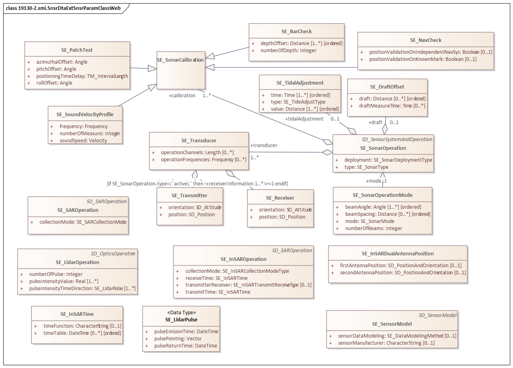
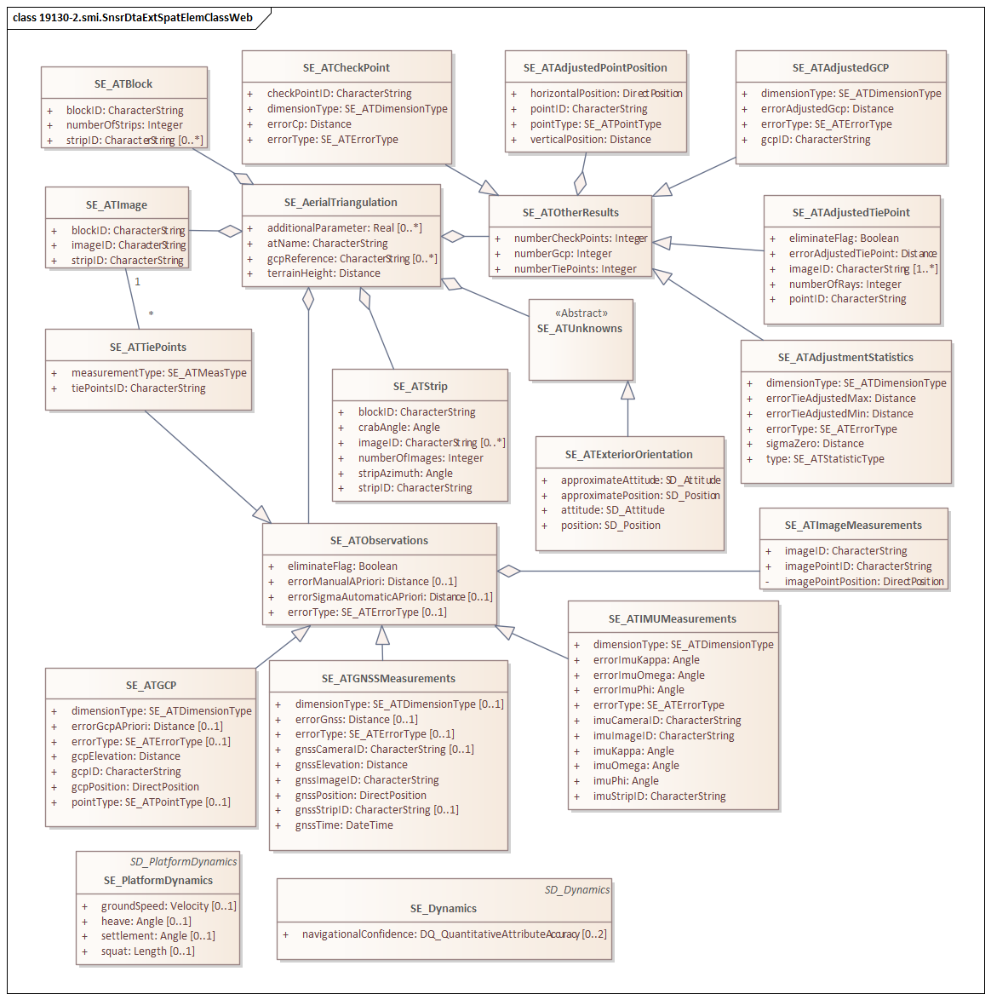
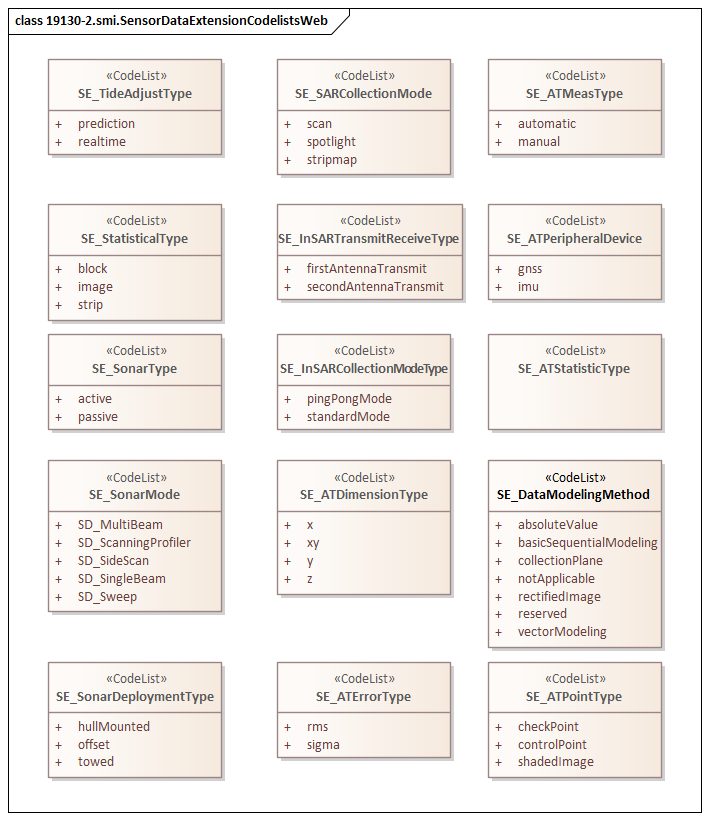

= SAR, INSAR, lidar and sonar (SMI)
:edition: 1.1
:revdate: 2021-02-15

== SAR, INSAR, lidar and sonar Version: 1.1

=== Description

The XML schema was encoded using the rules described in ISO 19108 and ISO/TS
19139:2007.

SMI 1.1 is an XML Schema implementation derived from:

* ISO 19130-1, Geographic Information - Imagery Sensor Models for Geopositioning -
Part 1: Fundamentals; and
* ISO 19130-2, Geographic Information - Imagery Sensor Models for Geopositioning -
Part 2: SAR, INSAR, lidar and sonar.

=== XML Namespace for smi 1.1

The namespace URI for smi 1.1 is
https://schemas.isotc211.org/19130/-3/smi/1.1.

=== XML Schema for smi 1.1

https://schemas.isotc211.org/19130/-3/smi/1.1.0/smi.xsd
is the XML Schema document to be referenced by XML documents containing XML elements
in the smi 1.1 namespace or by XML Schema documents importing the smi 1.1 namespace.
This XML schema includes (indirectly) all the implemented concepts of the smi
namespace, but it does not contain the declaration of any types.

=== Related XML Schema for smi 1.1 derived from ISO 19130-2, Geographic Information - Imagery Sensor Models for Geopositioning - Part 2: SAR, INSAR, lidar and sonar

==== Sensor Model

`https://schemas.isotc211.org/19130/-2/smi/1.1.0/sensorModel.xsd` implements the UML conceptual schema
defined in ISO 19130-2, Geographic Information - Imagery Sensor Models for
Geopositioning - Part 2: SAR, INSAR, lidar and sonar. It was created using the
encoding rules defined in ISO 19118, ISO 19139.

https://schemas.isotc211.org/19130/-2/smi/1.1.0/sensorModel.xsd contains the following classes:

* SE_SensorModel

==== Sensor Parameters

`https://schemas.isotc211.org/19130/-2/smi/1.1.0/sensorParameters.xsd` implements the UML conceptual
schema defined in ISO 19130-2, Geographic Information - Imagery Sensor Models for
Geopositioning - Part 2: SAR, INSAR, lidar and sonar. It was created using the
encoding rules defined in ISO 19118, ISO 19139.

.Classes in the ISO 19130-2 smi namespace, sensor parameters.

https://schemas.isotc211.org/19130/-2/smi/1.1.0/sensorParameters.xsd contains the following classes:

* SE_SAROperation
* SE_InSARTime
* SE_InSAROperation
* SE_InSARDualAntennaPosition
* SE_LIDAROperation
* SE_LIDARPulse
* SE_SonarOperation
* SE_SonarOperationMode
* SE_Transducer
* SE_Receiver
* SE_Transmitter
* SE_SonarCalibration
* SE_BarCheck
* SE_PatchTest
* SE_SoundVelocityProfile
* SE_NavCheck
* SE_DraftOffset
* SE_TidalAdjustment

==== Spatial Elements

`https://schemas.isotc211.org/19130/-2/smi/1.1.0/spatialElements.xsd`
implements the UML conceptual schema defined in ISO 19130-2, Geographic Information -
Imagery Sensor Models for Geopositioning - Part 2: SAR, INSAR, lidar and sonar. It
was created using the encoding rules defined in ISO 19118, ISO 19139.

.Classes in the ISO 19130-2 smi namespace, spatial elements.

https://schemas.isotc211.org/19130/-2/smi/1.1.0/spatialElements.xsd contains the following classes:

* SE_AerialTriangulation
* SE_ATAdjustedGCP
* SE_ATAdjustedPointPosition
* SE_ATAdjustedTiePoint
* SE_ATAdjustmentStatistics
* SE_ATBlock
* SE_ATCheckPoint
* SE_ATExteriorOrientation
* SE_ATGCP
* SE_ATGNSSMeasurements
* SE_ATImage
* SE_ATImageMeasurements
* SE_ATIMUMeasurements
* SE_ATObservations
* SE_ATOtherResults
* SE_ATStrip
* SE_ATTiePoints
* SE_ATUnknowns
* SE_Dynamics
* SE_PlatformDynamics

==== ISO 19130-2 Code lists

`https://schemas.isotc211.org/19130/-2/smi/1.1.0/codeList.xsd`
implements the codelists from the UML conceptual schema defined in ISO 19130-2,
Geographic Information - Imagery Sensor Models for Geopositioning - Part 1: SAR,
INSAR, lidar and sonar. It was created using the encoding rules defined in ISO 19118,
ISO 19139.

.Codelist(s) in the 19130-2 smi namespace

https://schemas.isotc211.org/19130/-2/smi/1.1.0/codeList.xsd contains the following classes:

* SE_ATDimensionType
* SE_ATMeasType
* SE_ATPointType
* SE_ATStatisticType
* SE_DataModelingMethod
* SE_SARCollectionMode
* SE_SonarDeploymentType
* SE_SonarMode
* SE_SonarType
* SE_TideAdjustType
* SE_InSARCollectionModeType
* SE_InSARTransmitReceiveType
* SE_ATErrorType
* SE_ATPeripheralDevice

=== Related XML Namespaces for ISO 19130-2 smi 1.1

The 19130-2 smi 1.1 namespace imports these other namespaces:

[%unnumbered]
[options=header,cols=4]
|===
| Name | Standard Prefix | Namespace Location | Schema Location

| Geographic Common Objects | gco |
`https://schemas.isotc211.org/19103/-/gco/1.2.0` | https://schemas.isotc211.org/19103/-/gco/1.2.0/gco.xsd[gco.xsd]
| Metadata for Data Quality | mdq |
`https://schemas.isotc211.org/19157/-/mdq/1.2.0` | https://schemas.isotc211.org/19157/-/mdq/1.2.0/mdq.xsd[mdq.xsd]
| Geospatial Meta-Language | gml |
http://schemas.opengis.net/gml/3.2.1/gml.xsd |
http://schemas.opengis.net/gml/3.2.1/gml.xsd
| Sensor Web Enabled | swe |
http://www.opengis.net/swe/2.0[http://www.opengis.net/swe/2.0] |
http://schemas.opengis.net/sweCommon/2.0/swe.xsd
|===

=== Working Versions

When revisions to these schema become necessary, they will be managed in the
https://github.com/ISO-TC211/XML[ISO TC211 Git Repository].
