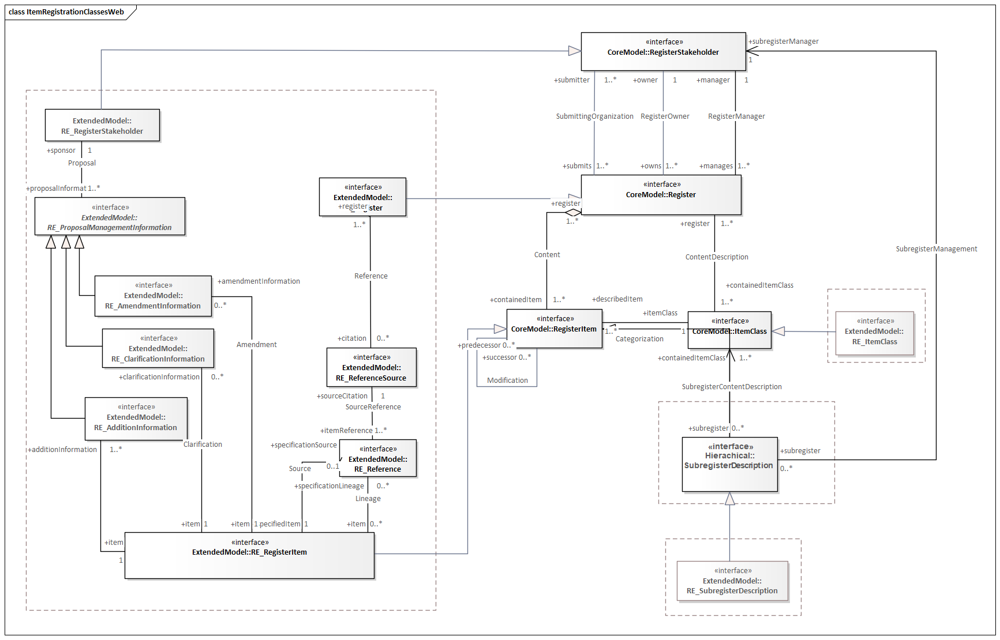

= Procedures for item registration Pt 2
:revdate: 2021-02-04

== Geographic Information - Procedures for item registration - Part 2: XML implementation Amendment 1

Processes for item registration - class diagram

. Processes for item registration classes

=== Description

PIR is an XML Schema implementation derived from ISO 19135-1, Geographic
Information - Procedures for item registration - Part 1: Fundamentals (2015), as
described in ISO 19135-2 Amendment 1 2021

=== XML Namespace for PIR

The namespace URI for PIR 1.0 is derived from ISO 19135-2
*http://standards.iso.org/iso/19135/-1/pir/1.0*.

=== XML Schema for PIR 1.0

`https://schemas.isotc211.org/19135/-1/pir/1.0/pir.xsd[pir.xsd in ISO 19135-1]` is
the XML Schema document to be referenced by XML documents containing XML elements in
the PIR 1.0 namespace or by XML Schema documents importing the PIR 1.0 namespace.

=== Related XML Schema for PIR 1.0

`https://schemas.isotc211.org/19135/-1/pir/1.0/core.xsd[core.xsd]` implements the UML
conceptual schema defined in ISO 19135-1. It was created using the encoding rules
defined in ISO 19118, ISO 19139, and the implementation approach described in ISO
19115-2. core.xsd contains the following classes (enumerations are bold italic):

* Register
* ItemClass
* Registration
* RegistrationStakeholder
* RE_version
* *_RE_ItemStatus_*

`https://schemas.isotc211.org/19135/-1/pir/1.0/extended.xsd[extended.xsd]` implements
the UML conceptual schema defined in ISO 19135-1. It was created using the encoding
rules defined in ISO 19118, ISO 19139, and the implementation approach described in
ISO 19115-2. core.xsd contains the following classes (enumerations are bold italic,
codeLists are bold):

* RE_AlternativeExpresion
* RE_AlternativeName
* RE_AmendedInformation
* RE_Register
* RE_RegisterItem
* RE_ItemClass
* RE_ClarificationInformation
* RE_ProposalManagementInformation
* RE_Reference
* RE_ReferenceSource
* RE_RegisterStakeholder
* RE_SubregisterDescription
* RE_FieldOfApplication
* RE_Locale
* *_RE_AmenedmentType_*
* *_RE_DecisionStatus_*
* *_RE_Disposition_*
* *RE_SimilarityToSource*

`https://schemas.isotc211.org/19135/-1/pir/1.0/hierarchy.xsd[hierarchy.xsd]`
implements the UML conceptual schema defined in ISO 19135-1. It was created using the
encoding rules defined in ISO 19118, ISO 19139, and the implementation approach
described in ISO 19115-2. core.xsd contains the following classes:

* SubregisterDescription

=== Related XML Namespaces for PIR

The PIR namespace imports these other namespaces:

[%unnumbered]
[options=header,cols=4]
|===
| Name | Standard Prefix | Namespace Location | Schema Location

| Geographic COmmon | gco |
`https://schemas.isotc211.org/19115/-3/gco/1.0` | https://schemas.isotc211.org/19115/-3/gco/1.0/gco.xsd
| CITation | cit |
`https://schemas.isotc211.org/19115/-3/cit/2.0` | https://schemas.isotc211.org/19115/-3/cit/2.0/cit.xsd
|===

=== Working Versions

When revisions to these schema become necessary, they will be managed in the
https://github.com/ISO-TC211/XML[ISO TC211 Git Repository].
