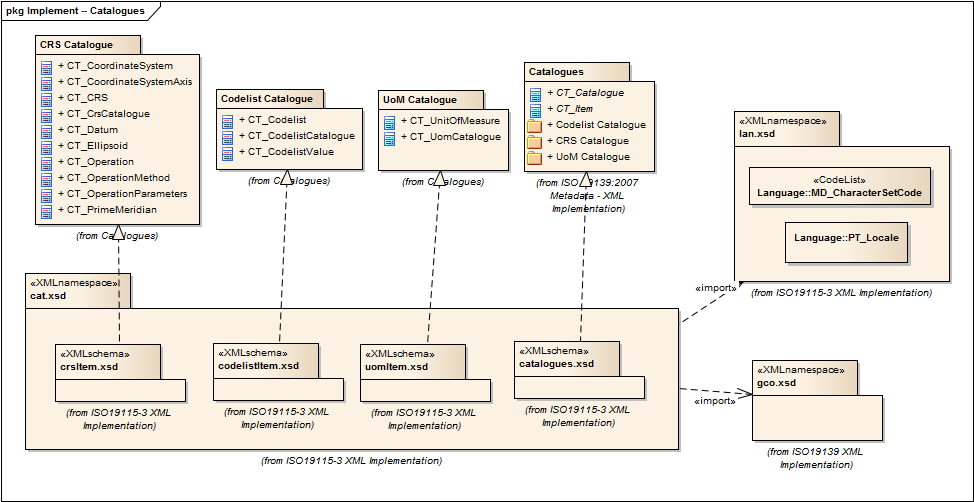

= CATalogue (CAT)
:edition: 1.2.0
:revdate: 2010-02-19

== CATalogue (CAT) Version: 1.2.0

=== Description

CAT 1.2.0 is an XML Schema implementation derived from ISO 19139:2007, Geographic
Information - Metadata - XML Schema Implementation. It includes elements for codelist
catalogues, and example catalogues. The XML schema was encoded using the rules
described in ISO/TS 19139:2007.

=== XML Namespace for cat 1.2

The namespace URI for cat 1.2 is `https://schemas.isotc211.org/19139/-/cat/1.2`.

=== XML Schema for cat 1.2

https://schemas.isotc211.org/19139/-/cat/1.2.0/cat.xsd[cat.xsd] is the XML Schema document to
be referenced by XML documents containing XML elements in the cat 1.2 namespace or by
XML Schema documents importing the cat 1.2 namespace. This XML schema includes
(indirectly) all the implemented concepts of the cat namespace, but it does not
contain the declaration of any types.

=== Related XML Schema for cat 1.2

https://schemas.isotc211.org/19139/-/cat/1.2.0/catalogues.xsd[catalogues.xsd] implements the
UML conceptual schema defined in ISO 19139:2007, Geographic Information - Metadata -
XML Schema Implementation, Clause 7.4.4. It was created using the encoding rules
defined in ISO 19118, ISO 19139.

https://schemas.isotc211.org/19139/-/cat/1.2.0/catalogues.xsd contains the following classes:

* AbstractCT_Catalogue
* AbstractCT_Item

https://schemas.isotc211.org/19139/-/cat/1.2.0/codelistItem.xsd[codelistItem.xsd] implements
the UML conceptual schema defined in ISO 19139:2007, Geographic Information -
Metadata - XML Schema Implementation, Clause 9.8.7. It was created using the encoding
rules defined in ISO 19118, ISO 19139.

https://schemas.isotc211.org/19139/-/cat/1.2.0/codelistItem.xsd contains the following classes:

* CT_CodelistCatalogue
* CT_Codelist
* CT_CodelistValue

https://schemas.isotc211.org/19139/-/cat/1.2.0/crsItem.xsd[crsItem.xsd] implements the UML
conceptual schema defined in ISO 19139:2007, Geographic Information - Metadata - XML
Schema Implementation, Clause 9.8.9. It was created using the encoding rules defined
in ISO 19118, ISO 19139.

https://schemas.isotc211.org/19139/-/cat/1.2.0/crsItem.xsd contains the following classes:

* CT_CrsCatalogue
* CT_CRS
* CT_CoordinateSystem
* CT_CoordinateSystemAxis
* CT_Datum
* CT_Ellipsoid
* CT_PrimeMeridian
* CT_Operation
* CT_OperationMethod
* CT_OperationParameters

link:uomItem.xsd[uomItem.xsd] implements the UML conceptual schema defined in ISO
19139:2007, Geographic Information - Metadata - XML Schema Implementation, Clause
9.8.8. It was created using the encoding rules defined in ISO 19118, ISO 19139.

https://schemas.isotc211.org/19139/-/cat/1.2.0/uomItem.xsd contains the following classes:

* CT_UnitOfMeasure
* CT_UomCatalogue

=== Related XML Namespaces for cat 1.2

The cat 1.2 namespace imports these other namespaces:

[%unnumbered]
[options=header,cols=4]
|===
| Name | Standard Prefix | Namespace Location | Schema Location

| Geographic Common Objects | gco |
https://schemas.isotc211.org/1911503/-/gco/1.2 | https://schemas.isotc211.org/19103/-/gco/1.2.0/gco.xsd[gco.xsd]
| LANguage and localization | lan |
`https://schemas.isotc211.org/19115/-3/lan/1.0` | https://schemas.isotc211.org/19115/-1/lan/1.3.0/lan.xsd[lan.xsd]
|===

=== Working Versions

When revisions to these schema become necessary, they will be managed in the
https://github.com/ISO-TC211/XML[ISO TC211 Git Repository].
