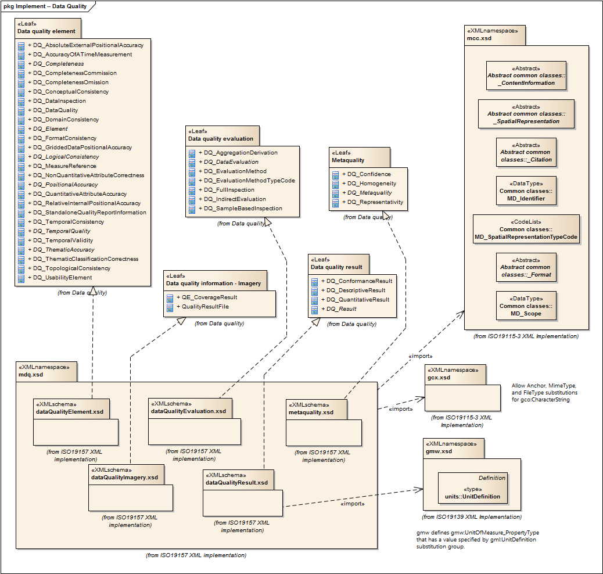

= Metadata for Data Quality (MDQ)
:edition: 1.0
:revdate: 2019-01-04

== Metadata for Data Quality (MDQ) Version: 1.0

=== Description

MDQ 1.0 is an XML Schema implementation derived from ISO 19157, Geographic
Information - Data Quality, Clause 6.4. It includes elements for describing the
quality of resources. The XML schema was encoded using the rules described in ISO/TS
19139:2007, Clause 8 and implementation approach from ISO/TS19115-3, Clause 8.

=== Sample XML files for mdq 1.0

* link:mdq.xml[mdq.xml]
* link:mdq_invalid.xml[mdq_invalid.xml]
* link:mdq_valid.xml[mdq_valid.xml]

=== CodeLists for mdq 1.0

* link:codelists.html[codelists.html]
* link:codelists.xml[codelists.xml]

=== XML Namespace for mdq 1.0

The namespace URI for mdq 1.0 is `http://standards.iso.org/iso/19157/-2/mdq/1.0`.

=== XML Schema for mdq 1.0

link:mdq.xsd[mdq.xsd] is the XML Schema document to be referenced by XML documents
containing XML elements in the mdq 1.0 namespace or by XML Schema documents importing
the mdq 1.0 namespace. This XML schema includes (indirectly) all the implemented
concepts of the mdq namespace, but it does not contain the declaration of any types.

NOTE: The XML Schema for mdq 1.0 are available link:mdq.zip[here]. A zip archive
including all the XML Schema Implementations defined in ISO/TS 19115-3 and related
standards is also
https://schemas.isotc211.org/19115/19115AllNamespaces.zip[available].

=== Related XML Schema for mdq 1.0

link:dataQualityElement.xsd[dataQualityElement.xsd] implements the UML conceptual
schema defined in ISO 19157, Geographic Information - Data Quality, Clause 6.4. It
was created using the encoding rules defined in ISO 19118, ISO 19139, and the
implementation approach described in ISO 19115-3 and contains the following classes
(codeLists are bold): DQ_AbsoluteExternalPositionalAccuracy,
DQ_AccuracyOfATimeMeasurement, AbstractDQ_Completeness, DQ_CompletenessCommission,
DQ_CompletenessOmission, DQ_ConceptualConsistency, DQ_DataInspection, DQ_DataQuality,
DQ_DomainConsistency, AbstractDQ_Element, DQ_FormatConsistency,
DQ_GriddedDataPositionalAccuracy, AbstractDQ_LogicalConsistency, DQ_MeasureReference,
DQ_NonQuantitativeAttributeCorrectness, AbstractDQ_PositionalAccuracy,
DQ_QuantitativeAttributeAccuracy, DQ_RelativeInternalPositionalAccuracy,
DQ_StandaloneQualityReportInformation, DQ_TemporalConsistency,
AbstractDQ_TemporalQuality, DQ_TemporalValidity, AbstractDQ_ThematicAccuracy,
DQ_ThematicClassificationCorrectness, DQ_TopologicalConsistency, and
DQ_UsabilityElement

link:dataQualityEvaluation.xsd[dataQualityEvaluation.xsd] implements the UML
conceptual schema defined in ISO 19157, Geographic Information - Data Quality, Clause
6.4. It was created using the encoding rules defined in ISO 19118, ISO 19139, and the
implementation approach described in ISO 19115-3 and contains the following classes
(codeLists are bold): DQ_AggregationDerivation, AbstractDQ_DataEvaluation,
DQ_EvaluationMethod, *DQ_EvaluationMethodTypeCode*, DQ_FullInspection,
DQ_IndirectEvaluation, and DQ_SampleBasedInspection

link:dataQualityImagery.xsd[dataQualityImagery.xsd] implements the UML conceptual
schema defined in ISO 19157, Geographic Information - Data Quality, Clause 6.4. It
was created using the encoding rules defined in ISO 19118, ISO 19139, and the
implementation approach described in ISO 19115-3 and contains the following classes
(codeLists are bold): QE_CoverageResult, and QualityResultFile

link:dataQualityResult.xsd[dataQualityResult.xsd] implements the UML conceptual
schema defined in ISO 19157, Geographic Information - Data Quality, Clause 6.4. It
was created using the encoding rules defined in ISO 19118, ISO 19139, and the
implementation approach described in ISO 19115-3 and contains the following classes
(codeLists are bold): DQ_ConformanceResult, DQ_DescriptiveResult,
DQ_QuantitativeResult, and AbstractDQ_Result

link:metaquality.xsd[metaquality.xsd] implements the UML conceptual schema defined
in ISO 19157, Geographic Information - Data Quality, Clause 6.4. It was created using
the encoding rules defined in ISO 19118, ISO 19139, and the implementation approach
described in ISO 19115-3 and contains the following classes (codeLists are bold):
DQ_Confidence, DQ_Homogeneity, AbstractDQ_Metaquality, and DQ_Representativity

=== Related XML Namespaces for mdq 1.0

The mdq 1.0 namespace imports these other namespaces:

[%unnumbered]
[options=header,cols=4]
|===
| Name | Standard Prefix | Namespace Location | Schema Location

| Data Quality Common Classes | dqc |
`https://schemas.isotc211.org/19157/-2/dqc/1.0` | https://schemas.isotc211.org/19157/-2/dqc/1.0/dqc.xsd[dqc.xsd]
| Geographic COmmon | gco |
`https://schemas.isotc211.org/19115/-3/gco/1.0` | https://schemas.isotc211.org/19115/-3/gco/1.0/gco.xsd[gco.xsd]
| Geospatial Common eXtension | gcx |
`https://schemas.isotc211.org/19115/-3/gcx/1.0` | https://schemas.isotc211.org/19115/-3/gcx/1.0/gcx.xsd[gcx.xsd]
| Geographic Markup Wrappers | gmw |
`https://schemas.isotc211.org/19115/-3/gmw/1.0` | https://schemas.isotc211.org/19115/-3/gmw/1.0/gmw.xsd[gmw.xsd]
| Metadata Common Classes | mcc |
`https://schemas.isotc211.org/19115/-3/mcc/1.0` | https://schemas.isotc211.org/19115/-3/mcc/1.0/mcc.xsd[mcc.xsd]
| Metadata for Resource Distribution | mrd |
`https://schemas.isotc211.org/19115/-3/mrd/1.0` | https://schemas.isotc211.org/19115/-3/mrd/1.0/mrd.xsd[mrd.xsd]
|===

=== Schematron Validation Rules for mdq 1.0

Schematron rules for validating instance documents of the mdq 1.0 namespace are in
link:mdq.sch[mdq.sch]. Other schematron rule sets that are required for a complete
validation are: gco.sch, dqc.sch, mcc.sch, gco.sch, mcc.sch, gco.sch, gcx.sch,
mcc.sch, mrd.sch, gco.sch, gmw.sch, mcc.sch, dqc.sch, gcx.sch, mcc.sch, and gco.sch

=== Working Versions

When revisions to these schema become necessary, they will be managed in the
https://github.com/ISO-TC211/XML[ISO TC211 Git Repository].
