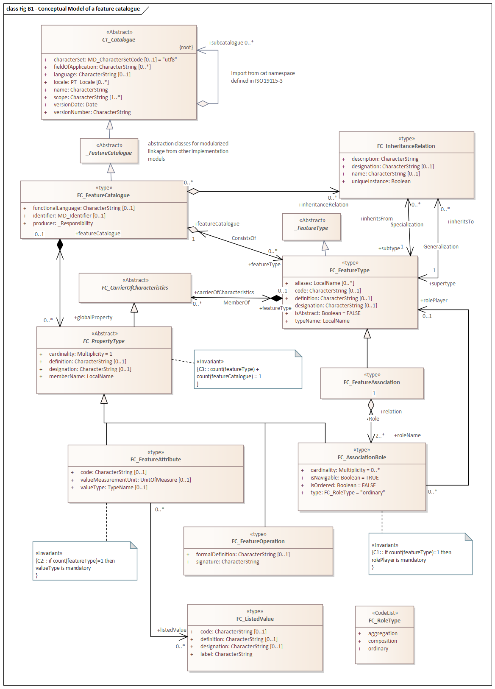

= General Feature Cataloguing (GFC)
:edition: 2.2.0
:revdate: 2010-02-25

== General Feature Cataloguing (GFC) Version: 2.2.0

.Classes in the gfc namespace

=== Description

General Feature Cataloguing (GFC) is an XML Schema implementation derived from ISO
19110:2016, Geographic Information - Methodologies for feature cataloging. It
includes elements for cataloguing features. The XML schema was encoded using the
encoding rules defined in ISO 19118, ISO 19139.

=== XML Namespace for gfc 2.2

The namespace URI for gfc 2.2 is `https://schemas.isotc211.org/19110/-/gfc/2.2`.

=== XML Schema for gfc 1.2

https://schemas.isotc211.org/19110/-/gfc/2.2.0/.2.0/gfc.xsd[gfc.xsd] is the XML Schema document
to be referenced by XML documents containing XML elements in the gfc 2.2 namespace or
by XML Schema documents importing the gfc 2.2 namespace. This XML schema includes
(indirectly) all the implemented concepts of the gfct namespace, but it does not
contain the declaration of any types.

=== Related XML Schema for cat 1.2

https://schemas.isotc211.org/19110/-/gfc/2.2.0/featureCatalogues.xsd[featureCatalogues.xsd]
implements the UML conceptual schema defined in ISO 191110:2016, Geographic
Information - Methodologies for feature cataloging, Clause 6. It was created using
the encoding rules defined in ISO 19118, ISO 19139.

https://schemas.isotc211.org/19110/-/gfc/2.2.0/featureCatalogues.xsd
contains the following classes:

* FC_AssociationRole
* FC_Binding
* FC_BoundAssociationRole
* FC_BoundFeatureAttribute
* AbstractFC_CarrierOfCharacteristics
* FC_Constraint
* FC_DefinitionReference
* FC_DefinitionSource
* FC_FeatureAssociation
* FC_FeatureAttribute
* FC_FeatureCatalogue
* FC_FeatureOperation
* FC_FeatureType
* FC_InheritanceRelation
* FC_ListedValue
* FC_LocalisedDefinitionReference
* AbstractFC_PropertyType
* FC_RoleType

=== Related XML Namespaces for gfc 2.2

The gfc 2.2 namespace imports these other namespaces:

[%unnumbered]
[options=header,cols=4]
|===
| Name | Standard Prefix | Namespace Location | Schema Location

| Geographic Common Objects | gco |
https://schemas.isotc211.org/19103/-/gco/1.2 | https://schemas.isotc211.org/19103/-/gco/1.2.0/gco.xsd[gco.xsd]
| Feature Catalogue Common | fcc |
https://schemas.isotc211.org/19110/-/fcc/2.2 | https://schemas.isotc211.org/19110/-/fcc/2.2.0/fcc.xsd[fcc.xsd]
| Cataloguing | cat |
https://schemas.isotc211.org/19139/-/cat/1.2 | https://schemas.isotc211.org/19139/-/cat/1.2.0/cat.xsd[cat.xsd]
| Language | lan |
https://schemas.isotc211.org/19115/-1/lan/1.3 | https://schemas.isotc211.org/19115/-1/lan/1.3.0/lan.xsd[lan.xsd]
| Metadata Common Classes | mcc |
https://schemas.isotc211.org/19115/-1/mcc/1.3 | https://schemas.isotc211.org/19115/-1/mcc/1.3.0/mcc.xsd[mcc.xsd]
|===

=== Working Versions

When revisions to these schema become necessary, they will be managed in the
https://github.com/ISO-TC211/XML[ISO TC211 Git Repository].
