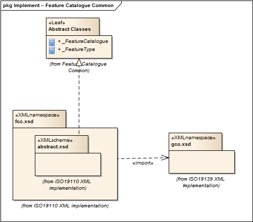

= Feature Catalog Common (FCC)
:edition: 1.0
:revdate: 2019-01-04

== Feature Catalog Common (FCC) Version: 1.0

=== Description

FCC 1.0 is an XML Schema implementation derived from ISO 19110, Geographic
information -- Methodology for feature cataloguing. It includes abstract classes
shared by multiple namespaces and is required in order to enable modularization of
the XML implementation. The XML schema was encoded using the rules described in
ISO/TS 19139:2007, Clause 8 and implementation approach from ISO/TS19115-3, Clause 8.

=== XML Namespace for fcc 1.0

The namespace URI for fcc 1.0 is `http://standards.iso.org/iso/19110/fcc/1.0`.

=== XML Schema for fcc 1.0

link:fcc.xsd[fcc.xsd] is the XML Schema document to be referenced by XML documents
containing XML elements in the fcc 1.0 namespace or by XML Schema documents importing
the fcc 1.0 namespace. This XML schema includes (indirectly) all the implemented
concepts of the fcc namespace, but it does not contain the declaration of any types.

NOTE: The XML Schema for fcc 1.0 are available link:fcc.zip[here]. A zip archive
including all the XML Schema Implementations defined in ISO/TS 19115-3 and related
standards is also https://schemas.isotc211.org/19115/19115AllNamespaces.zip[available].

=== Related XML Schema for fcc 1.0

link:abstract.xsd[abstract.xsd] implements the UML conceptual schema defined in ISO
19110, Geographic information -- Methodology for feature cataloguing. It was created
using the encoding rules defined in ISO 19118, ISO 19139, and the implementation
approach described in ISO 19115-3 and contains the following classes (codeLists are
bold): Abstract_FeatureCatalogue, and Abstract_FeatureType

=== Related XML Namespaces for fcc 1.0

The fcc 1.0 namespace imports these other namespaces:

[%unnumbered]
[options=header,cols=4]
|===
| Name | Standard Prefix | Namespace Location | Schema Location

| CATalogue | cat |
`https://schemas.isotc211.org/19115/-3/cat/1.0` | https://schemas.isotc211.org/19115/-3/cat/1.0/cat.xsd[cat.xsd]

| Geographic COmmon | gco |
`https://schemas.isotc211.org/19115/-3/gco/1.0` | https://schemas.isotc211.org/19115/-3/gco/1.0/gco.xsd[gco.xsd]

|===

=== Working Versions

When revisions to these schema become necessary, they will be managed in the
https://github.com/ISO-TC211/XML[ISO TC211 Git Repository].
