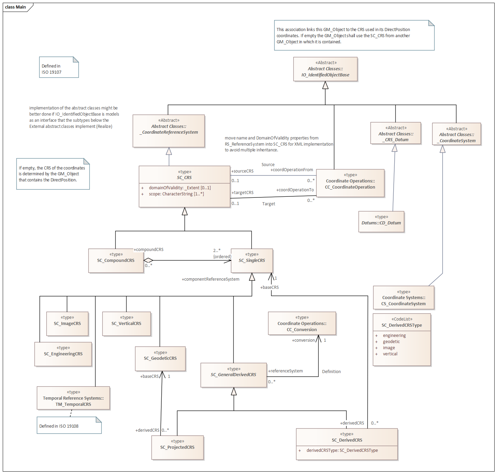

= Simplified stub for Referencing By Coordinates (RBC)
:edition: 3.1.0
:revdate: 2010-02-25

== Simplified stub for Referencing By Coordinates (RBC) Version: 3.1.0

.Classes in the rbc namespace

=== Description

Simplified stub for Referencing By Coordinates (RBC) is an XML Schema implementation
derived from ISO 19111:2019, Geographic Information - Referencing by coordinates. It
includes elements for referencing features using coordinates. The XML schema was
encoded using the encoding rules defined in ISO 19118, ISO 19139.

=== XML Namespace for rbc 2.2

The namespace URI for rbc 2.2 is `https://schemas.isotc211.org/19110/-/rbc/2.2`.

=== XML Schema for rbc 1.2

https://schemas.isotc211.org/19110/-/rbc/3.1.0/rbc.xsd[rbc.xsd] is the XML Schema document to
be referenced by XML documents containing XML elements in the rbc 3.1 namespace or by
XML Schema documents importing the rbc 3.1 namespace. This XML schema includes
(indirectly) all the implemented concepts of the rbc namespace, but it does not
contain the declaration of any types.

=== Related XML Schema for RBC 1.3

https://schemas.isotc211.org/19111/-/rbc/3.1.0/rbcStubs.xsd[rbcStubs.xsd] implements very
limited of the UML conceptual schema defined in ISO 191111:2019, Geographic
Information - Referencing By Coordinates. This implementation was established to
allow for the introduction of dynamic datums into the reference system component of
ISO 19115-1. The complexity of Referencing By Coordinates has been simplified to a
set of character string components. It was created using the encoding rules defined
in ISO 19118, ISO 19139.

https://schemas.isotc211.org/19111/-/rbc/3.1.0/rbcStubs.xsd contains the following classes:

* RS_CRS
* RS_CoordinateOperation
* RS_DataEpoch

=== Related XML Namespaces for rbc 3.1

The rbc 3.1 namespace imports these other namespaces:

[%unnumbered]
[options=header,cols=4]
|===
| Name | Standard Prefix | Namespace Location | Schema Location

| Geographic Common Objects | gco |
https://schemas.isotc211.org/19103/-/gco/1.2 | https://schemas.isotc211.org/19103/-/gco/1.2.0/gco.xsd[gco.xsd]
| Metadata Common Classes | mcc |
https://schemas.isotc211.org/19115/-1/mcc/1.3 | https://schemas.isotc211.org/19115/-1/mcc/1.3.0/mcc.xsd[mcc.xsd]
|===

=== Working Versions

When revisions to these schema become necessary, they will be managed in the
https://github.com/ISO-TC211/XML[ISO TC211 Git Repository].
