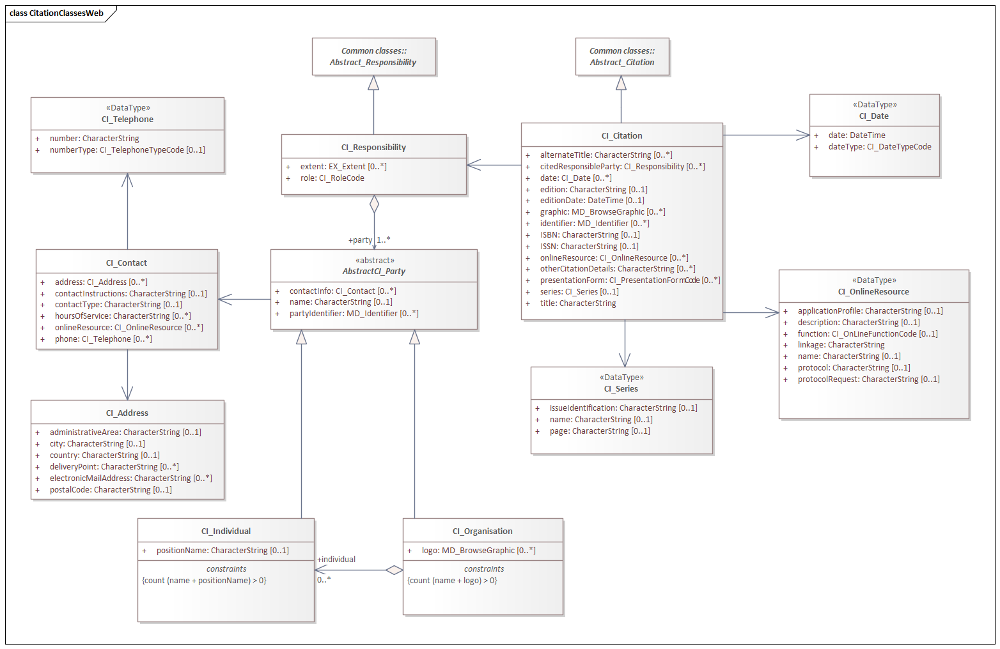
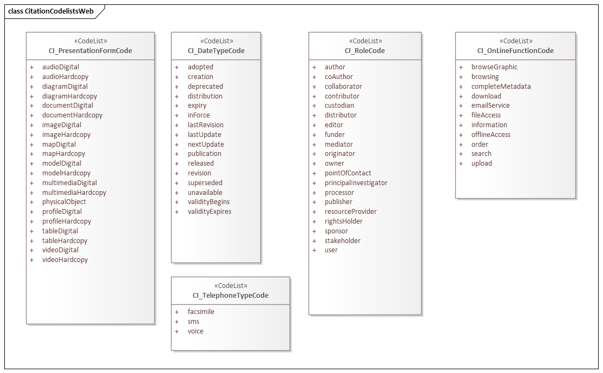

= Citation and responsible party information (CIT)
:edition: 1.3
:revdate: 2021-02-15

== Citation and responsible party information (CIT) Version: 1.3

.Classes in the cit namespace

.Codelist(s) in the cit namespace

=== Description

CIT 1.3 is an XML Schema implementation derived from ISO 19115-1, Geographic
Information - Metadata - Part 1: Fundamentals AMENDMENT 1, Clause 6.6.2. It includes
utility elements for citation, identification, and web linkage of resources. The XML
schema was encoded using the rules described in ISO/TS 19139:2007.

=== XML Namespace for cit 1.3

The namespace URI for cit 1.3 is `https://schemas.isotc211.org/19115/-1/cit/1.3`.

=== XML Schema for cit 1.3

https://schemas.isotc211.org/19115/-1/cit/1.3.0/cit.xsd[cit.xsd] is the XML Schema document to
be referenced by XML documents containing XML elements in the cit 1.3 namespace or by
XML Schema documents importing the cit 1.3 namespace. This XML schema includes
(indirectly) all the implemented concepts of the cit namespace, but it does not
contain the declaration of any types.

=== Related XML Schema for cit 1.3

https://schemas.isotc211.org/19115/-1/cit/1.3.0/citation.xsd[citation.xsd] implements the UML
conceptual schema defined in ISO 19115-1, Geographic Information - Metadata - Part 1:
Fundamentals AMENDMENT 1, Clause 6.6.2. It was created using the encoding rules
defined in ISO 19118, ISO 19139.

https://schemas.isotc211.org/19115/-1/cit/1.3.0/citation.xsd contains the folowing classes:

* CI_Citation
* CI_Responsibility
* AbstractCI_Party
* CI_Individual
* CI_Organisation
* CI_Address
* CI_Contact
* CI_Date
* CI_OnlineResource
* CI_Series
* CI_Telephone
* CI_DateTypeCode
* CI_OnLineFunctionCode
* CI_PresentationFormCode
* CI_RoleCode
* CI_TelephoneTypeCode

https://schemas.isotc211.org/19115/-1/cit/1.3.0/citation.xsd contains references to the following codelists:

* CI_DateTypeCode
* CI_OnLineFunctionCode
* CI_PresentationFormCode
* CI_RoleCode
* CI_TelephoneTypeCode

=== Related XML Namespaces for cit 1.3

The cit 1.3 namespace imports these other namespaces:

[%unnumbered]
[options=header,cols=4]
|===
| Name | Standard Prefix | Namespace Location | Schema Location

| Geographic Common Objects | gco | `https://schemas.isotc211.org/19103/-/gco/1.2.0` | https://schemas.isotc211.org/19103/-/gco/1.2/gco.xsd[gco.xsd]
| Metadata Common Classes | mcc | `https://schemas.isotc211.org/19115/-1/mcc/1.3.0` | https://schemas.isotc211.org/19115/-1/mcc/1.3.0/mcc.xsd[mcc.xsd]
|===

=== Schematron Validation Rules for cit 1.3

Schematron rules for validating instance documents of the cit 1.3 namespace are in
https://schemas.isotc211.org/19115/-1/cit/1.3.0/cit.sch[cit.sch].

=== Working Versions

When revisions to these schema become necessary, they will be managed in the
https://github.com/ISO-TC211/XML[ISO TC211 Git Repository].
