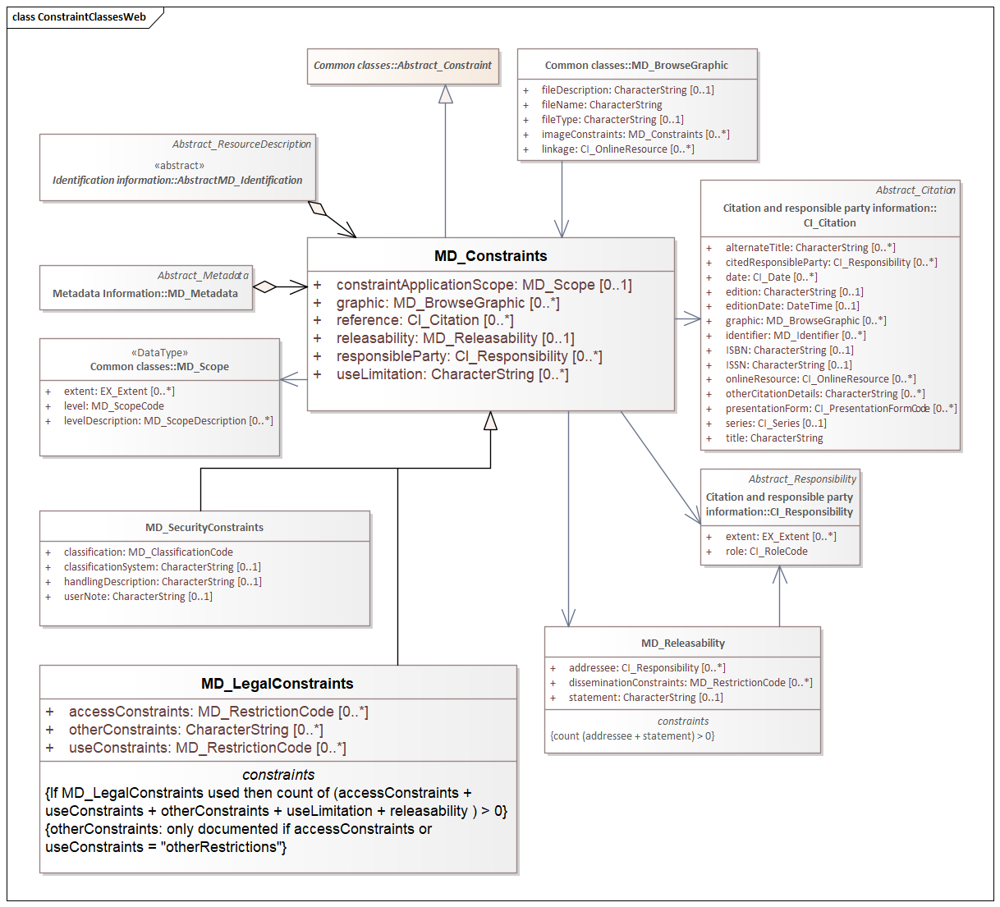
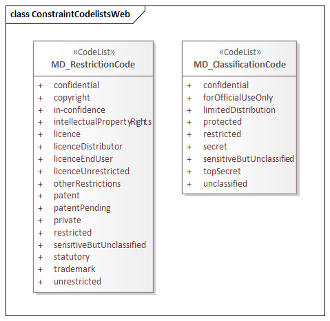

= Metadata for COnstraints (MCO)
:edition: 1.3
:revdate: 2021-02-15

== Metadata for COnstraints (MCO) Version: 1.3

.Classes in the mco namespace

.Code list(s) in the mco namespace

=== Description

MCO 1.3 is an XML Schema implementation derived from ISO 19115-1, Geographic
Information - Metadata - Part 1: Fundamentals, Clause 6.5.4. It includes elements for
describing resource and metadata constraints. The XML schema was encoded using the
rules described in ISO/TS 19139:2007.

=== XML Namespace for mco 1.3

The namespace URI for mco 1.3 is `https://schemas.isotc211.org/19115/-1/mco/1.3`.

=== XML Schema for mco 1.3

https://schemas.isotc211.org/19115/-1/mco/1.3.0/mco.xsd[mco.xsd] is the XML Schema document to
be referenced by XML documents containing XML elements in the mco 1.3 namespace or by
XML Schema documents importing the mco 1.3 namespace. This XML schema includes
(indirectly) all the implemented concepts of the mco namespace, but it does not
contain the declaration of any types.

=== Related XML Schema for mco 1.3

https://schemas.isotc211.org/19115/-1/mco/1.3.0/constraints.xsd[constraints.xsd] implements the
UML conceptual schema defined in ISO 19115-1, Geographic Information - Metadata -
Part 1: Fundamentals, Clause 6.5.4. It was created using the encoding rules defined
in ISO 19118, ISO 19139.

https://schemas.isotc211.org/19115/-1/mco/1.3.0/constraints.xsd contains the following classes:

* MD_Constraints
* MD_LegalConstraints
* MD_SecurityConstraints
* MD_Releasability

https://schemas.isotc211.org/19115/-1/mco/1.3.0/constraints.xsd contains references to the following codelists:

* MD_ClassificationCode
* MD_RestrictionCode

=== Related XML Namespaces for mco 1.3

The mco 1.3 namespace imports these other namespaces:

[%unnumbered]
[options=header,cols=4]
|===
| Name | Standard Prefix | Namespace Location | Schema Location

| Geographic Common Objects | gco |
`https://schemas.isotc211.org/19103/-/gco/1.2.0` | https://schemas.isotc211.org/19103/-/gco/1.2/gco.xsd[gco.xsd]
| Metadata Common Classes | mcc |
`https://schemas.isotc211.org/19115/-1/mcc/1.3.0` | https://schemas.isotc211.org/19115/-1/mcc/1.3.0/mcc.xsd[mcc.xsd]
|===

=== Schematron Validation Rules for mco 1.3

[%unnumbered]
[options=header,cols=4]
|===
| Package name | File name | Location | Constraint tested

| Metadata for COnstraints | mco.sch |
https://schemas.isotc211.org/19115/-1/mco/1.3.0/mco.sch[mco.sch]

a|
* MD_Releasability - count(addressee + statement) \> 0
* MD_LegalConstraints - count of (accessConstraints + useConstraints + otherConstraints + useLimitation + releasability) \> 0

| CITation and responsibility | cit.sch |
https://schemas.isotc211.org/19115/-1/cit/1.3.0/cit.sch[cit.sch]

a|
* CI_Individual - count(name + positionName) \> 0
* CI_organisation - count(name + logo) \> 0
|===

=== Schematron Validation Rules for mco 1.3

Schematron rules for validating instance documents of the mco 1.3 namespace are in
https://schemas.isotc211.org/19115/-1/mco/1.3.0/mco.sch[mco.sch].

=== Working Versions

When revisions to these schema become necessary, they will be managed in the
https://github.com/ISO-TC211/XML[ISO TC211 Git Repository].
