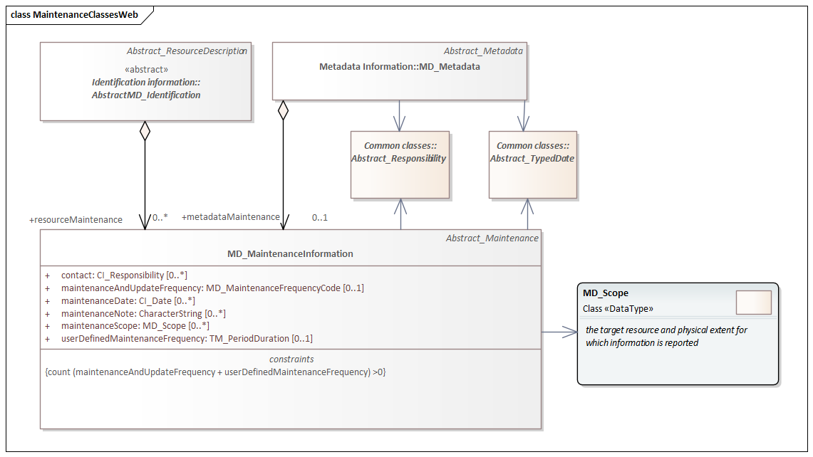
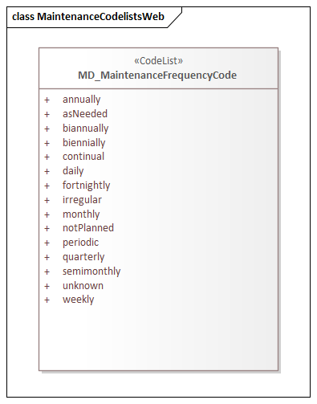

= Metadata for Maintenance Information (MMI)
:edition: 1.3
:revdate: 2021-02-16

== Metadata for Maintenance Information (MMI) Version: 1.3

.Classes in the mmi namespace

.Code list(s) in the mmi namespace

=== Description

MMI 1.3 is an XML Schema implementation derived from ISO 19115-1, Geographic
Information - Metadata - Part 1: Fundamentals, Clause 6.5.6. It includes elements
describing resource and metadata maintenance. The XML schema was encoded using the
rules described in ISO/TS 19139:2007.

=== XML Namespace for mmi 1.3

The namespace URI for mmi 1.3 is `https://schemas.isotc211.org/19115/-1/mmi/1.3`.

=== XML Schema for mmi 1.3

https://schemas.isotc211.org/19115/-1/mmi/1.3.0/mmi.xsd[mmi.xsd] is the XML Schema document to
be referenced by XML documents containing XML elements in the mmi 1.3 namespace or by
XML Schema documents importing the mmi 1.3 namespace. This XML schema includes
(indirectly) all the implemented concepts of the mmi namespace, but it does not
contain the declaration of any types.

=== Related XML Schema for mmi 1.3

https://schemas.isotc211.org/19115/-1/mmi/1.3.0/maintenance.xsd[maintenance.xsd] implements the
UML conceptual schema defined in ISO 19115-1, Geographic Information - Metadata -
Part 1: Fundamentals, Clause 6.5.6. It was created using the encoding rules defined
in ISO 19118, ISO 19139.

https://schemas.isotc211.org/19115/-1/mmi/1.3.0/maintenance.xsd contains the following class:

* MD_MaintenanceInformation

https://schemas.isotc211.org/19115/-1/mmi/1.3.0/maintenance.xsd contains references to the following
codelist:

* MD_MaintenanceFrequencyCode

=== Related XML Namespaces for mmi 1.3

The mmi 1.3 namespace imports these other namespaces:

[%unnumbered]
[options=header,cols=4]
|===
| Name | Standard Prefix | Namespace Location | Schema Location

| Geographic Common Objects | gco |
`https://schemas.isotc211.org/19103/-/gco/1.2.0` | https://schemas.isotc211.org/19103/-/gco/1.2/gco.xsd[gco.xsd]
| Metadata Common Classes | mcc |
`https://schemas.isotc211.org/19115/-1/mcc/1.3.0` | https://schemas.isotc211.org/19115/-1/mcc/1.3.0/mcc.xsd[mcc.xsd]
| CITation and Responsibility | cit |
`https://schemas.isotc211.org/19115/-1/cit/1.3.0` | https://schemas.isotc211.org/19115/-1/cit/1.3.0/cit.xsd[cit.xsd]
|===

=== Schematron Validation Rules for mmi 1.3

Schematron rules for validating instance documents of the mmi 1.3 namespace are in
https://schemas.isotc211.org/19115/-1/mmi/1.3.0/mmi.sch[mmi.sch].

[%unnumbered]
[options=header,cols=4]
|===
| Package name | File name | Location | Constraint tested

| MetaData Base | mmi.sch |
https://schemas.isotc211.org/19115/-1/mmi/1.3.0/mmi.sch a|
* MD_MaintenanceInformation - count(maintenanceAndUpdateFrequency + userDefinedMaintenanceFrequency) \> 0
| CITation and responsibility | cit.sch |
https://schemas.isotc211.org/19115/-1/cit/1.3.0/cit.sch a|
* CI_Individual - count(name + positionName) \> 0
* CI_organisation - count(name + logo) \> 0
|===

=== Working Versions

When revisions to these schema become necessary, they will be managed in the
https://github.com/ISO-TC211/XML[ISO TC211 Git Repository].
