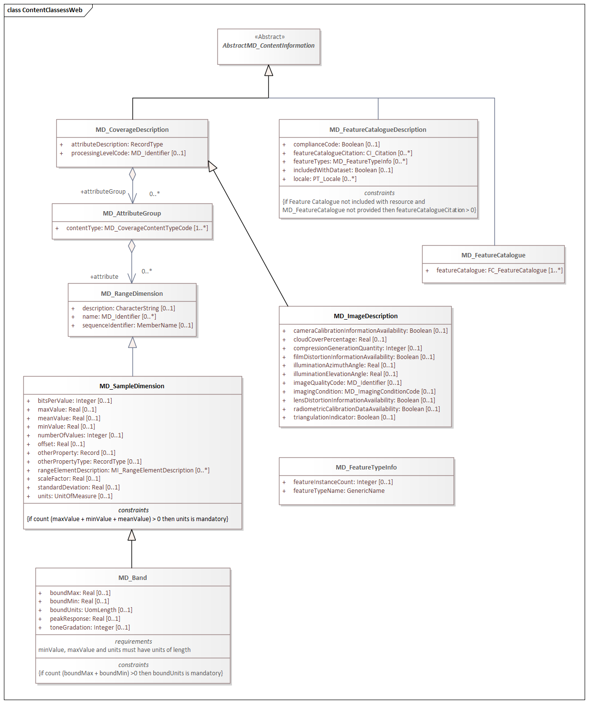
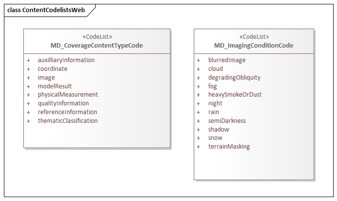

= Metadata for Resource Content (MRC)
:edition: 1.3
:revdate: 2021-02-16

== Metadata for Resource Content (MRC) Version: 1.3

.Classes in the mmi namespace

.Code list(s) in the mmi namespace

=== Description

MRC 1.3 is an XML Schema implementation derived from ISO 19115-1, Geographic
Information - Metadata - Part 1: Fundamentals AMENDMENT 1, Clause 6.5.9. It includes
elements for describing resource structure and content. The XML schema was encoded
using the rules described in ISO/TS 19139:2007.

=== XML Namespace for mrc 1.3

The namespace URI for mrc 1.3 is `https://schemas.isotc211.org/19115/-1/mrc/1.3`.

=== XML Schema for mrc 1.3

https://schemas.isotc211.org/19115/-1/mrc/1.3.0/mrc.xsd[mrc.xsd] is the XML Schema document to
be referenced by XML documents containing XML elements in the mrc 1.3 namespace or by
XML Schema documents importing the mrc 1.3 namespace. This XML schema includes
(indirectly) all the implemented concepts of the mrc namespace, but it does not
contain the declaration of any types.

=== Related XML Schema for mrc 1.3

https://schemas.isotc211.org/19115/-1/mrc/1.3.0/content.xsd[content.xsd] implements the UML
conceptual schema defined in ISO 19115-1, Geographic Information - Metadata - Part 1:
Fundamentals AMENDMENT 1, Clause 6.5.9. It was created using the encoding rules
defined in ISO 19118, ISO 19139.

https://schemas.isotc211.org/19115/-1/mrc/1.3.0/content.xsd contains the following classes:

* AbstractMD_ContentInformation
* MD_FeatureCatalogueDescription
* MD_FeatureCatalogue
* MD_CoverageDescription
* MD_ImageDescription
* MD_AttributeGroup
* MD_RangeDimension
* MD_SampleDimension
* MD_Band
* MD_FeatureTypeInfo

https://schemas.isotc211.org/19115/-1/mrc/1.3.0/content.xsd contains references to the following codelists:

* MD_CoverageContentTypeCode
* MD_ImagingConditionCode

https://schemas.isotc211.org/19115/-2/mrc/2.2.0/contentInformationImagery.xsd[contentInformationImagery.xsd]
implements the UML conceptual schema defined in ISO 19115-2, Geographic Information -
Metadata - Part 2: Extensions for acquisition and processing, Clause 6.5.9.
Information about
https://schemas.isotc211.org/19115/-2/mrc/2.2.0/contentInformationImagery.xsd[contentInformationImagery.xsd] can be obtained from
https://schemas.isotc211.org/19115/-2/mrc/2.2.0/

=== Related XML Namespaces for mrc 1.3

The mrc 1.3 namespace imports these other namespaces:

[%unnumbered]
[options=header,cols=4]
|===
| Name | Standard Prefix | Namespace Location | Schema Location

| Feature Catalog Common | fcc |
`https://schemas.isotc211.org/19110/fcc/1.3.0` | https://schemas.isotc211.org/19110/fcc/1.3.0/fcc.xsd[fcc.xsd]
| Geographic Common Objects | gco |
`https://schemas.isotc211.org/19103/-/gco/1.2.0` | https://schemas.isotc211.org/19103/-/gco/1.2/gco.xsd[gco.xsd]
| Geographic Markup Wrappers | gmw |
`https://schemas.isotc211.org/19163/-/gmw/1.1.0` | https://schemas.isotc211.org/19163/-/gmw/1.1/gmw.xsd[gmw.xsd]
| Language localization | lan |
`https://schemas.isotc211.org/19115/-1/lan/1.3.0` | https://schemas.isotc211.org/19115/-1/lan/1.3.0/lan.xsd[lan.xsd]
| Metadata Common Classes | mcc |
`https://schemas.isotc211.org/19115/-1/mcc/1.3.0` | https://schemas.isotc211.org/19115/-1/mcc/1.3.0/mcc.xsd[mcc.xsd]
| CITation and Responsibility | cit |
`https://schemas.isotc211.org/19115/-1/cit/1.3.0` | https://schemas.isotc211.org/19115/-1/cit/1.3.0/cit.xsd[cit.xsd]
|===

=== Schematron Validation Rules for mrc 1.3

Schematron rules for validating instance documents required for a complete validation
are:

[%unnumbered]
[options=header,cols=4]
|===
| Package name | File name | Location | Constraint tested

| Metadata for Resorce content | mrc.sch |
https://schemas.isotc211.org/19115/-1/mrc/1.3.0/mrc.sch a|
* MD_SampleDimension - if count (m axValue + m inValue + meanValue) \> 0 then units
is mandatory
* MD_FeatureCatalogueDescription - if Feature Catalogue not included with resource
and MD_FeatureCatalogue not provided then featureCatalogueCitation \> 0
* MD_Band - if count(boundMax + boundMin) \> 0 then boundUnits is mandatory
| CITation and responsibility | cit.sch |
https://schemas.isotc211.org/19115/-1/cit/1.3.0/cit.sch a|
* CI_Individual - count(name + positionName) \> 0
* CI_organisation - count(name + logo) \> 0
|===

=== Schematron Validation Rules for mrc 1.3

Schematron rules for validating instance documents of the mrc 1.3 namespace are in
https://schemas.isotc211.org/19115/-1/mrc/1.3.0/mrc.sch[mrc.sch].

=== Working Versions

When revisions to these schema become necessary, they will be managed in the
https://github.com/ISO-TC211/XML[ISO TC211 Git Repository].
