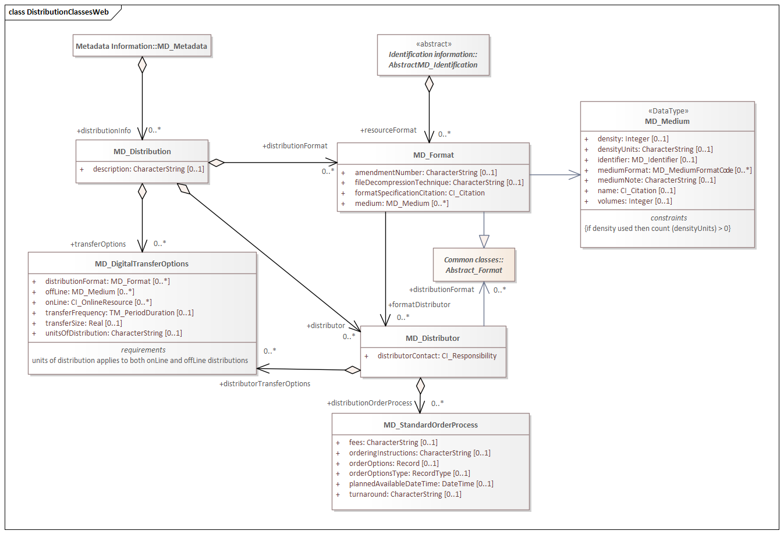
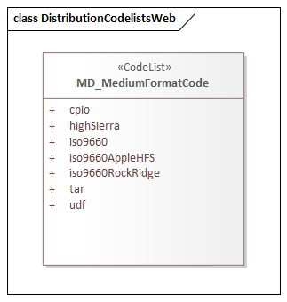

= Metadata for Resource Distribution (MRD)
:edition: 1.3
:revdate: 2021-02-16

== Metadata for Resource Distribution (MRD) Version: 1.3

.Classes in the mrd namespace

.Code list(s) in the mrd namespace

=== Description

MRD 1.3 is an XML Schema implementation derived from ISO 19115-1, Geographic
Information - Metadata - Part 1: Fundamentals, Clause 6.5.11. It includes elements
specifying how a resource is accessed. The XML schema was encoded using the rules
described in ISO/TS 19139:2007.

=== XML Namespace for mrd 1.3

The namespace URI for mrd 1.3 is `https://schemas.isotc211.org/19115/-1/mrd/1.3`.

=== XML Schema for mrd 1.3

https://schemas.isotc211.org/19115/-1/mrd/1.3.0/mrd.xsd[mrd.xsd] is the XML Schema document to
be referenced by XML documents containing XML elements in the mrd 1.3 namespace or by
XML Schema documents importing the mrd 1.3 namespace. This XML schema includes
(indirectly) all the implemented concepts of the mrd namespace, but it does not
contain the declaration of any types.

=== Related XML Schema for mrd 1.3

https://schemas.isotc211.org/19115/-1/mrd/1.3.0/distribution.xsd[distribution.xsd] implements
the UML conceptual schema defined in ISO 19115-1, Geographic Information - Metadata -
Part 1: Fundamentals, Clause 6.5.11. It was created using the encoding rules defined
in ISO 19118, ISO 19139.

https://schemas.isotc211.org/19115/-1/mrd/1.3.0/distribution.xsd contains the following classes:

* MD_Distribution
* MD_DigitalTransferOptions
* MD_Distributor
* MD_Format
* MD_Medium
* MD_StandardOrderProcess

https://schemas.isotc211.org/19115/-1/mrd/1.3.0/distribution.xsd contains reference(s) to the following
codelist:

* MD_MediumFormatCode

=== Related XML Namespaces for mrd 1.3

The mrd 1.3 namespace imports these other namespaces:

[%unnumbered]
[options=header,cols=4]
|===
| Name | Standard Prefix | Namespace Location | Schema Location

| Geographic Common Objects | gco |
`https://schemas.isotc211.org/19103/-/gco/1.2.0` | https://schemas.isotc211.org/19103/-/gco/1.2/gco.xsd[gco.xsd]
| Metadata Common Classes | mcc |
`https://schemas.isotc211.org/19115/-1/mcc/1.3.0` | https://schemas.isotc211.org/19115/-1/mcc/1.3.0/mcc.xsd[mcc.xsd]
| CITation and Responsibility | cit |
`https://schemas.isotc211.org/19115/-1/cit/1.3.0` | https://schemas.isotc211.org/19115/-1/cit/1.3.0/cit.xsd[cit.xsd]
|===

=== Schematron Validation Rules for mrd 1.3

Schematron rules for validating instance documents required for a complete validation are:

[%unnumbered]
[options=header,cols=4]
|===
| Package name | File name | Location | Constraint tested

| Metadata for Resource Distribution | mrd.sch |
https://schemas.isotc211.org/19115/-1/mrd/1.3.0/mrd.sch a|
* MD_Medium - if density used then count(densityUnits) \> 0
| CITation and responsibility | cit.sch |
https://schemas.isotc211.org/19115/-1/cit/1.3.0/cit.sch a|
* CI_Individual - count(name + positionName) \> 0
* CI_organisation - count(name + logo) \> 0
|===

=== Schematron Validation Rules for mrd 1.3

Schematron rules for validating instance documents of the mrd 1.3 namespace are in
https://schemas.isotc211.org/19115/-1/mrd/1.3.0/mrd.sch[mrd.sch]. Other schematron
rule sets that are required for a complete validation are: gco.sch, and mcc.sch

=== Working Versions

When revisions to these schema become necessary, they will be managed in the
https://github.com/ISO-TC211/XML[ISO TC211 Git Repository].
