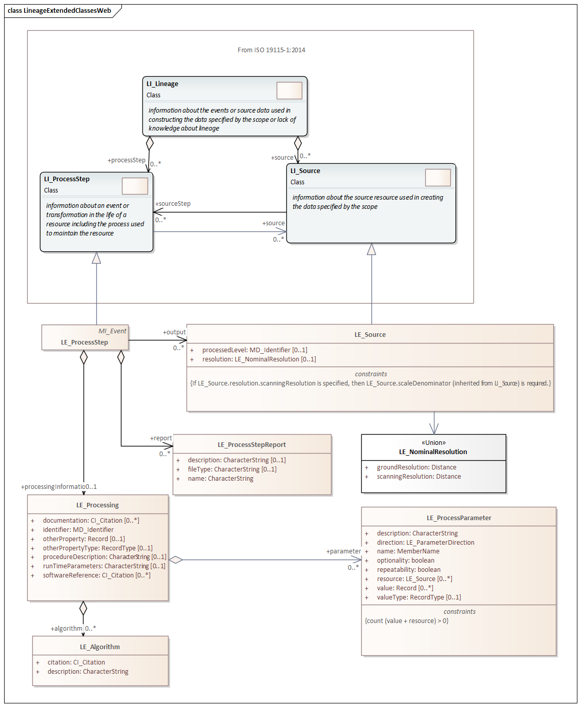
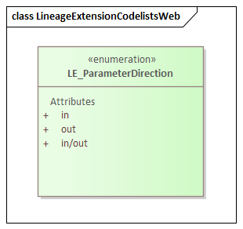

= Metadata for Resource Lineage (MRL) [Imagery]
:edition: 2.2
:revdate: 2021-02-17

== Metadata for Resource Lineage (MRL) [ISO 19115-2] Version: 2.2

.Classes in the mrl namespace

.Codelists in the mrl namespace

=== Description

MRL 2.2 is an XML Schema implementation derived from ISO 19115-2:2019 (Ed2),
Geographic Information - Metadata - Part 2: Extensions for acquisition and
processing, Clause 6.3.3. The MRL 2.2 schema is an extension of MRL 1.3 as defined in
ISO 19115-1, Geographic Information - Metadata - Part 1: Fundamentals. It includes
additional elements for describing lineage, processes and sources. The XML schema was
encoded using the rules described in ISO/TS 19139:2007.

=== XML Namespace for Metadata for Resource Lineage (MRL) [ISO 19115-2]

The namespace URI for Metadata for Resource Lineage (MRL) [ISO 19115-2] is derived
from ISO 19115-1 `https://schemas.isotc211.org/19115/-1/mrl/1.3`.

=== XML Schema for mrl 1.3

https://schemas.isotc211.org/19115/-1/mrl/1.3.0/mrl.xsd
is the XML Schema document to be referenced by XML documents containing XML elements
in the mrl 1.3 namespace or by XML Schema documents importing the mrl 1.3 namespace.
The schema
https://schemas.isotc211.org/19115/-1/mrl/1.3.0/mrl.xsd
forms the basis for ISO 19115 Metadata Resource Lineage definitions from both ISO
19115-1 and ISO 19115-2. This XML schema includes (indirectly) all the implemented
concepts of the mrc namespace, but it does not contain the declaration of any types.

=== Related XML Schema for mrl 1.3

https://schemas.isotc211.org/19115/-1/mrl/1.3.0/lineage.xsd
implements the UML conceptual schema defined in ISO 19115-1, Geographic Information -
Metadata - Part 1: Fundamentals AMENDMENT 1, Clause 6.5.5. Details about
https://schemas.isotc211.org/19115/-1/mrl/1.3.0/lineage.xsd
can be accessed from
https://schemas.isotc211.org/19115/-1/mrl/1.3.0.

https://schemas.isotc211.org/19115/-2/mrl/2.2.0/lineageImagery.xsd[lineageImagery.xsd"]
implements the UML conceptual schema defined in ISO 19115-2, Geographic Information -
Metadata - Part 2: Extensions for acquisition and processing, Clause 6.3.5.
https://schemas.isotc211.org/19115/-2/mrl/2.2.0/lineageImagery.xsd[lineageImagery.xsd"]
LE_ProcessStep inherits attributes from ISO 19115-1:Lineage:LI_ProcessStep, and
LE_Source inherits attributes from ISO 19115-1:Lineage:LI_Source. It was created using
the encoding rules defined in ISO 19118, ISO 19139.

https://schemas.isotc211.org/19115/-2/mrl/2.2.0/lineageImagery.xsd
contains the following classes:

* LE_Algorithm
* LE_NominalResolution
* LE_Processing
* LE_ProcessParameter
* LE_ProcessStep
* LE_ProcessStepReport
* LE_Source

https://schemas.isotc211.org/19115/-2/mrl/2.2.0/lineageImagery.xsd
contains references to the following codelist:

* LE_ParameterDirection

=== Related XML Namespaces for mrl 2.2

The mrl 1.3 namespace imports these other namespaces:

[%unnumbered]
[options=header,cols=4]
|===
| Name | Standard Prefix | Namespace Location | Schema Location

a| Geographic Common Objects +
in its own right and also by inheritance
| gco |
`https://schemas.isotc211.org/19103/-/gco/1.2.0` | https://schemas.isotc211.org/19103/-/gco/1.2.0/gco.xsd
a| Geographic Markup Wrappers +
by inheritance
| gmw |
`https://schemas.isotc211.org/19163/-/gmw/1.1.0` | https://schemas.isotc211.org/19163/-/gmw/1.1.0/gmw.xsd
a| Geospatial MetaLanguage +
by inheritance
| gml |
http://schemas.opengis.net/gml/3.2.1/gml.xsd |
http://schemas.opengis.net/gml/3.2.1/gml.xsd
a| Metadata Common Classes +
in its own right and also by inheritance
| mcc |
`https://schemas.isotc211.org/19115/-1/mcc/1.3.0` | https://schemas.isotc211.org/19115/-1/mcc/1.3.0/mcc.xsd
a| CITation andresponsibility +
in its own right and also by inheritance
| mcc |
`https://schemas.isotc211.org/19115/-1/cit/1.3.0` | https://schemas.isotc211.org/19115/-1/cit/1.3.0/cit.xsd
a| Metadata Reference System +
by inheritance
| mcc |
`https://schemas.isotc211.org/19115/-1/mrs/1.3.0` | https://schemas.isotc211.org/19115/-1/mrs/1.3.0/mrs.xsd
|===

=== Schematron Validation Rules for mrl 1.3 derived from ISO 19115-2

Schematron rules for validating instance documents required for a complete validation
are:

[%unnumbered]
[options=header,cols=4]
|===
| Package name | File name | Location | Constraint tested

| Metadata for Resource Lineage - Extended | mrlExt.sch |
https://schemas.isotc211.org/19115/-2/mrl/2.2.0/mrlExt.sch a|
* LE_Source - count(description + scope) \> 0
| Metadata for Resource Lineage | mrl.sch |
https://schemas.isotc211.org/19115/-1/mrl/1.3.0/mrl.sch a|
* LI_Source - count(description + scope) \> 0
| CITation and responsibility | cit.sch |
https://schemas.isotc211.org/19115/-1/cit/1.3.0/cit.sch a|
* CI_Individual - count(name + positionName) \> 0
* CI_organisation - count(name + logo) \> 0
| Metadata Resource Identification | mri.sch |
https://schemas.isotc211.org/19115/-1/mri/1.3.0/mri.sch a|
* MD_MetadataScope/MD_Identification -
MD_Metadata.metadataScope.MD_MetadataScope.resourceScope)='dataset' implies
count(extent.geographicElement.EX_GeographicBoundingBox + extent.geographicElement.EX_GeographicDescription) \>= 1
* MD_MetadataScope/MD_Identification -
MD_Metadata.metadataScope.MD_Scope.resourceScope) = ('dataset' or 'series')
implies topicCategory is mandatory
* MD_DataIdentification - defaultLocale documented if resource includes textual
information (test atempt only)
* MD_DataIdentification - defaultLocale.PT_Locale.characterEncoding default value is
UTF-8
* MD_AssociatedResource - count(name + metadataReference
* MD_Keywords/[SV_ServiceIdentification] - When the resource described is a service,
one instance of MD_Keyword shall refer to the service taxonomy defined in ISO 19119
|===

Other schematron rule sets that maybe required for a complete validation (optional
direct from MD_Metadata or indirectly through associations) are:

* Metadata for Reference Systems
https://schemas.isotc211.org/19115/-1/mrs/1.3.0/mrs.sch

=== Working Versions

When revisions to these schema become necessary, they will be managed in the
https://github.com/ISO-TC211/XML[ISO TC211 Git Repository].
