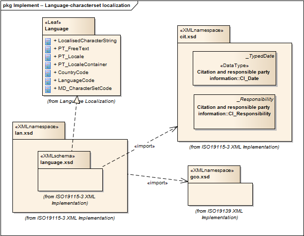

= Language localization (LAN)
:edition: 1.0
:revdate: 2019-01-04

== Language localization (LAN) Version: 1.0

=== Description

LAN 1.0 is an XML Schema implementation derived from ISO 19115-1, Geographic
Information - Metadata - Part 1: Fundamentals, Clause 7.3. It includes elements for
cultural and linguistic adaptability. The XML schema was encoded using the rules
described in ISO/TS 19139:2007, Clause 8 and implementation approach from
ISO/TS19115-3, Clause 8.

=== XML Namespace for lan 1.0

The namespace URI for lan 1.0 is `http://standards.iso.org/iso/19115/-3/lan/1.0`.

=== XML Schema for lan 1.0

link:lan.xsd[lan.xsd] is the XML Schema document to be referenced by XML documents
containing XML elements in the lan 1.0 namespace or by XML Schema documents importing
the lan 1.0 namespace. This XML schema includes (indirectly) all the implemented
concepts of the lan namespace, but it does not contain the declaration of any types.

NOTE: The XML Schema for lan 1.0 are available link:lan.zip[here]. A zip archive
including all the XML Schema Implementations defined in ISO/TS 19115-3 and related
standards is also
https://schemas.isotc211.org/19115/19115AllNamespaces.zip[available].

=== Related XML Schema for lan 1.0

link:language.xsd[language.xsd] implements the UML conceptual schema defined in ISO
19115-1, Geographic Information - Metadata - Part 1: Fundamentals, Clause 7.3. It was
created using the encoding rules defined in ISO 19118, ISO 19139, and the
implementation approach described in ISO 19115-3 and contains the following classes
(codeLists are bold): *CountryCode*, *LanguageCode*, LocalisedCharacterString,
*MD_CharacterSetCode*, PT_FreeText, PT_Locale, and PT_LocaleContainer

=== Related XML Namespaces for lan 1.0

The lan 1.0 namespace imports these other namespaces:

[%unnumbered]
[options=header,cols=4]
|===
| Name | Standard Prefix | Namespace Location | Schema Location

| Citation and responsible party information Citation and responsible party
information | cit |
`https://schemas.isotc211.org/19115/-3/cit/1.0` | https://schemas.isotc211.org/19115/-3/cit/1.0/cit.xsd[cit.xsd]
| Geographic COmmon | gco |
`https://schemas.isotc211.org/19115/-3/gco/1.0` | https://schemas.isotc211.org/19115/-3/gco/1.0/gco.xsd[gco.xsd]
|===

=== Working Versions

When revisions to these schema become necessary, they will be managed in the
https://github.com/ISO-TC211/XML[ISO TC211 Git Repository].
