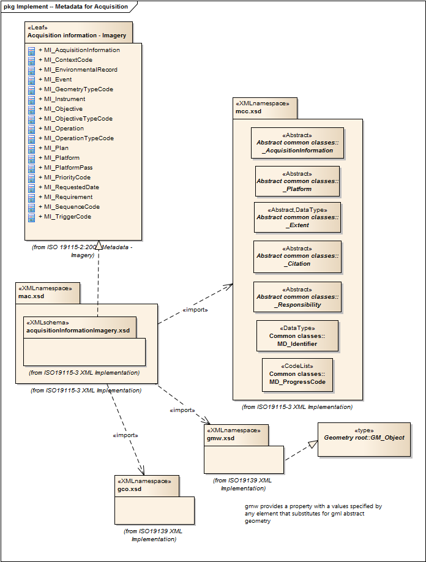

= Metadata for Acquisition (MAC)
:edition: 1.0
:revdate: 2019-01-04

== Metadata for Acquisition (MAC) Version: 1.0

=== Description

MAC 1.0 is an XML Schema implementation derived from ISO 19115-2, Geographic
Information - Metadata - Part 2: Extensions for imagery and gridded data, Clause
A.2.5. It includes information related to acquisition platforms, instruments,
operations and other details. The XML schema was encoded using the rules described in
ISO/TS 19139:2007, Clause 8 and implementation approach from ISO/TS19115-3, Clause 8.

=== XML Namespace for mac 1.0

The namespace URI for mac 1.0 is `http://standards.iso.org/iso/19115/-3/mac/1.0`.

=== XML Schema for mac 1.0

link:mac.xsd[mac.xsd] is the XML Schema document to be referenced by XML documents
containing XML elements in the mac 1.0 namespace or by XML Schema documents importing
the mac 1.0 namespace. This XML schema includes (indirectly) all the implemented
concepts of the mac namespace, but it does not contain the declaration of any types.

NOTE: The XML Schema for mac 1.0 are available link:mac.zip[here]. A zip archive
including all the XML Schema Implementations defined in ISO/TS 19115-3 and related
standards is also
https://schemas.isotc211.org/19115/19115AllNamespaces.zip[available].

=== Related XML Schema for mac 1.0

link:acquisitionInformationImagery.xsd[acquisitionInformationImagery.xsd]
implements the UML conceptual schema defined in ISO 19115-2, Geographic Information -
Metadata - Part 2: Extensions for imagery and gridded data, Clause A.2.5. It was
created using the encoding rules defined in ISO 19118, ISO 19139, and the
implementation approach described in ISO 19115-3 and contains the following classes
(codeLists are bold): MI_AcquisitionInformation, *MI_ContextCode*,
MI_EnvironmentalRecord, MI_Event, *MI_GeometryTypeCode*, MI_Instrument, MI_Objective,
*MI_ObjectiveTypeCode*, MI_Operation, *MI_OperationTypeCode*, MI_Plan, MI_Platform,
MI_PlatformPass, *MI_PriorityCode*, MI_RequestedDate, MI_Requirement,
*MI_SensorTypeCode*, *MI_SequenceCode*, and *MI_TriggerCode*

=== Related XML Namespaces for mac 1.0

The mac 1.0 namespace imports these other namespaces:

[%unnumbered]
[options=header,cols=4]
|===
| Name | Standard Prefix | Namespace Location | Schema Location

| Geographic COmmon | gco |
`https://schemas.isotc211.org/19115/-3/gco/1.0` | https://schemas.isotc211.org/19115/-3/gco/1.0/gco.xsd[gco.xsd]
| Geographic Markup Wrappers | gmw |
`https://schemas.isotc211.org/19115/-3/gmw/1.0` | https://schemas.isotc211.org/19115/-3/gmw/1.0/gmw.xsd[gmw.xsd]
| Metadata Common Classes | mcc |
`https://schemas.isotc211.org/19115/-3/mcc/1.0` | https://schemas.isotc211.org/19115/-3/mcc/1.0/mcc.xsd[mcc.xsd]
|===

=== Working Versions

When revisions to these schema become necessary, they will be managed in the
https://github.com/ISO-TC211/XML[ISO TC211 Git Repository].
