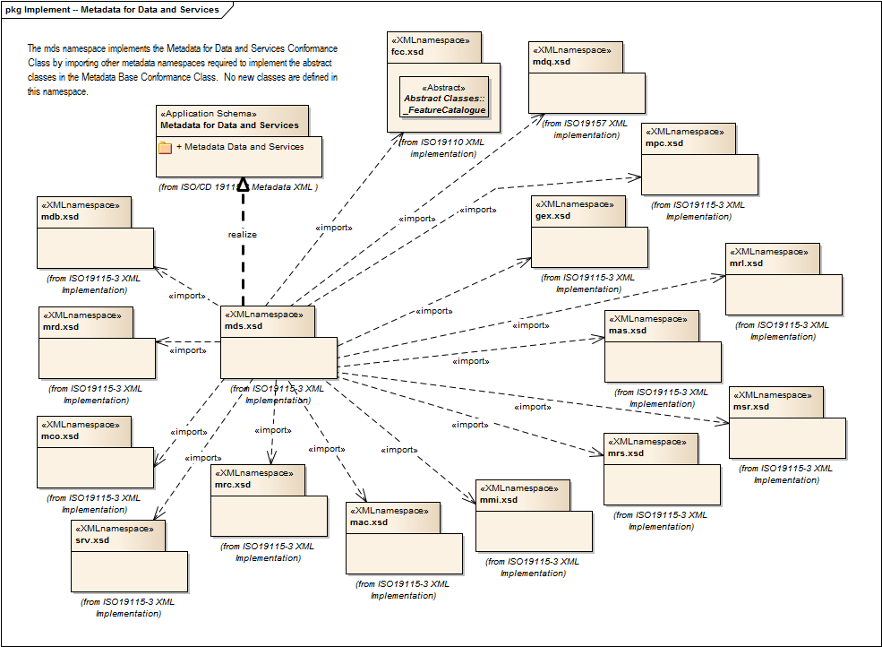

= Metadata for Data and Services (MDS)
:edition: 2.0
:revdate: 2019-01-04

== Metadata for Data and Services (MDS) Version: 2.0

=== Description

MDS 2.0 is an XML Schema implementation derived from ISO 19115-1, Geographic
Information - Metadata - Part 1: Fundamentals, Clause 6.5.2. It includes this
namespace contains all classes needed for a complete metadata record for any
resource. It is used for metadata records that do not include geospatial common
extensions (gex), extensions to the schema (mex), data series (DS_*) elements (mda)
or metadata for data transfer (mdt). The XML schema was encoded using the rules
described in ISO/TS 19139:2007, Clause 8 and implementation approach from
ISO/TS19115-3, Clause 8.

=== Sample XML files for mds 2.0

link:mds.xml[mds.xml]

=== XML Namespace for mds 2.0

The namespace URI for mds 2.0 is `http://standards.iso.org/iso/19115/-3/mds/2.0`.

=== XML Schema for mds 2.0

link:mds.xsd[mds.xsd] is the XML Schema document to be referenced by XML documents
containing XML elements in the mds 2.0 namespace or by XML Schema documents importing
the mds 2.0 namespace. This XML schema includes (indirectly) all the implemented
concepts of the mds namespace, but it does not contain the declaration of any types.

NOTE: The XML Schema for mds 2.0 are available link:mds.zip[here]. A zip archive
including all the XML Schema Implementations defined in ISO/TS 19115-3 and related
standards is also
https://schemas.isotc211.org/19115/19115AllNamespaces.zip[available].

=== Related XML Schema for mds 2.0

link:metadataDataServices.xsd[metadataDataServices.xsd] implements the UML
conceptual schema defined in ISO 19115-1, Geographic Information - Metadata - Part 1:
Fundamentals, Clause 6.5.2. It was created using the encoding rules defined in ISO
19118, ISO 19139, and the implementation approach described in ISO 19115-3 and
contains the following classes (codeLists are bold):

=== Related XML Namespaces for mds 2.0

The mds 2.0 namespace imports these other namespaces:

[%unnumbered]
[options=header,cols=4]
|===
| Name | Standard Prefix | Namespace Location | Schema Location

| Feature Catalog Common | fcc |
`https://schemas.isotc211.org/19110/fcc/1.0` | https://schemas.isotc211.org/19110/fcc/1.0/fcc.xsd[fcc.xsd]
| Geospatial EXtent | gex |
https://schemas.isotc211.org/19115/-3/gex/1.0[https://schemas.isotc211.org/19115/-3/gex
/1.0] | https://schemas.isotc211.org/19115/-3/gex/1.0/gex.xsd[gex.xsd]
| Metadata for Acquisition Metadata for Acquisition | mac |
`https://schemas.isotc211.org/19115/-3/mac/2.0` | https://schemas.isotc211.org/19115/-3/mac/2.0/mac.xsd[mac.xsd]
| Metadata for Application Schema | mas |
`https://schemas.isotc211.org/19115/-3/mas/1.0` | https://schemas.isotc211.org/19115/-3/mas/1.0/mas.xsd[mas.xsd]
| Metadata for Constraints | mco |
`https://schemas.isotc211.org/19115/-3/mco/1.0` | https://schemas.isotc211.org/19115/-3/mco/1.0/mco.xsd[mco.xsd]
| Metadata Base Metadata Base | mdb |
`https://schemas.isotc211.org/19115/-3/mdb/2.0` | https://schemas.isotc211.org/19115/-3/mdb/2.0/mdb.xsd[mdb.xsd]
| Metadata for Data Quality | mdq |
`https://schemas.isotc211.org/19157/-2/mdq/1.0` | https://schemas.isotc211.org/19157/-2/mdq/1.0/mdq.xsd[mdq.xsd]
| Metadata for Maintenance Information | mmi |
`https://schemas.isotc211.org/19115/-3/mmi/1.0` | https://schemas.isotc211.org/19115/-3/mmi/1.0/mmi.xsd[mmi.xsd]
| Metadata for Portrayal Catalog | mpc |
`https://schemas.isotc211.org/19115/-3/mpc/1.0` | https://schemas.isotc211.org/19115/-3/mpc/1.0/mpc.xsd[mpc.xsd]
| Metadata for Resource Content Metadata for Resource Content | mrc |
`https://schemas.isotc211.org/19115/-3/mrc/2.0` | https://schemas.isotc211.org/19115/-3/mrc/2.0/mrc.xsd[mrc.xsd]
| Metadata for Resource Distribution | mrd |
`https://schemas.isotc211.org/19115/-3/mrd/1.0` | https://schemas.isotc211.org/19115/-3/mrd/1.0/mrd.xsd[mrd.xsd]
| Metadata for Resource Lineage Metadata for Resource Lineage | mrl |
`https://schemas.isotc211.org/19115/-3/mrl/2.0` | https://schemas.isotc211.org/19115/-3/mrl/2.0/mrl.xsd[mrl.xsd]
| Metadata for Reference System | mrs |
`https://schemas.isotc211.org/19115/-3/mrs/1.0` | https://schemas.isotc211.org/19115/-3/mrs/1.0/mrs.xsd[mrs.xsd]
| Metadata for Spatial Representation Metadata for Spatial Representation | msr |
`https://schemas.isotc211.org/19115/-3/msr/2.0` | https://schemas.isotc211.org/19115/-3/msr/2.0/msr.xsd[msr.xsd]
| Metadata for Services | srv |
`https://schemas.isotc211.org/19115/-3/srv/2.0` | https://schemas.isotc211.org/19115/-3/srv/2.0/srv.xsd[srv.xsd]
|===

=== Working Versions

When revisions to these schema become necessary, they will be managed in the
https://github.com/ISO-TC211/XML[ISO TC211 Git Repository].
