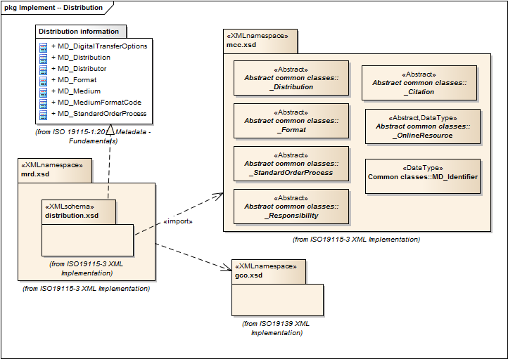

= Metadata for Resource Distribution (MRD)
:edition: 1.0
:revdate: 2019-01-04

== Metadata for Resource Distribution (MRD) Version: 1.0

=== Description

MRD 1.0 is an XML Schema implementation derived from ISO 19115-1, Geographic
Information - Metadata - Part 1: Fundamentals, Clause 6.5.11. It includes elements
specifying how a resource is accessed. The XML schema was encoded using the rules
described in ISO/TS 19139:2007, Clause 8 and implementation approach from
ISO/TS19115-3, Clause 8.

=== Sample XML files for mrd 1.0

* link:mrd_invalid.xml[mrd_invalid.xml]
* link:mrd_valid.xml[mrd_valid.xml]

=== CodeLists for mrd 1.0

* link:codelists.html[codelists.html]
* link:codelists.xml[codelists.xml]

=== XML Namespace for mrd 1.0

The namespace URI for mrd 1.0 is `http://standards.iso.org/iso/19115/-3/mrd/1.0`.

=== XML Schema for mrd 1.0

link:mrd.xsd[mrd.xsd] is the XML Schema document to be referenced by XML documents
containing XML elements in the mrd 1.0 namespace or by XML Schema documents importing
the mrd 1.0 namespace. This XML schema includes (indirectly) all the implemented
concepts of the mrd namespace, but it does not contain the declaration of any types.

NOTE: The XML Schema for mrd 1.0 are available link:mrd.zip[here]. A zip archive
including all the XML Schema Implementations defined in ISO/TS 19115-3 and related
standards is also
https://schemas.isotc211.org/19115/19115AllNamespaces.zip[available].

=== Related XML Schema for mrd 1.0

link:distribution.xsd[distribution.xsd] implements the UML conceptual schema
defined in ISO 19115-1, Geographic Information - Metadata - Part 1: Fundamentals,
Clause 6.5.11. It was created using the encoding rules defined in ISO 19118, ISO
19139, and the implementation approach described in ISO 19115-3 and contains the
following classes (codeLists are bold): MD_DigitalTransferOptions, MD_Distribution,
MD_Distributor, MD_Format, MD_Medium, *MD_MediumFormatCode*, and
MD_StandardOrderProcess

=== Related XML Namespaces for mrd 1.0

The mrd 1.0 namespace imports these other namespaces:

[%unnumbered]
[options=header,cols=4]
|===
| Name | Standard Prefix | Namespace Location | Schema Location

| Geographic COmmon | gco |
`https://schemas.isotc211.org/19115/-3/gco/1.0` | https://schemas.isotc211.org/19115/-3/gco/1.0/gco.xsd[gco.xsd]
| Metadata Common Classes | mcc |
`https://schemas.isotc211.org/19115/-3/mcc/1.0` | https://schemas.isotc211.org/19115/-3/mcc/1.0/mcc.xsd[mcc.xsd]
|===

=== Schematron Validation Rules for mrd 1.0

Schematron rules for validating instance documents of the mrd 1.0 namespace are in
link:mrd.sch[mrd.sch]. Other schematron rule sets that are required for a complete
validation are: gco.sch, mcc.sch, and mcc.sch

=== Working Versions

When revisions to these schema become necessary, they will be managed in the
https://github.com/ISO-TC211/XML[ISO TC211 Git Repository].
