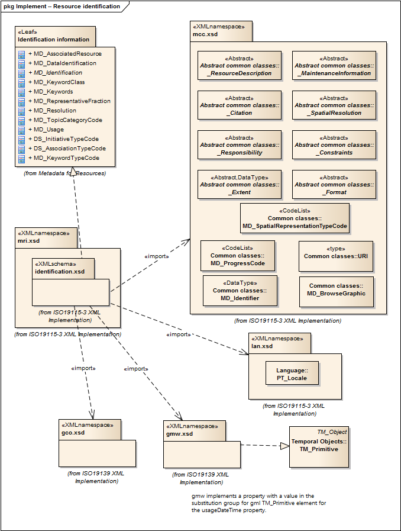

= Metadata for Resource Identification (MRI)
:edition: 1.0
:revdate: 2019-01-04

== Metadata for Resource Identification (MRI) Version: 1.0

=== Description

MRI 1.0 is an XML Schema implementation derived from ISO 19115-1, Geographic
Information - Metadata - Part 1: Fundamentals, Clause 6.5.3. It includes elements for
identifying resources. The XML schema was encoded using the rules described in ISO/TS
19139:2007, Clause 8 and implementation approach from ISO/TS19115-3, Clause 8.

=== Sample XML files for mri 1.0

* link:mri_invalid.xml[mri_invalid.xml]
* link:mri_valid.xml[mri_valid.xml]

=== CodeLists for mri 1.0

* link:codelists.html[codelists.html]
* link:codelists.xml[codelists.xml]

=== XML Namespace for mri 1.0

The namespace URI for mri 1.0 is `http://standards.iso.org/iso/19115/-3/mri/1.0`.

=== XML Schema for mri 1.0

link:mri.xsd[mri.xsd] is the XML Schema document to be referenced by XML documents
containing XML elements in the mri 1.0 namespace or by XML Schema documents importing
the mri 1.0 namespace. This XML schema includes (indirectly) all the implemented
concepts of the mri namespace, but it does not contain the declaration of any types.

NOTE: The XML Schema for mri 1.0 are available link:mri.zip[here]. A zip archive
including all the XML Schema Implementations defined in ISO/TS 19115-3 and related
standards is also
https://schemas.isotc211.org/19115/19115AllNamespaces.zip[available].

=== Related XML Schema for mri 1.0

link:identification.xsd[identification.xsd] implements the UML conceptual schema
defined in ISO 19115-1, Geographic Information - Metadata - Part 1: Fundamentals,
Clause 6.5.3. It was created using the encoding rules defined in ISO 19118, ISO
19139, and the implementation approach described in ISO 19115-3 and contains the
following classes (codeLists are bold): *DS_AssociationTypeCode*,
*DS_InitiativeTypeCode*, MD_AssociatedResource, MD_DataIdentification,
AbstractMD_Identification, MD_KeywordClass, *MD_KeywordTypeCode*, MD_Keywords,
MD_RepresentativeFraction, MD_Resolution, *MD_TopicCategoryCode*, and MD_Usage

=== Related XML Namespaces for mri 1.0

The mri 1.0 namespace imports these other namespaces:

[%unnumbered]
[options=header,cols=4]
|===
| Name | Standard Prefix | Namespace Location | Schema Location

| Geographic COmmon | gco |
`https://schemas.isotc211.org/19115/-3/gco/1.0` | https://schemas.isotc211.org/19115/-3/gco/1.0/gco.xsd[gco.xsd]
| Geographic Markup Wrappers | gmw |
`https://schemas.isotc211.org/19115/-3/gmw/1.0` | https://schemas.isotc211.org/19115/-3/gmw/1.0/gmw.xsd[gmw.xsd]
| Language localization | lan |
`https://schemas.isotc211.org/19115/-3/lan/1.0` | https://schemas.isotc211.org/19115/-3/lan/1.0/lan.xsd[lan.xsd]
| Metadata Common Classes | mcc |
`https://schemas.isotc211.org/19115/-3/mcc/1.0` | https://schemas.isotc211.org/19115/-3/mcc/1.0/mcc.xsd[mcc.xsd]
|===

=== Schematron Validation Rules for mri 1.0

Schematron rules for validating instance documents of the mri 1.0 namespace are in
link:mri.sch[mri.sch]. Other schematron rule sets that are required for a complete
validation are: gco.sch, gmw.sch, lan.sch, mcc.sch, lan.sch, and mcc.sch

=== Working Versions

When revisions to these schema become necessary, they will be managed in the
https://github.com/ISO-TC211/XML[ISO TC211 Git Repository].
