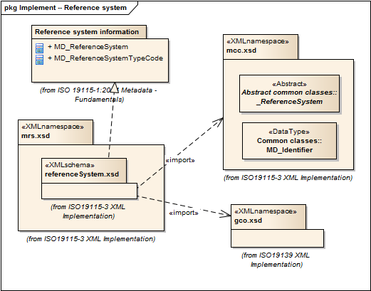

= Metadata for Reference System (MRS)
:edition: 1.0
:revdate: 2019-01-04

== Metadata for Reference System (MRS) Version: 1.0

=== Description

MRS 1.0 is an XML Schema implementation derived from ISO 19115-1, Geographic
Information - Metadata - Part 1: Fundamentals, Clause 6.5.8. It includes elements for
describing Reference Systems. The XML schema was encoded using the rules described in
ISO/TS 19139:2007, Clause 8 and implementation approach from ISO/TS19115-3, Clause 8.

=== Sample XML files for mrs 1.0

=== CodeLists for mrs 1.0

* link:codelists.html[codelists.html]
* link:codelists.xml[codelists.xml]

=== XML Namespace for mrs 1.0

The namespace URI for mrs 1.0 is `http://standards.iso.org/iso/19115/-3/mrs/1.0`.

=== XML Schema for mrs 1.0

link:mrs.xsd[mrs.xsd] is the XML Schema document to be referenced by XML documents
containing XML elements in the mrs 1.0 namespace or by XML Schema documents importing
the mrs 1.0 namespace. This XML schema includes (indirectly) all the implemented
concepts of the mrs namespace, but it does not contain the declaration of any types.

NOTE: The XML Schema for mrs 1.0 are available link:mrs.zip[here]. A zip archive
including all the XML Schema Implementations defined in ISO/TS 19115-3 and related
standards is also
https://schemas.isotc211.org/19115/19115AllNamespaces.zip[available].

=== Related XML Schema for mrs 1.0

link:referenceSystem.xsd[referenceSystem.xsd] implements the UML conceptual schema
defined in ISO 19115-1, Geographic Information - Metadata - Part 1: Fundamentals,
Clause 6.5.8. It was created using the encoding rules defined in ISO 19118, ISO
19139, and the implementation approach described in ISO 19115-3 and contains the
following classes (codeLists are bold): MD_ReferenceSystem, and
*MD_ReferenceSystemTypeCode*

=== Related XML Namespaces for mrs 1.0

The mrs 1.0 namespace imports these other namespaces:

[%unnumbered]
[options=header,cols=4]
|===
| Name | Standard Prefix | Namespace Location | Schema Location

| Geographic COmmon | gco |
`https://schemas.isotc211.org/19115/-3/gco/1.0` | https://schemas.isotc211.org/19115/-3/gco/1.0/gco.xsd[gco.xsd]
| Metadata Common Classes | mcc |
`https://schemas.isotc211.org/19115/-3/mcc/1.0` | https://schemas.isotc211.org/19115/-3/mcc/1.0/mcc.xsd[mcc.xsd]
|===

=== Schematron Validation Rules for mrs 1.0

Schematron rules for validating instance documents of the mrs 1.0 namespace are in
link:mrs.sch[mrs.sch]. Other schematron rule sets that are required for a complete
validation are: mcc.sch, gco.sch, and mcc.sch

=== Working Versions

When revisions to these schema become necessary, they will be managed in the
https://github.com/ISO-TC211/XML[ISO TC211 Git Repository].
