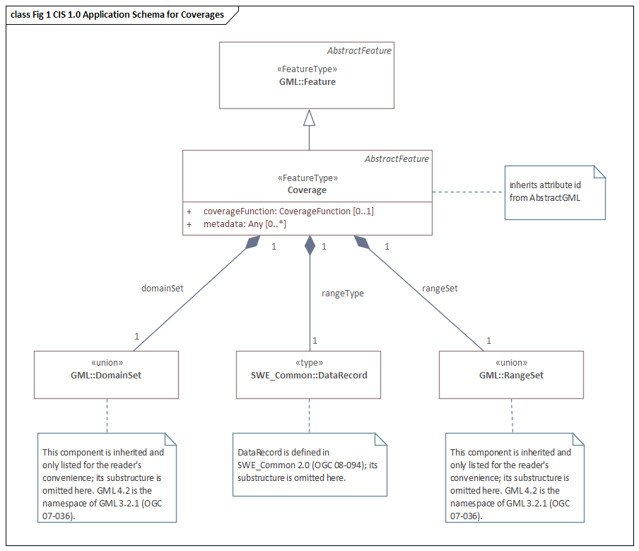

= Schemas for coverage geometry and functions - Coverage Implementation Schema (CIS)
:edition: 1.1.0
:revdate: 2010-02-25

== Schemas for coverage geometry and functions - Coverage Implementation Schema (CIS) Version: 1.1.0

.Classes in the 19123-2:2018 gmlCov namespace

=== Description

Schemas for coverage geometry and functions - Coverage Implementation Schema (CIS) is
an XML Schema implementation derived from ISO 19123-2, Schemas for coverage geometry
and functions Part 2: Coverage Implementation schema. It includes elements for
delivering information about spatial coverages. The XML schema was encoded using the
encoding rules defined in ISO 19118, ISO 19139.

=== XML Namespace for CIS 1.1

The namespace URI for CIS 1.1 is `http://www.opengis.net/gmlcov/1.0`.

=== XML Schema for ISO 19123-2 CIS 1.1

https://schemas.isotc211.org/19123/-2/cis/1.1.0/1.1.0/gmlCovAll.xsd[gmlCovAll.xsd] is the XML
Schema document to be referenced by XML documents containing XML elements in the
gmlCov namespace or by XML Schema documents importing the gmlCov 1.0 namespace. This
XML schema includes (indirectly) all the implemented concepts of the gmlCov
namespace, but it does not contain the declaration of any types.

=== Related XML Schema for ISO 19123-2 CIS 1.1

https://schemas.isotc211.org/19123/-2/cis/1.1.0/grids.xsd[grids.xsd] implements very limited of
the UML conceptual schema defined in ISO 191123 Geographic Information - Schemas for
coverage geometry and functions Part 2: Coverage implementation schema. It was
created using the encoding rules defined in ISO 19118, ISO 19139.

https://schemas.isotc211.org/19123/-2/cis/1.1.0/grids.xsd contains the following classes:

* AbstractReferenceableGrid
* ParameterValue
* SimpleMultiPoint

https://schemas.isotc211.org/19123/-/cis/1.1.0/coverage.xsd[coverage.xsd] implements very
limited of the UML conceptual schema defined in ISO 191123 Geographic Information -
Schemas for coverage geometry and functions Part 2: Coverage implementation schema,
Clause 8.4. It was created using the encoding rules defined in ISO 19118, ISO 19139.

https://schemas.isotc211.org/19123/-2/cis/1.1.0/coverage.xsd contains the following classes:

* AbstractCoverage
* Extension
* AbstractDiscreteCoverage
* AbstractContinuousCoverage
* MultiPointCoverage
* MultiCurveCoverage
* MultiSurfaceCoverage
* MultiSolidCoverage
* GridCoverage
* RectifiedGridCoverage
* ReferenceableGridCoverage

=== Related XML Namespaces for ISO 19123-2 CIS 1.1

The ISO 19123-2 gmlCov 1.1 namespace imports these other namespaces:

[%unnumbered]
[options=header,cols=4]
|===
| Name | Standard Prefix | Namespace Location | Schema Location

| Geospatial Meta-Language | gml |
http://www.opengis.net/gml/3.2[http://www.opengis.net/gml/3.2] |
http://www.opengis.net/gml/3.2.1/gml.xsd
| Sensor Web Enablement | swe |
http://www.opengis.net/swe/2.0[http://www.opengis.net/swe/2.0] |
http://schemas.opengis.net/sweCommon/2.0/swe.xsd
|===

=== Working Versions

When revisions to these schema become necessary, they will be managed in the
https://github.com/ISO-TC211/XML[ISO TC211 Git Repository].
