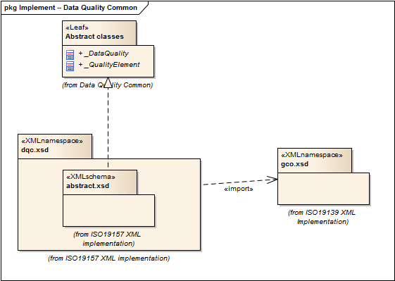

= Data Quality Common Classes (DQC)
:edition: 1.0
:revdate: 2019-01-04

== Data Quality Common Classes (DQC) Version: 1.0

=== Description

DQC 1.0 is an XML Schema implementation derived from ISO 19157, Geographic
Information - Data Quality, Clause 6.4. It includes abstract classes shared by
multiple namespaces and is required in order to enable modularization of the XML
implementation. The XML schema was encoded using the rules described in ISO/TS
19115-3, Clause 8.

=== XML Namespace for dqc 1.0

The namespace URI for dqc 1.0 is `http://standards.iso.org/iso/19157/-2/dqc/1.0`.

=== XML Schema for dqc 1.0

link:dqc.xsd[dqc.xsd] is the XML Schema document to be referenced by XML documents
containing XML elements in the dqc 1.0 namespace or by XML Schema documents importing
the dqc 1.0 namespace. This XML schema includes (indirectly) all the implemented
concepts of the dqc namespace, but it does not contain the declaration of any types.

NOTE: The XML Schema for dqc 1.0 are available link:dqc.zip[here]. A zip archive
including all the XML Schema Implementations defined in ISO/TS 19115-3 and related
standards is also https://schemas.isotc211.org/19115/19115AllNamespaces.zip[available].

=== Related XML Schema for dqc 1.0

link:abstract.xsd[abstract.xsd] implements the UML conceptual schema defined in ISO
19157, Geographic Information - Data Quality, Clause 6.4. It was created using the
encoding rules defined in ISO 19118, ISO 19139, and the implementation approach
described in ISO 19115-3 and contains the following classes (codeLists are bold):
Abstract_DataQuality, and Abstract_QualityElement

=== Related XML Namespaces for dqc 1.0

The dqc 1.0 namespace imports these other namespaces:

[%unnumbered]
[options=header,cols=4]
|===
| Name | Standard Prefix | Namespace Location | Schema Location

| Geographic COmmon | gco |
`https://schemas.isotc211.org/19115/-3/gco/1.0` | https://schemas.isotc211.org/19115/-3/gco/1.0/gco.xsd[gco.xsd]
|===

=== Working Versions

When revisions to these schema become necessary, they will be managed in the
https://github.com/ISO-TC211/XML[ISO TC211 Git Repository].
